# 中国城市轨道交通协会团体标准

T/CAMET 04010.2—2018

# 城市轨道交通基于通信的列车运行控制系统（CBTC）互联互通系统规范第2部分：系统架构和功能分配

Urban rail transit — System specification for interoperability of communication based train control system Part 2: System architecture and functional allocations

# 目 次

前言 VI引言

1范围·  
2规范性引用文件  
3术语和缩略语  
3.1术语…  
3.2缩略语

# 4系统架构 5

4.1 架构组成 5  
4.2CBTC系统物理接口和功能接口 5

5功能对照

6 ATP功能分配… 10

6.1ATP的主要功能… 10  
6.2列车位置确定. 12  
6.3移动防护限制和日标点的确定 19  
6.4ATP曲线确定… 24  
6.5确定限制速度… 27  
6.6列车实际速度/列车运行方向确定 28  
6.7监督/强制允许速度和允许运行方向 30  
6.8 车门/站台门控制 33  
6.9列车折返… 38  
6.10车载ATP用户界面 39  
6.11自诊断、故障报警及数据记录· 40

# 7ATO 功能分配 40

7.1功能描述… 40  
7.2确定ATO曲线 40  
7.3 列车速度调整… 42  
7.4门控制… 43  
7.5车载ATO用户界面 45  
7.6自诊断、故障报警及数据记录 45  
8ATS 功能分配… 46  
8.1功能描述… 46  
8.2列车识别· 46  
8.3列车追踪… 48  
8.4列车进路办理. 48  
8.5 列车调整… 50  
8.6列车运行控制. 51  
8.7控制列车运行 53  
8.8时刻表编制… 53  
8.9模拟培训… 53  
8.10用户界面 54  
9CI功能分配 56  
9.1功能描述· 56  
9.2进路办理… 56  
9.3 锁闭/解锁进路/区段· 58  
9.4紧急停车按钮 59  
9.5故障监测及操作记录· 59  
参考文献… 61

# 前 言

T/CAMET04010《城市轨道交通基于通信的列车运行控制系统（CBTC）互联互通系统规范》分为以下四个部分：

第1部分：系统总体要求；  
第2部分：系统架构和功能分配；  
第3部分：车载电子地图；  
一第4部分：互联互通危害分析。

本部分是T/CAMET04010的第2部分。

本部分按照GB/T1.1—2009给出的规则起草。

请注意本部分的某些内容可能涉及专利，本部分的发布机构不承担识别这些专利的责任。

本部分由中国城市轨道交通协会技术装备专业委员会提出。

本部分由中国城市轨道交通协会归口。

本部分起草单位：交控科技股份有限公司、北京交通大学、北京全路通信信号研究设计院集团有限公司、中国铁道科学研究院集团有限公司通信信号研究所、株洲中车时代电气股份有限公司、浙江众合科技股份有限公司。

本部分主要起草人：编写组：郜春海、黄友能、王伟、刘波、李凯、王悉、刘宏杰、孙晓光、刘鲁鹏、吕浩炯、刘志水、尹逊政、孙旺、高晓菲、胡顺定。审查组：李中浩、朱翔、赵炜、郑生全、张艳兵、张良、王道敏、张琼燕、段晨宁、李新文、李德堂、文成祥、任敬、朱东飞、肖利君、张守芝、刘新平。

# 引 言

为促进中国城市轨道交通建设，实现并满足城市轨道交通互联互通的需要，达到经济适用、资源共享、技术先进及可持续发展的目标，制定城市轨道交通基于通信的列车运行控制系统（CBTC）互联互通系列团体标准，

该系列规范包括《城市轨道交通基于通信的列车运行控制系统（CBTC）互联互通系统规范》、《城市轨道交通基于通信的列车运行控制系统（CBTC）互联互通接口规范》、《城市轨道交通基于通信的列车运行控制系统（CBTC）互联互通测试规范》《城市轨道交通基于通信的列车运行控制系统（CBTC）E联互通T程规范》4个规范（17个部分）。

# 城市轨道交通基于通信的列车运行控制系统(CBTC)互联互通系统规范第2部分：系统架构和功能分配

# 1范围

T/CAMET04010的本部分定义了互联互通的系统架构利功能分配

# 2规范性引用文件

件，下列文件对于本部置都。凡是注日期的用文版本（包括所有的修改单）适用于本部分。

GB/T12758—2004城市轨道交通信号系统通用技术条件

GB50157—2013地铁设计规范

CJ/T407—2012城市轨道交通基于通信的列车自动控制系统技术要求

T/CAMET04010.1—2018城市轨道交通基于通信的列车运行控制系统（CBTC）互联互通系统规范第1部分：系统总体要求

# 3术语和缩略语

GB/T12758—2004、GB 50157—2013、CJ/T407—2012 和T/CAMET

04010.1一2018界定的及下列术语和缩略语适用于本部分、为了便于使用，以下重复列出了其中的主要相关术语。

# 3.1术语

3.1.1

城市轨道交通信号urban rail transit signal

应用于城市轨道交通系统中，人工或自动实现行车指挥和列车运行控制、安全间隔控制技术的总称。

[GB/T12758—2004，术语与定义3.1]

# 3.1.2

基于通信的列车控制communication based train control（CBTC）

通过不依赖轨旁列车占川检测设备的列车主动定位技术，连续车一地双向数据通信技术以及能够执行安全功能的车载和地面处理器而构建的连续式列车白动控制系统。

[CJ/T407—2012，定义3.1.1]

# 3.1.3

移动闭塞 moving block

前方列车与后续列车之间的最小安全追踪间隔距离单元不预定设定，并随列车的移动、速度的变化而变化的闭塞方式。

[GB/T12758—2004术语与定义3.10]

# 3.1.4

列车自动控制automatic train control

信号系统自动实现列车监控、安全防护和运行控制等技术的总称。

[GB 50157—2013，定义2.0.37]

# 3.1.5

列车自动监控automatic train supervision

根据列车时刻表为列车运行自动设定进路、指挥行车、实施列车运行管理等技术的总称。

[GB50157—2013,定义2.0.38]

3.1.6

列车自动防护automatic train protection

自动实现列车运行间隔、超速防护、进路安全和车门等监控技术的总称。

[GB50157—2013，定义2.0.39]

3.1.7

列车自动运行automatic train operation

白动实现列车加速、调速、停车和车门开闭、提示等控制技术的总称。

[GB 50157—2013，定义2.0.40]

3.1.8

计算机联锁computer interlocking

以计算机技术为核心，自动实现进路、道岔、信号机等防护技术的总称

[CJ/T407—2012，定义3.1.6]

# 3.1.9

维护支持系统maintenance support system

监测记录系统内其他各子系统维护信息，辅助系统故障分析，川于系统1常运营维护

3.1.10

保护区段 overlap section为实现超速防护，保证安全停车而延伸的闭塞区段。[GB/T12758—2004，术语与定义3.12]

3.1.11

目标速度target speed列车运行至前方目标地点应达到的允许速度。[GB/T12758—2004，术语与定义3.13]

3.1.12

# 目标距离target distance

列车运行至前方目标地点的走行距离。

[GB/T12758—2004，术语与定义3.14]

3.1.13

安全保护距离safe protection distance

列车自动防护系统中，列车超速防护实施安全停车控制时，为防止停车位置离散性可能造成的危险，而设置的自预定停车位置至目标地点的安全距离。

[GB/T12758—2004，术语与定义3.15]

3.1.14

危险点danger point

列车运行前方不允许列车任何部位越过的特定点。

[T/CAMET04010.1，术语和缩略语3.1.10]

3.1.15

移动授权movenent authority   
列车沿给定的行驶方向进人并在某-特定轨道区段内行车的许可，   
[CJ/T407——2012，定义3.1.7]

3.1.16

限制速度restricted speed

线路、车辆结构等限制及列车移动授权所获取的最严格的速度限制。

[CJ/T407——2012，定义3.1.11]

3.1.17

# 互联互通interoperability

装备不同信号厂家车载设备的列车可以在装备不同信号厂家轨旁设备的一条轨道交通线路内或多条轨道交通线路上无缝互通、安全可靠运营。

[T/CAMET04010.1,术语和缩略语3.1.16]

3.1.18

共线运行mix operation

装备不同厂家车载信号设备的列车可以在装备同一厂家轨旁信号设

备线路上支持以点式列车控制级别和连续式列车控制级别无缝安全可靠运营。

# 3.2缩略语

AM:列车自动驾驶模式（AutomaticTrainOperatingMode）ATC：列车自动控制（AutomaticTrain Control）ATO:列车自动运行（AutomaticTrainOperation）ATP:列车白动防护（AutomaticTrainProtection）ATS:列车自动监控（Automatic Train Supervision)CBTC：基于通信的列车控制系统（CommunicationBasedTrainControl)Lnte! ockingCM：列车白动防 Mole )DCS:数据通信 Data CommunicationLEU：轨旁电子 Lineside Electroni UnMSS：维护支持 tem)RM：限制人Restictedi aling Mole)SIL：安全完整性等al ntegrilyyZC:区域控制器（Zone

# 4系统架构

# 4.1架构组成

CBTC系统由ATS、CBTC轨旁（轨旁CBTC设备，含区域控制器等）、CBTC车载（车载CBTC设备，含车载ATP、车载ATO等）、CI、DCS子系统组成。

# 4.2CBTC系统物理接口和功能接口

CBTC系统物理接口和功能接口示意图见图1，互联互通下CBTC系统物理接口和功能接口示意图见图2。

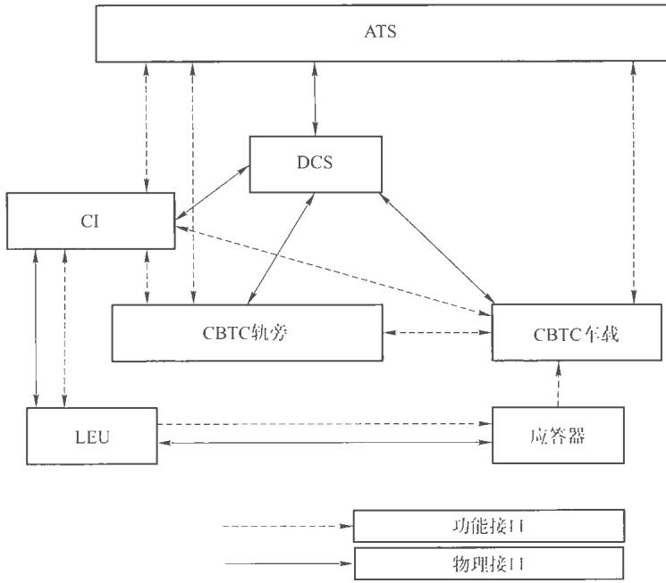  
图1CBTC系统物理接口和功能接口示意图

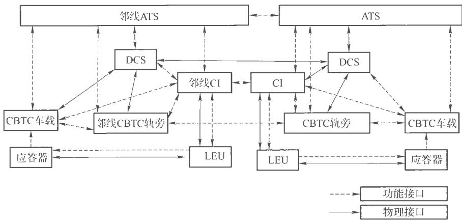  
图2互联互通下CBTC系统物理接口和功能接口示意图

相对于CBTC系统物理接口和功能接口，互联互通下CBTC系统物理接口和功能接口，增加了列车与邻线地面设备间的接口，以及各线间地面设备间的接口（CBTC轨旁间及CI设备间）。

# 5功能对照

功能分配与总体要求的对照内容见表1。

表1功能对照表  

<table><tr><td colspan="1" rowspan="1">序号</td><td colspan="1" rowspan="1">总体要求中的功能点名称</td><td colspan="2" rowspan="1">对应本文章节</td></tr><tr><td colspan="1" rowspan="1">1</td><td colspan="1" rowspan="1">初始化 CBTC列车位置</td><td colspan="2" rowspan="1">6.2.2</td></tr><tr><td colspan="1" rowspan="1">2</td><td colspan="1" rowspan="1">确定CBTC列车位置</td><td colspan="2" rowspan="1">6.2.3</td></tr><tr><td colspan="1" rowspan="1">3</td><td colspan="1" rowspan="1">确定轨道区段占用状态</td><td colspan="2" rowspan="1">6.2.4</td></tr><tr><td colspan="1" rowspan="1">4</td><td colspan="1" rowspan="1">防护列车丢失位置报告</td><td colspan="2" rowspan="1">6.2.5.2</td></tr><tr><td colspan="1" rowspan="1">5</td><td colspan="1" rowspan="1">防护列车完整性玉失</td><td colspan="2" rowspan="1">6.2.5.3</td></tr><tr><td colspan="1" rowspan="1">6</td><td colspan="1" rowspan="1">确定前方CBTC列车位置</td><td colspan="2" rowspan="1">6.3.2.2</td></tr><tr><td colspan="1" rowspan="1">7</td><td colspan="1" rowspan="1">确定前方安全进路限制</td><td colspan="2" rowspan="1">6.3.2.3</td></tr><tr><td colspan="1" rowspan="1">8</td><td colspan="1" rowspan="1">确定移动授权</td><td colspan="2" rowspan="1">6.3.3.2</td></tr><tr><td colspan="1" rowspan="1">9</td><td colspan="1" rowspan="1">确定目标点</td><td colspan="2" rowspan="1">6.3.4.2</td></tr><tr><td colspan="1" rowspan="1">10</td><td colspan="1" rowspan="1">响应紧急停车按钮</td><td colspan="2" rowspan="1">6.3.4.3</td></tr><tr><td colspan="1" rowspan="1">11</td><td colspan="1" rowspan="1">道岔状态防护</td><td colspan="2" rowspan="1">6.3.4.4</td></tr><tr><td colspan="1" rowspan="1">12</td><td colspan="1" rowspan="1">车载故障处理</td><td colspan="2" rowspan="1">6.3.5.2</td></tr><tr><td colspan="1" rowspan="1">13</td><td colspan="1" rowspan="1">周定速度限製防护</td><td colspan="2" rowspan="1">6.4.2</td></tr><tr><td colspan="1" rowspan="1">14</td><td colspan="1" rowspan="1">临时限速限制防护</td><td colspan="2" rowspan="1">6.4.3</td></tr><tr><td colspan="1" rowspan="1">序号</td><td colspan="1" rowspan="1">总体要求中的功能点名称</td><td colspan="2" rowspan="1">对应本文章节</td></tr><tr><td colspan="1" rowspan="1">15</td><td colspan="1" rowspan="1">确定制动曲线</td><td colspan="2" rowspan="1">6.4.4</td></tr><tr><td colspan="1" rowspan="1">16</td><td colspan="1" rowspan="1">列车超速防护</td><td colspan="2" rowspan="1">6.4.4.3</td></tr><tr><td colspan="1" rowspan="1">17</td><td colspan="1" rowspan="1">列车速度测定</td><td colspan="2" rowspan="1">6.6.2</td></tr><tr><td colspan="1" rowspan="1">18</td><td colspan="1" rowspan="1">测速误差补偿</td><td colspan="2" rowspan="1">6.6.2.3</td></tr><tr><td colspan="1" rowspan="1">19</td><td colspan="1" rowspan="1">零速状态确定</td><td colspan="2" rowspan="1">6.6.2.4</td></tr><tr><td colspan="1" rowspan="1">20</td><td colspan="1" rowspan="1">列年运行方向确定</td><td colspan="2" rowspan="1">6.6.3</td></tr><tr><td colspan="1" rowspan="1">21</td><td colspan="1" rowspan="1">列年运行方向防护</td><td colspan="2" rowspan="1">6.7.3.2</td></tr><tr><td colspan="1" rowspan="1">22</td><td colspan="1" rowspan="1">退行防护</td><td colspan="2" rowspan="1">6.7.3.3</td></tr><tr><td colspan="1" rowspan="1">23</td><td colspan="1" rowspan="1">越过移动授权终点防护</td><td colspan="2" rowspan="1">6.7.4.1</td></tr><tr><td colspan="1" rowspan="1">24</td><td colspan="1" rowspan="1">移动授权更新超时防护</td><td colspan="2" rowspan="1">6.7.4.3</td></tr><tr><td colspan="1" rowspan="1">25</td><td colspan="1" rowspan="1">紧急制动缓解</td><td colspan="2" rowspan="1">6.7.4.4</td></tr><tr><td colspan="1" rowspan="1">26</td><td colspan="1" rowspan="1">车门允许</td><td colspan="2" rowspan="1">6.8.2</td></tr><tr><td colspan="1" rowspan="1">27</td><td colspan="1" rowspan="1">站台门控制</td><td colspan="2" rowspan="1">6.8.2.3</td></tr><tr><td colspan="1" rowspan="1">28</td><td colspan="1" rowspan="1">车门防护</td><td colspan="2" rowspan="1">6.8.3.2</td></tr><tr><td colspan="1" rowspan="1">29</td><td colspan="1" rowspan="1">车门防护切除</td><td colspan="2" rowspan="1">6.8.4.4</td></tr><tr><td colspan="1" rowspan="1">30</td><td colspan="1" rowspan="1">站台门防护</td><td colspan="2" rowspan="1">6.8.3</td></tr><tr><td colspan="1" rowspan="1">31</td><td colspan="1" rowspan="1">列车折返</td><td colspan="2" rowspan="1">6.9</td></tr><tr><td colspan="1" rowspan="1">32</td><td colspan="1" rowspan="1">车载ATP界面功能</td><td colspan="2" rowspan="1">6.10.1</td></tr><tr><td colspan="1" rowspan="1">33</td><td colspan="1" rowspan="1">ATP门诊断、故障报警及数据记录</td><td colspan="2" rowspan="1">6.11</td></tr><tr><td colspan="1" rowspan="1">34</td><td colspan="1" rowspan="1">模式转换</td><td colspan="2" rowspan="1">6.2.3.10</td></tr><tr><td colspan="1" rowspan="1">序号</td><td colspan="1" rowspan="1">总体要求中的功能点名称</td><td colspan="2" rowspan="1">对应本文章节</td></tr><tr><td colspan="1" rowspan="1">35</td><td colspan="1" rowspan="1">ZC间移交</td><td colspan="2" rowspan="1">6.3.4.5</td></tr><tr><td colspan="1" rowspan="1">36</td><td colspan="1" rowspan="1">电子地图存储</td><td colspan="2" rowspan="1">6.2.2.4</td></tr><tr><td colspan="1" rowspan="1">37</td><td colspan="1" rowspan="1">停稳停准判断</td><td colspan="2" rowspan="1">6.2.3.8</td></tr><tr><td colspan="1" rowspan="1">38</td><td colspan="1" rowspan="1">确定ATO曲线</td><td colspan="2" rowspan="1">7.2.1</td></tr><tr><td colspan="1" rowspan="1">39</td><td colspan="1" rowspan="1">精确停车</td><td colspan="2" rowspan="1">7.2.2</td></tr><tr><td colspan="1" rowspan="1">40</td><td colspan="1" rowspan="1">根据ATO曲线调整列车速度</td><td colspan="2" rowspan="1">7.3.1</td></tr><tr><td colspan="1" rowspan="1">41</td><td colspan="1" rowspan="1">跳停</td><td colspan="2" rowspan="1">7.3.2</td></tr><tr><td colspan="1" rowspan="1">42</td><td colspan="1" rowspan="1">运营调整</td><td colspan="2" rowspan="1">3</td></tr><tr><td colspan="1" rowspan="1">43</td><td colspan="1" rowspan="1">开关车</td><td colspan="1" rowspan="1"></td><td colspan="1" rowspan="1"></td></tr><tr><td colspan="1" rowspan="1">44</td><td colspan="1" rowspan="1">ATO 界面</td><td colspan="1" rowspan="1"></td><td colspan="1" rowspan="1"></td></tr><tr><td colspan="1" rowspan="1">45</td><td colspan="1" rowspan="1">ATO自诊断故及数据记录</td><td colspan="2" rowspan="1"></td></tr><tr><td colspan="1" rowspan="1">46</td><td colspan="1" rowspan="1">ATO发送列车运行信息</td><td colspan="2" rowspan="1">7.3.4</td></tr><tr><td colspan="1" rowspan="1">47</td><td colspan="1" rowspan="1">ATO发送旅客信息</td><td colspan="2" rowspan="1">7.6.3</td></tr><tr><td colspan="1" rowspan="1">48</td><td colspan="1" rowspan="1">确定列车识别号</td><td colspan="2" rowspan="1">8.2</td></tr><tr><td colspan="1" rowspan="1">49</td><td colspan="1" rowspan="1">ATS列车追踪</td><td colspan="2" rowspan="1">8.3</td></tr><tr><td colspan="1" rowspan="1">50</td><td colspan="1" rowspan="1">列车进路办理</td><td colspan="2" rowspan="1">8.4</td></tr><tr><td colspan="1" rowspan="1">51</td><td colspan="1" rowspan="1">列车自动调整</td><td colspan="2" rowspan="1">8.5.1</td></tr><tr><td colspan="1" rowspan="1">52</td><td colspan="1" rowspan="1">节能运行</td><td colspan="2" rowspan="1">8.5.2</td></tr><tr><td colspan="1" rowspan="1">53</td><td colspan="1" rowspan="1">扣车</td><td colspan="2" rowspan="1">8.6.1</td></tr><tr><td colspan="1" rowspan="1">54</td><td colspan="1" rowspan="1">提前发车</td><td colspan="2" rowspan="1">8.6.2</td></tr><tr><td colspan="1" rowspan="1">序号</td><td colspan="1" rowspan="1">总体要求中的功能点名称</td><td colspan="2" rowspan="1">对应本文章节</td></tr><tr><td colspan="1" rowspan="1">55</td><td colspan="1" rowspan="1">跳停</td><td colspan="2" rowspan="1">8.6.3</td></tr><tr><td colspan="1" rowspan="1">56</td><td colspan="1" rowspan="1">设置/取消临时限速</td><td colspan="2" rowspan="1">8.7</td></tr><tr><td colspan="1" rowspan="1">57</td><td colspan="1" rowspan="1">时刻表编制管理</td><td colspan="2" rowspan="1">8.8</td></tr><tr><td colspan="1" rowspan="1">58</td><td colspan="1" rowspan="1">模拟培训</td><td colspan="2" rowspan="1">8.9</td></tr><tr><td colspan="1" rowspan="1">59</td><td colspan="1" rowspan="1">ATS界面功能</td><td colspan="2" rowspan="1">8.10.1</td></tr><tr><td colspan="1" rowspan="1">60</td><td colspan="1" rowspan="1">ATS数据记录</td><td colspan="2" rowspan="1">8.10.2.4</td></tr><tr><td colspan="1" rowspan="1">61</td><td colspan="1" rowspan="1">中控/站控转换</td><td colspan="2" rowspan="1">8.6.4</td></tr><tr><td colspan="1" rowspan="1">62</td><td colspan="1" rowspan="1">进路办理</td><td colspan="2" rowspan="1">9.2.2</td></tr><tr><td colspan="1" rowspan="1">63</td><td colspan="1" rowspan="1">保护区段建立</td><td colspan="2" rowspan="1">9.2.4</td></tr><tr><td colspan="1" rowspan="1">64</td><td colspan="1" rowspan="1">进路/区段锁闭</td><td colspan="2" rowspan="1">9.3.2</td></tr><tr><td colspan="1" rowspan="1">65</td><td colspan="1" rowspan="1">道岔单操、单锁</td><td colspan="2" rowspan="1">9.3.3</td></tr><tr><td colspan="1" rowspan="1">66</td><td colspan="1" rowspan="1">车站/区间封锁</td><td colspan="2" rowspan="1">9.3.2</td></tr><tr><td colspan="1" rowspan="1">67</td><td colspan="1" rowspan="1">紧急停车按钮</td><td colspan="2" rowspan="1">9.4</td></tr><tr><td colspan="1" rowspan="1">68</td><td colspan="1" rowspan="1">C.I接口</td><td colspan="2" rowspan="1">无</td></tr><tr><td colspan="1" rowspan="1">69</td><td colspan="1" rowspan="1">CI自检、故障报警及数据记录</td><td colspan="2" rowspan="1">9.5</td></tr><tr><td colspan="1" rowspan="1">70</td><td colspan="1" rowspan="1">进路解锁及取消</td><td colspan="2" rowspan="1">9.3.2</td></tr><tr><td colspan="1" rowspan="1">71</td><td colspan="1" rowspan="1">计轴故障恢复</td><td colspan="2" rowspan="1">9.3.4</td></tr><tr><td colspan="1" rowspan="1">72</td><td colspan="1" rowspan="1">扣车</td><td colspan="2" rowspan="1">8.6.1</td></tr><tr><td colspan="1" rowspan="1">73</td><td colspan="1" rowspan="1">站控/遥控</td><td colspan="2" rowspan="1">8.6.4</td></tr><tr><td colspan="1" rowspan="1">74</td><td colspan="1" rowspan="1">CI权限设置</td><td colspan="2" rowspan="1">无</td></tr></table>

# 6ATP功能分配

# 6.1 ATP的主要功能

ATP的主要功能见图3。

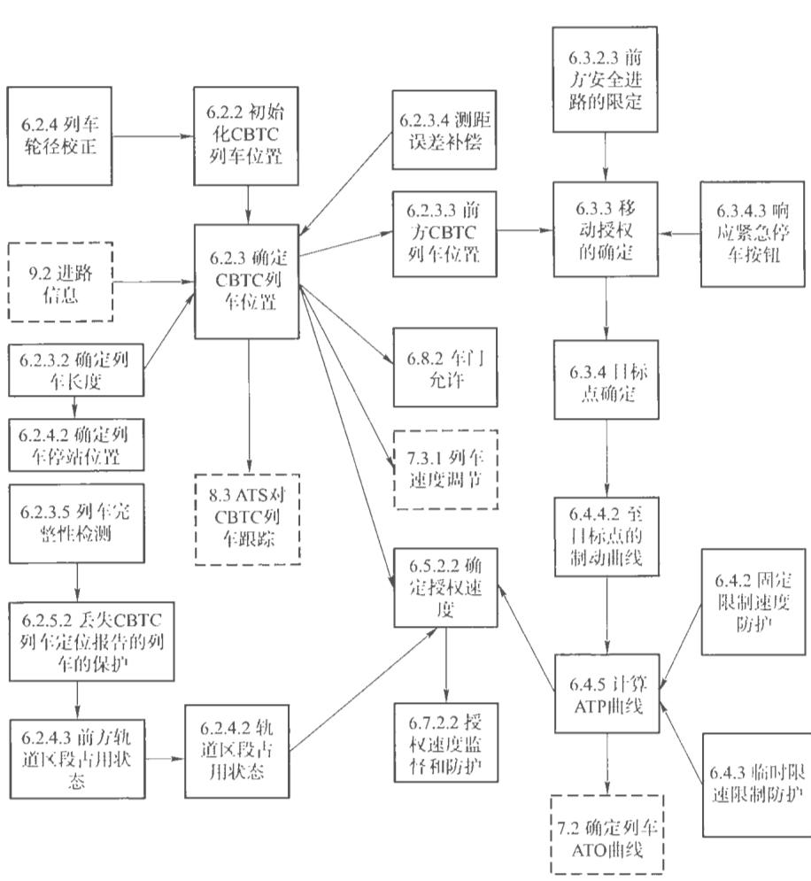  
图3ATP主要功能

说明：实线框——其他章节描述内容；虚线框—本章节描述内容。

# 6.2列车位置确定

# 6.2.1确定列车位置关系图

图4概括了本段中所描述的子功能（实线框）之间的接口，以及其他段落中描述的子功能（虚线框）间的接口。

说明：

  
图4确定列车位置关系图

实线框——定位功能的条件；虚线框——定位功能的用途

# 6.2.2初始化CBTC列车位置

# 6.2.2.1概述

此功能用于初始化CBTC列车位置，即确定CBTC装备列车的初始位置。表2\~表4规定了列车定位初始化的内容。

# 6.2.2.2进入CBTC区域的CBTC列车位置初始化

CBTC列车位置初始化，并白动检测每列符合装备CBTC设备的列车，进人CBTC区域无需手动输入列车位置或列车长度的数据，见表2。

表2进入CBTC区域的CBTC列车位置初始化  

<table><tr><td rowspan=1 colspan=1>功能分配</td><td rowspan=1 colspan=1>输    人</td><td rowspan=1 colspan=1>实   现</td><td rowspan=1 colspan=1>输    山</td></tr><tr><td rowspan=1 colspan=1>ATS</td><td rowspan=1 colspan=1></td><td rowspan=1 colspan=1></td><td rowspan=1 colspan=1></td></tr><tr><td rowspan=1 colspan=1>CBTC轨旁</td><td rowspan=1 colspan=1>X</td><td rowspan=1 colspan=1></td><td rowspan=1 colspan=1></td></tr><tr><td rowspan=1 colspan=1>CBTC 车载</td><td rowspan=1 colspan=1>OCIAT</td><td rowspan=1 colspan=1></td><td rowspan=1 colspan=1>Y</td></tr><tr><td rowspan=1 colspan=4>入的子系统；         功能的子系统：“输出”接收该功能实现     子系统（适用于后续表     内容）注2：本表格及后      中的“CBTC轨旁”              轨旁、应答器、LEU”</td></tr></table>

# 6.2.2.3从设备故障H恢复的CBIC列车完成置初始化

CBTC列个位置初据，见表3 轨道 交

表3进从设备故障中恢复的CBTC列车完成位置初始化  

<table><tr><td rowspan=1 colspan=1>功能分配</td><td rowspan=1 colspan=1>输  人</td><td rowspan=1 colspan=1>实现</td><td rowspan=1 colspan=1>输   出</td></tr><tr><td rowspan=1 colspan=1>ATS</td><td rowspan=1 colspan=1></td><td rowspan=1 colspan=1></td><td rowspan=1 colspan=1></td></tr><tr><td rowspan=1 colspan=1>CBTC 轨旁</td><td rowspan=1 colspan=1>X</td><td rowspan=1 colspan=1></td><td rowspan=1 colspan=1></td></tr><tr><td rowspan=1 colspan=1>CBTC 车载</td><td rowspan=1 colspan=1></td><td rowspan=1 colspan=1>X</td><td rowspan=1 colspan=1>X</td></tr></table>

# 6.2.2.4电子地图存储

CBTC系统的车载设备和轨旁设备应根据运行和管辖范围的不同，分别存储相关线路范围的电子地图，见表4。

表4电子地图存储  

<table><tr><td rowspan=1 colspan=1>功能分配</td><td rowspan=1 colspan=1>输   入</td><td rowspan=1 colspan=1>实现</td><td rowspan=1 colspan=1>输</td></tr><tr><td rowspan=1 colspan=1>ATS</td><td rowspan=1 colspan=1></td><td rowspan=1 colspan=1></td><td rowspan=1 colspan=1></td></tr><tr><td rowspan=1 colspan=1>CBTC 轨旁</td><td rowspan=1 colspan=1>X</td><td rowspan=1 colspan=1>X</td><td rowspan=1 colspan=1>X</td></tr><tr><td rowspan=1 colspan=1>CBTC 车载</td><td rowspan=1 colspan=1>X</td><td rowspan=1 colspan=1>X</td><td rowspan=1 colspan=1>X</td></tr></table>

# 6.2.3确定CBTC列车位置

# 6.2.3.1概述

此功能确定列车运行前方和后方的相邻CBTC列车的位置。表5\~表13规定了列车位置用途的内容，

# 6.2.3.2确定列车长度

CBTC列车位置应能确定列车长度，见表5

表5确定列车长度  

<table><tr><td rowspan=1 colspan=1>功能分配</td><td rowspan=1 colspan=1>输  入</td><td rowspan=1 colspan=1>实现</td><td rowspan=1 colspan=1>输出</td></tr><tr><td rowspan=1 colspan=1>ATS</td><td rowspan=1 colspan=1></td><td rowspan=1 colspan=1></td><td rowspan=1 colspan=1>X</td></tr><tr><td rowspan=1 colspan=1>CBTC 轨劳</td><td rowspan=1 colspan=1></td><td rowspan=1 colspan=1></td><td rowspan=1 colspan=1>X</td></tr><tr><td rowspan=1 colspan=1>CBTC车载</td><td rowspan=1 colspan=1>X</td><td rowspan=1 colspan=1>X</td><td rowspan=1 colspan=1></td></tr></table>

# 6.2.3.3确定CBTC列车位置

CBTC列车位置的确定应包括安全、准确地确定列年车头和车尾的位置，并用足够的分辨率和精准度来满足性能和安全需求，见表6。

表6确定CBT列车位置  

<table><tr><td rowspan=1 colspan=1>功能分配</td><td rowspan=1 colspan=1>输</td><td rowspan=1 colspan=1>实现</td><td rowspan=1 colspan=1>输俞出</td></tr><tr><td rowspan=1 colspan=1>ATS</td><td rowspan=1 colspan=1></td><td rowspan=1 colspan=1></td><td rowspan=1 colspan=1>X</td></tr><tr><td rowspan=1 colspan=1>CBTC 轨券</td><td rowspan=1 colspan=1>X</td><td rowspan=1 colspan=1></td><td rowspan=1 colspan=1>X</td></tr><tr><td rowspan=1 colspan=1>CBTC车载</td><td rowspan=1 colspan=1>X</td><td rowspan=1 colspan=1>X</td><td rowspan=1 colspan=1>X</td></tr></table>

# 6.2.3.4位置误差校正

CBTC列车位置的确定应包含测距误差的影响，并对位置误差包含合适的余量，见表7。

表7位置误差校正  

<table><tr><td rowspan=1 colspan=1>功能分配</td><td rowspan=1 colspan=1>输  入</td><td rowspan=1 colspan=1>实现</td><td rowspan=1 colspan=1>输   出</td></tr><tr><td rowspan=1 colspan=1>ATS</td><td rowspan=1 colspan=1></td><td rowspan=1 colspan=1></td><td rowspan=1 colspan=1>X</td></tr><tr><td rowspan=1 colspan=1>CBTC 轨旁</td><td rowspan=1 colspan=1></td><td rowspan=1 colspan=1></td><td rowspan=1 colspan=1>X</td></tr><tr><td rowspan=1 colspan=1>CBTC 车载</td><td rowspan=1 colspan=1>X</td><td rowspan=1 colspan=1>X</td><td rowspan=1 colspan=1>X</td></tr></table>

# 6.2.3.5列车完整性检测

CBTC系统应能实现列车的完整性检测，当车载设备检测到列车完整性信息丢失，列车完整性检查电路中断时，应对列车实施紧急制动，并丢失定位，同时系统应对后续追踪列车进行安全防护，保证后续列车安全运行，见長8。

表8列车完整性检测  

<table><tr><td rowspan=1 colspan=1>功能分配</td><td rowspan=1 colspan=1>输入</td><td rowspan=1 colspan=1>实现</td><td rowspan=1 colspan=1>输出</td></tr><tr><td rowspan=1 colspan=1>ATS</td><td rowspan=1 colspan=1></td><td rowspan=1 colspan=1></td><td rowspan=1 colspan=1>X</td></tr><tr><td rowspan=1 colspan=1>CBTC 轨旁</td><td rowspan=1 colspan=1></td><td rowspan=1 colspan=1></td><td rowspan=1 colspan=1>X</td></tr><tr><td rowspan=1 colspan=1>CBTC 车载</td><td rowspan=1 colspan=1>X</td><td rowspan=1 colspan=1>X</td><td rowspan=1 colspan=1></td></tr><tr><td rowspan=1 colspan=1>C1</td><td rowspan=1 colspan=1></td><td rowspan=1 colspan=1></td><td rowspan=1 colspan=1></td></tr><tr><td rowspan=1 colspan=1>外部系统(车辆)</td><td rowspan=1 colspan=1>X</td><td rowspan=1 colspan=1></td><td rowspan=1 colspan=1></td></tr></table>

# 6.2.3.6列车轮径校正

CBTC系统应能实现列车轮径校正功能，系统宜在列车进入转换轨前设置轮径自动补偿设备，并在出段/场前完成自动轮径补偿，见表9。

表9列车轮径校正  

<table><tr><td rowspan=1 colspan=1>功能分配</td><td rowspan=1 colspan=1>输   人</td><td rowspan=1 colspan=1>实现</td><td rowspan=1 colspan=1>输   出</td></tr><tr><td rowspan=1 colspan=1>ATS</td><td rowspan=1 colspan=1></td><td rowspan=1 colspan=1></td><td rowspan=1 colspan=1></td></tr><tr><td rowspan=1 colspan=1>CBTC 轨旁</td><td rowspan=1 colspan=1>X</td><td rowspan=1 colspan=1></td><td rowspan=1 colspan=1></td></tr><tr><td rowspan=1 colspan=1>CBTC 车载</td><td rowspan=1 colspan=1></td><td rowspan=1 colspan=1>X</td><td rowspan=1 colspan=1>X</td></tr></table>

# 6.2.3.7列车升级至CBTC级别

当系统由点式列车控制级别或联锁控制级别升级为连续式列车控制级别时，应满足如下转换条件：

-ATP车载设备无故障，且完成列车定位；

—ATP车载设备收到ATP轨旁设备发送的有效MA信息，见表10

表10列车升级至CBTC级别  

<table><tr><td rowspan=1 colspan=1>功能分配</td><td rowspan=1 colspan=1>输    入</td><td rowspan=1 colspan=1>实现</td><td rowspan=1 colspan=2>输出</td></tr><tr><td rowspan=1 colspan=1>ATS</td><td rowspan=1 colspan=1></td><td rowspan=1 colspan=1></td><td rowspan=1 colspan=2>X</td></tr><tr><td rowspan=1 colspan=1>CBTC轨旁</td><td rowspan=1 colspan=1></td><td rowspan=1 colspan=1>X</td><td rowspan=1 colspan=2></td></tr><tr><td rowspan=1 colspan=1>CBTC 车载</td><td rowspan=1 colspan=1>X</td><td rowspan=1 colspan=1>X</td><td rowspan=1 colspan=2>X</td></tr><tr><td rowspan=1 colspan=1>C.1</td><td rowspan=1 colspan=1>X</td><td rowspan=1 colspan=1></td><td rowspan=1 colspan=1></td><td rowspan=1 colspan=1>X</td></tr></table>

# 6.2.3.8确定列车停站位置

CBTC系统应根据不同的列车长度，确定列车的停站位置，见表11。

表11确定列车停站位置  

<table><tr><td rowspan=1 colspan=1>功能分配</td><td rowspan=1 colspan=1>输 入</td><td rowspan=1 colspan=1>实现</td><td rowspan=1 colspan=1>输   出</td></tr><tr><td rowspan=1 colspan=1>ATS</td><td rowspan=1 colspan=1></td><td rowspan=1 colspan=1></td><td rowspan=1 colspan=1></td></tr><tr><td rowspan=1 colspan=1>CBTC轨旁</td><td rowspan=1 colspan=1></td><td rowspan=1 colspan=1></td><td rowspan=1 colspan=1></td></tr><tr><td rowspan=1 colspan=1>CBTC车载</td><td rowspan=1 colspan=1>X</td><td rowspan=1 colspan=1>X</td><td rowspan=1 colspan=1>X</td></tr></table>

# 6.2.3.9列车驾驶模式

列车应具有的驾驶模式包括：列车白动运行模式（AM）、列车自动防护模式（CM）、限制人工驾驶模式（RM）、非限制人T驾驶模式（EUM）、列车自动运行模式（AM），列车自动防护模式（CM）为列车正常运行模式，见表12。

表12列车驾驶模式  

<table><tr><td rowspan=1 colspan=1>功能分配</td><td rowspan=1 colspan=1>输    人</td><td rowspan=1 colspan=1>现</td><td rowspan=1 colspan=1>输   出</td></tr><tr><td rowspan=1 colspan=1>ATS</td><td rowspan=1 colspan=1></td><td rowspan=1 colspan=1></td><td rowspan=1 colspan=1>X</td></tr><tr><td rowspan=1 colspan=1>CBTC 轨旁</td><td rowspan=1 colspan=1></td><td rowspan=1 colspan=1></td><td rowspan=1 colspan=1>X</td></tr><tr><td rowspan=1 colspan=1>CBTC车载</td><td rowspan=1 colspan=1>CSOCIATIONC</td><td rowspan=1 colspan=1>OF</td><td rowspan=1 colspan=1>X</td></tr></table>

# 6.2.3.10驾驶模式转换

列车驾驶模式 ，的是转换条件可由人事世可自动转换，

为保证行车安全列车驾驶模式由AM、CM换为RM时，列乍应停表13 轨道 专换时 交通 不停车转换驾驶模式、见

表13驾驶模式转换  

<table><tr><td rowspan=1 colspan=1>功能分配</td><td rowspan=1 colspan=1>输  入</td><td rowspan=1 colspan=1>实现</td><td rowspan=1 colspan=1>输出</td></tr><tr><td rowspan=1 colspan=1>ATS</td><td rowspan=1 colspan=1></td><td rowspan=1 colspan=1></td><td rowspan=1 colspan=1>X</td></tr><tr><td rowspan=1 colspan=1>CBTC轨旁</td><td rowspan=1 colspan=1></td><td rowspan=1 colspan=1></td><td rowspan=1 colspan=1></td></tr><tr><td rowspan=1 colspan=1>CBTC 车载</td><td rowspan=1 colspan=1>X</td><td rowspan=1 colspan=1>X</td><td rowspan=1 colspan=1>X</td></tr></table>

# 6.2.4确定轨道区段占用状态

# 6.2.4.1概述

此功能用于确定轨道区段的占用状态。表14和表15规定了轨道区段占用状态的内容：

# 6.2.4.2轨道区段的占用状态

CBTC系统可根据轨旁次级占用检测设备提供的信息，结合CBTC列车汇报的位置信息，确定轨道区段的占用状态（有一辆或多辆车占川区段，包括CBTC列车和（或）装有无效的CBTC车载设备的列车）见表14。

表14轨道区段的占用状态  

<table><tr><td rowspan=1 colspan=1>功能分配</td><td rowspan=1 colspan=1>输入</td><td rowspan=1 colspan=1>实现</td><td rowspan=1 colspan=1>输出</td></tr><tr><td rowspan=1 colspan=1>ATS</td><td rowspan=1 colspan=1></td><td rowspan=1 colspan=1></td><td rowspan=1 colspan=1>X</td></tr><tr><td rowspan=1 colspan=1>CBTC 轨旁</td><td rowspan=1 colspan=1></td><td rowspan=1 colspan=1>X</td><td rowspan=1 colspan=1>X</td></tr><tr><td rowspan=1 colspan=1>CBTC 车载</td><td rowspan=1 colspan=1>X</td><td rowspan=1 colspan=1></td><td rowspan=1 colspan=1></td></tr><tr><td rowspan=1 colspan=1>CI</td><td rowspan=1 colspan=1>X</td><td rowspan=1 colspan=1>X</td><td rowspan=1 colspan=1></td></tr><tr><td rowspan=1 colspan=1>外部系统（次级占用检测设备）</td><td rowspan=1 colspan=1>X</td><td rowspan=1 colspan=1></td><td rowspan=1 colspan=1></td></tr></table>

# 6.2.4.3前方轨道区段占用状态

当CBTC列车前方区段被故障列车或者非CBTC装备列车占用时，CBTC系统应根据前方区段占用状态确定CBTC列车的安全边界，见表15。

表15前方轨道区段的占用状态  

<table><tr><td rowspan=1 colspan=1>功能分配</td><td rowspan=1 colspan=1>输</td><td rowspan=1 colspan=1>实现</td><td rowspan=1 colspan=1>输出</td></tr><tr><td rowspan=1 colspan=1>ATS</td><td rowspan=1 colspan=1></td><td rowspan=1 colspan=1></td><td rowspan=1 colspan=1></td></tr><tr><td rowspan=1 colspan=1>CBTC 轨劳</td><td rowspan=1 colspan=1></td><td rowspan=1 colspan=1>X</td><td rowspan=1 colspan=1></td></tr><tr><td rowspan=1 colspan=1>CBTC车载</td><td rowspan=1 colspan=1></td><td rowspan=1 colspan=1></td><td rowspan=1 colspan=1>X</td></tr><tr><td rowspan=1 colspan=1>CI</td><td rowspan=1 colspan=1>X</td><td rowspan=1 colspan=1></td><td rowspan=1 colspan=1></td></tr></table>

# 6.2.5故障管理

# 6.2.5.1概述

与基础的CBTC系统功能组合，后备轨旁系统和/或操作程序应在确

定列车位置功能故障情况下，为列车移动提供安全保障。表16和表17规定了列车位置功能故障的内容。

# 6.2.5.2防护列车丢失位置报告

当列车丢失位置报告后，CBTC系统将提供移动授权防护，避免其他列车进入无位置汇报列车占用的区段，见表16。

表16防护列车丢失位置报告  

<table><tr><td rowspan=1 colspan=1>功能分配</td><td rowspan=1 colspan=1>输前人</td><td rowspan=1 colspan=1>实现</td><td rowspan=1 colspan=1>输   出</td></tr><tr><td rowspan=1 colspan=1>ATS</td><td rowspan=1 colspan=1></td><td rowspan=1 colspan=1></td><td rowspan=1 colspan=1></td></tr><tr><td rowspan=1 colspan=1>CBTC 轨旁</td><td rowspan=1 colspan=1></td><td rowspan=1 colspan=1>X</td><td rowspan=1 colspan=1>X</td></tr><tr><td rowspan=1 colspan=1>CBTC 车载</td><td rowspan=1 colspan=1>X</td><td rowspan=1 colspan=1></td><td rowspan=1 colspan=1></td></tr><tr><td rowspan=1 colspan=1>CI</td><td rowspan=1 colspan=1>X</td><td rowspan=1 colspan=1></td><td rowspan=1 colspan=1></td></tr></table>

# 6.2.5.3列车完整性丢失防护

在检测到列车完整性丢失时，CBTC系统将提供移动授权防护，避免其他列车进入无位置汇报列车占川的区段，见表17。

表17列车完整性丢失防护  

<table><tr><td rowspan=1 colspan=1>功能分配</td><td rowspan=1 colspan=1>输入</td><td rowspan=1 colspan=1>实现</td><td rowspan=1 colspan=1>出</td></tr><tr><td rowspan=1 colspan=1>CBTC ATS 设备</td><td rowspan=1 colspan=1></td><td rowspan=1 colspan=1></td><td rowspan=1 colspan=1></td></tr><tr><td rowspan=1 colspan=1>CBTC 轨务</td><td rowspan=1 colspan=1></td><td rowspan=1 colspan=1>X</td><td rowspan=1 colspan=1>X</td></tr><tr><td rowspan=1 colspan=1>CBT车载</td><td rowspan=1 colspan=1>X</td><td rowspan=1 colspan=1>X</td><td rowspan=1 colspan=1></td></tr><tr><td rowspan=1 colspan=1>CI</td><td rowspan=1 colspan=1>X</td><td rowspan=1 colspan=1></td><td rowspan=1 colspan=1></td></tr></table>

# 6.3移动防护限制和目标点的确定

# 6.3.1移动防护限制和相关的目标点

这一功能为CBTC列车确立了移动防护限制和相关的目标点。图5为移动保护的限定和目标点测定。

说明：

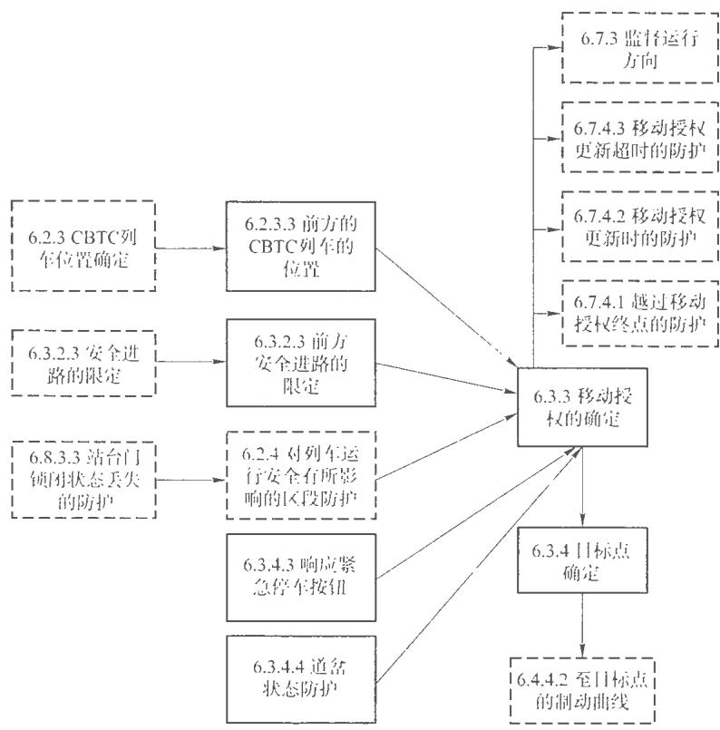  
图5移动保护的限定和目标点测定

实线框——移动授权确定的具体条件；虚线框—移动授权保护的限定和失效防护

# 6.3.2确定移动防护的潜在限制

# 6.3.2.1功能描述

此功能用于确定CBTC列车前方移动授权的限制，表18和表19规定了列车位置用途的内容。

# 6.3.2.2CBTC列车前方位置

对于每辆CBTC列车，应确定列车前方的CBTC列车位置，见表18。

表18CBTC列车前方位置  

<table><tr><td rowspan=1 colspan=1>功能分配</td><td rowspan=1 colspan=1>输    人</td><td rowspan=1 colspan=1>实现</td><td rowspan=1 colspan=1>输出</td></tr><tr><td rowspan=1 colspan=1>ATS</td><td rowspan=1 colspan=1></td><td rowspan=1 colspan=1></td><td rowspan=1 colspan=1></td></tr><tr><td rowspan=1 colspan=1>CBTC 轨旁</td><td rowspan=1 colspan=1></td><td rowspan=1 colspan=1>X</td><td rowspan=1 colspan=1>X</td></tr><tr><td rowspan=1 colspan=1>CBTC 车载</td><td rowspan=1 colspan=1>X</td><td rowspan=1 colspan=1></td><td rowspan=1 colspan=1>X</td></tr></table>

# 6.3.2.3前方安全进路限制

对于每辆CBTC列年，系统应确定列车的安全进路位置，见表19。

表19前方安全进路限制  

<table><tr><td rowspan=1 colspan=1>功能分配</td><td rowspan=1 colspan=1>输</td><td rowspan=1 colspan=1>现</td><td rowspan=1 colspan=1>输   山</td></tr><tr><td rowspan=1 colspan=1>ATS</td><td rowspan=1 colspan=1></td><td rowspan=1 colspan=1></td><td rowspan=1 colspan=1></td></tr><tr><td rowspan=1 colspan=1>CBTC轨旁</td><td rowspan=1 colspan=1>X</td><td rowspan=1 colspan=1></td><td rowspan=1 colspan=1>X</td></tr><tr><td rowspan=1 colspan=1>CBTC车载</td><td rowspan=1 colspan=1></td><td rowspan=1 colspan=1></td><td rowspan=1 colspan=1>X</td></tr><tr><td rowspan=1 colspan=1>CI</td><td rowspan=1 colspan=1></td><td rowspan=1 colspan=1>体</td><td rowspan=1 colspan=1></td></tr></table>

# 6.3.3移动授权的确定

# 6.3.3.1概述

# 轨道

此功能确定移动授权。表20规定了移动授权的内容，

# 6.3.3.2移动授权的确定

为对列车进行合适的移动防护限制，CBTC系统应估算最大移动授权限制位置，见表20。

表20移动授权的确定  

<table><tr><td rowspan=1 colspan=1>功能分配</td><td rowspan=1 colspan=1>输人</td><td rowspan=1 colspan=1>实现</td><td rowspan=1 colspan=1>输出</td></tr><tr><td rowspan=1 colspan=1>ATS</td><td rowspan=1 colspan=1></td><td rowspan=1 colspan=1></td><td rowspan=1 colspan=1>X</td></tr><tr><td rowspan=1 colspan=1>CBTC轨旁</td><td rowspan=1 colspan=1>X</td><td rowspan=1 colspan=1>X</td><td rowspan=1 colspan=1>X</td></tr><tr><td rowspan=1 colspan=1>CBTC 车载</td><td rowspan=1 colspan=1></td><td rowspan=1 colspan=1>X</td><td rowspan=1 colspan=1>X</td></tr><tr><td rowspan=1 colspan=1>CI</td><td rowspan=1 colspan=1>X</td><td rowspan=1 colspan=1></td><td rowspan=1 colspan=1></td></tr></table>

# 6.3.4目标点确定

6.3.4.1概述

此功能确定移动防护限制的目标点。表21\~表24规定了目标点的内容。

# 6.3.4.2目标点确定

为了确保列车不超过移动授权，CBTC系统应确定一个日标点，见表21。

表21目标点确定  

<table><tr><td rowspan=1 colspan=1>功能分配</td><td rowspan=1 colspan=1>输入</td><td rowspan=1 colspan=1>实现</td><td rowspan=1 colspan=1>输出</td></tr><tr><td rowspan=1 colspan=1>ATS</td><td rowspan=1 colspan=1></td><td rowspan=1 colspan=1></td><td rowspan=1 colspan=1></td></tr><tr><td rowspan=1 colspan=1>CBTC 轨旁</td><td rowspan=1 colspan=1>X</td><td rowspan=1 colspan=1>X</td><td rowspan=1 colspan=1></td></tr><tr><td rowspan=1 colspan=1>CBTC 车载</td><td rowspan=1 colspan=1>X</td><td rowspan=1 colspan=1>X</td><td rowspan=1 colspan=1>X</td></tr><tr><td rowspan=1 colspan=1>CI</td><td rowspan=1 colspan=1>X</td><td rowspan=1 colspan=1></td><td rowspan=1 colspan=1></td></tr></table>

# 6.3.4.3响应紧急停车按钮的按下

当ATP轨旁设备接收到站台紧急停车按钮被按下的信息时，应通过车地通信设备向列车发送相应的列车控制命令信息，见表22。

表22响应紧急停车按钮的按下  

<table><tr><td rowspan=1 colspan=1>功能分配</td><td rowspan=1 colspan=1>输</td><td rowspan=1 colspan=1>实现</td><td rowspan=1 colspan=1>山</td></tr><tr><td rowspan=1 colspan=1>ATS</td><td rowspan=1 colspan=1></td><td rowspan=1 colspan=1></td><td rowspan=1 colspan=1>X</td></tr><tr><td rowspan=1 colspan=1>CBTC 轨旁</td><td rowspan=1 colspan=1></td><td rowspan=1 colspan=1>X</td><td rowspan=1 colspan=1></td></tr><tr><td rowspan=1 colspan=1>CBTC车载</td><td rowspan=1 colspan=1></td><td rowspan=1 colspan=1>X</td><td rowspan=1 colspan=1>X</td></tr><tr><td rowspan=1 colspan=1>CI</td><td rowspan=1 colspan=1>X</td><td rowspan=1 colspan=1></td><td rowspan=1 colspan=1></td></tr></table>

# 6.3.4.4道岔状态防护

CBTC系统应控制区域内道岔状态并进行防护。当道岔状态丢失时，移动授权回撤至道岔区域的边界位置；当列车已驶入丢失状态的道岔

区域时，列车应实施紧急制动，见表23。

表23道岔状态保护  

<table><tr><td rowspan=1 colspan=1>功能分配</td><td rowspan=1 colspan=1>输前入</td><td rowspan=1 colspan=1>实现</td><td rowspan=1 colspan=1>输出</td></tr><tr><td rowspan=1 colspan=1>ATS</td><td rowspan=1 colspan=1></td><td rowspan=1 colspan=1></td><td rowspan=1 colspan=1></td></tr><tr><td rowspan=1 colspan=1>CBTC 轨旁</td><td rowspan=1 colspan=1></td><td rowspan=1 colspan=1>X</td><td rowspan=1 colspan=1></td></tr><tr><td rowspan=1 colspan=1>CBTC车载</td><td rowspan=1 colspan=1></td><td rowspan=1 colspan=1></td><td rowspan=1 colspan=1>X</td></tr><tr><td rowspan=1 colspan=1>C1</td><td rowspan=1 colspan=1>X</td><td rowspan=1 colspan=1></td><td rowspan=1 colspan=1></td></tr></table>

# 6.3.4.5 ZC切换

两条连续式列车控制级别线路间应设置移交边界和移交重叠区。

列车进人移交重叠区后，车载ATP设备应同时与移交、接管线路的轨旁ATP设备建立通信，并根据列车是否越过移交边界选择采用移交/接管线路的轨旁ATP设备发送的MA；移交、接管线路的轨旁ATP设备间应互传线路状态、列车位置等信息，并向车载ATP设备发送MA信息，见表24。

表24ZC切换  

<table><tr><td rowspan=1 colspan=1>功能分配</td><td rowspan=1 colspan=1>输前人</td><td rowspan=1 colspan=1>实现</td><td rowspan=1 colspan=1>输出</td></tr><tr><td rowspan=1 colspan=1>ATS</td><td rowspan=1 colspan=1>X</td><td rowspan=1 colspan=1></td><td rowspan=1 colspan=1></td></tr><tr><td rowspan=1 colspan=1>CBTC 轨旁</td><td rowspan=1 colspan=1></td><td rowspan=1 colspan=1>X</td><td rowspan=1 colspan=1></td></tr><tr><td rowspan=1 colspan=1>CBTC车载</td><td rowspan=1 colspan=1></td><td rowspan=1 colspan=1>X</td><td rowspan=1 colspan=1>X</td></tr><tr><td rowspan=1 colspan=1>CI</td><td rowspan=1 colspan=1>X</td><td rowspan=1 colspan=1></td><td rowspan=1 colspan=1></td></tr></table>

# 6.3.5故障管理

# 6.3.5.1概述

本功能明确ATP故障管理的要求。表25规定了故障管理的内容。

# 6.3.5.2故障管理

列车的非预期移动、ATP轨旁设备故障、车载设备故障、超过系统允

许范围的年地通信中断等均应给出报警提示，与行车安全相关的故障均应产生紧急制动，见表25

表25故障管理  

<table><tr><td rowspan=1 colspan=1>功能分配</td><td rowspan=1 colspan=1>输人</td><td rowspan=1 colspan=1>实现</td><td rowspan=1 colspan=1>输出</td></tr><tr><td rowspan=1 colspan=1>ATS</td><td rowspan=1 colspan=1></td><td rowspan=1 colspan=1></td><td rowspan=1 colspan=1>X</td></tr><tr><td rowspan=1 colspan=1>CBTC 轨劳</td><td rowspan=1 colspan=1>X</td><td rowspan=1 colspan=1></td><td rowspan=1 colspan=1></td></tr><tr><td rowspan=1 colspan=1>CBTC车载</td><td rowspan=1 colspan=1>X</td><td rowspan=1 colspan=1>X</td><td rowspan=1 colspan=1>X</td></tr><tr><td rowspan=1 colspan=1>C</td><td rowspan=1 colspan=1></td><td rowspan=1 colspan=1></td><td rowspan=1 colspan=1></td></tr></table>

# 6.4ATP曲线确定

# 6.4.1 ATP曲线计算

该功能用于计算ATP曲线，如图6所示。

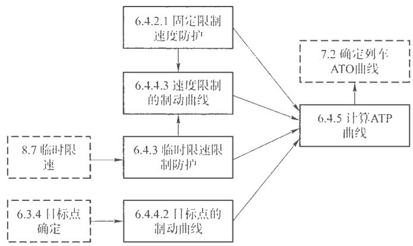  
图6ATP曲线计算

# 6.4.2固定限制速度防护

此功能确定列车的固定限制速度。表26和表27规定了固定限制速度防护。

# 6.4.2.1固定线路限制速度

CBTC应提供固定线路限速的限制防护，见表26。

# 表26固定线路限制速度

<table><tr><td rowspan=1 colspan=1>功能分配</td><td rowspan=1 colspan=1>输 入</td><td rowspan=1 colspan=1>实现</td><td rowspan=1 colspan=1>输   出</td></tr><tr><td rowspan=1 colspan=1>ATS</td><td rowspan=1 colspan=1></td><td rowspan=1 colspan=1></td><td rowspan=1 colspan=1></td></tr><tr><td rowspan=1 colspan=1>CBTC轨旁</td><td rowspan=1 colspan=1>X</td><td rowspan=1 colspan=1>X</td><td rowspan=1 colspan=1></td></tr><tr><td rowspan=1 colspan=1>CBTC 车载</td><td rowspan=1 colspan=1>X</td><td rowspan=1 colspan=1>X</td><td rowspan=1 colspan=1>X</td></tr><tr><td rowspan=1 colspan=1>C1</td><td rowspan=1 colspan=1>X</td><td rowspan=1 colspan=1></td><td rowspan=1 colspan=1></td></tr></table>

# 6.4.2.2 列车构造限制速度nCIATION

系统应提供列车构造速度的防护，见表22

表27列车构造限制速度  

<table><tr><td rowspan=1 colspan=1>功能分配</td><td rowspan=1 colspan=1></td><td rowspan=1 colspan=1></td><td rowspan=1 colspan=2></td><td rowspan=1 colspan=1>输    出</td></tr><tr><td rowspan=1 colspan=1>ATS</td><td rowspan=1 colspan=2></td><td rowspan=1 colspan=1></td><td rowspan=1 colspan=1></td><td rowspan=1 colspan=1></td></tr><tr><td rowspan=1 colspan=1>CBTC 轨旁</td><td rowspan=1 colspan=2>国城</td><td rowspan=1 colspan=2></td><td rowspan=1 colspan=1></td></tr><tr><td rowspan=1 colspan=1>CBTC年载</td><td rowspan=1 colspan=2></td><td rowspan=1 colspan=2></td><td rowspan=1 colspan=1>X</td></tr></table>

# 6.4.3临时限速限制防护

# 轨道

6.4.3.1概述

此功能确定列车的临时限速防护表28规定了临时限速限制防护问题。

# 6.4.3.2临时限制速度限制

CBTC应按照系统设置的临时限速，为列车计算移动授权，对临时限速进行防护，见表28。

表28临时限制速度限制  

<table><tr><td colspan="1" rowspan="1">功能分配</td><td colspan="1" rowspan="1">输入</td><td colspan="1" rowspan="1">实现</td><td colspan="1" rowspan="1">输   出</td></tr><tr><td colspan="1" rowspan="1">ATS</td><td colspan="1" rowspan="1">X</td><td colspan="1" rowspan="1"></td><td colspan="1" rowspan="1"></td></tr><tr><td colspan="1" rowspan="1">CBTC轨旁</td><td colspan="1" rowspan="1">X</td><td colspan="1" rowspan="1">X</td><td colspan="1" rowspan="1">X</td></tr><tr><td colspan="1" rowspan="1">CBTC车载</td><td colspan="1" rowspan="1"></td><td colspan="1" rowspan="1">X</td><td colspan="1" rowspan="1">X</td></tr></table>

# 6.4.4确定制动曲线

6.4.4.1概述

此功能确定制动曲线，以保证列车在指定的目标点停车，表29和表30规定制动曲线的内容，

# 6.4.4.2目标点的制动曲线

表29规定了日标点制动曲线的内容

表29目标点的制动曲线  

<table><tr><td rowspan=1 colspan=1>功能分配</td><td rowspan=1 colspan=1>输</td><td rowspan=1 colspan=1>实现</td><td rowspan=1 colspan=1>输</td></tr><tr><td rowspan=1 colspan=1>ATS</td><td rowspan=1 colspan=1></td><td rowspan=1 colspan=1></td><td rowspan=1 colspan=1></td></tr><tr><td rowspan=1 colspan=1>CBTC轨旁</td><td rowspan=1 colspan=1>X</td><td rowspan=1 colspan=1></td><td rowspan=1 colspan=1></td></tr><tr><td rowspan=1 colspan=1>CBTC 车载</td><td rowspan=1 colspan=1>X</td><td rowspan=1 colspan=1>X</td><td rowspan=1 colspan=1>X</td></tr></table>

# 6.4.4.3防止制动曲线超过速度限制

CBTC应保证制动曲线在超过固定或临时限速之前减速，见表 $3 0 _ { \mathit { \Omega } _ { \mathit { \Omega } } }$

表30防止制动曲线超过速度限制  

<table><tr><td rowspan=1 colspan=1>功能分配</td><td rowspan=1 colspan=1>输</td><td rowspan=1 colspan=1>实现</td><td rowspan=1 colspan=1>出</td></tr><tr><td rowspan=1 colspan=1>ATS</td><td rowspan=1 colspan=1></td><td rowspan=1 colspan=1></td><td rowspan=1 colspan=1></td></tr><tr><td rowspan=1 colspan=1>CBTC 轨旁</td><td rowspan=1 colspan=1>X</td><td rowspan=1 colspan=1></td><td rowspan=1 colspan=1></td></tr><tr><td rowspan=1 colspan=1>CBTC 车载</td><td rowspan=1 colspan=1>X</td><td rowspan=1 colspan=1>X</td><td rowspan=1 colspan=1>X</td></tr></table>

# 6.4.5计算ATP曲线

# 6.4.5.1概述

此功能用于计算完整的ATP曲线。表31规定了ATP曲线的内容。

# 6.4.5.2 ATP曲线

CBTC应为每辆列车计算完整的ATP曲线，见表31。

表31ATP曲线  

<table><tr><td rowspan=1 colspan=1>功能分配</td><td rowspan=1 colspan=2>输入</td><td rowspan=1 colspan=1>实现</td><td rowspan=1 colspan=1>输出</td></tr><tr><td rowspan=1 colspan=1>ATS</td><td rowspan=1 colspan=2></td><td rowspan=1 colspan=1></td><td rowspan=1 colspan=1></td></tr><tr><td rowspan=1 colspan=1>CBTC 轨旁</td><td rowspan=1 colspan=1>X</td><td rowspan=1 colspan=1></td><td rowspan=1 colspan=1></td><td rowspan=1 colspan=1></td></tr><tr><td rowspan=1 colspan=1>CBTC 车载</td><td rowspan=1 colspan=2>X</td><td rowspan=1 colspan=1>X</td><td rowspan=1 colspan=1>X</td></tr></table>

# 6.5确定限制速度

# 6.5.1CBTC列车限制速度

此功能确定对CBTC列车的限制速度。

图7概括了本条目描述的子功能接口和其他条目描述的子功能接口。

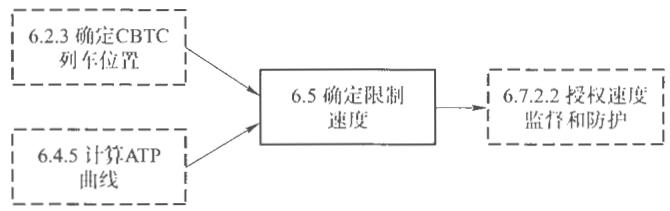  
图7确定限制速度

# 6.5.2确定限制速度

6.5.2.1概述

此功能确定列车当前位置的限制速度。表32规定了限制速度的内容。

# 6.5.2.2确定授权速度

CBTC应基于ATP曲线，确定列车当前位置的限制速度，见表32。

表32确定授权速度  

<table><tr><td rowspan=1 colspan=1>功能分配</td><td rowspan=1 colspan=1>输入</td><td rowspan=1 colspan=1>实现</td><td rowspan=1 colspan=1>输</td></tr><tr><td rowspan=1 colspan=1>ATS</td><td rowspan=1 colspan=1></td><td rowspan=1 colspan=1></td><td rowspan=1 colspan=1></td></tr><tr><td rowspan=1 colspan=1>CBTC 轨旁</td><td rowspan=1 colspan=1></td><td rowspan=1 colspan=1></td><td rowspan=1 colspan=1></td></tr><tr><td rowspan=1 colspan=1>CBTC 车载</td><td rowspan=1 colspan=1>X</td><td rowspan=1 colspan=1>X</td><td rowspan=1 colspan=1>X</td></tr></table>

# 6.6列车实际速度/列车运行方向确定

6.6.1概述

图8概括了本条日描述的子功能接口和其他条目描述的子功能接口。

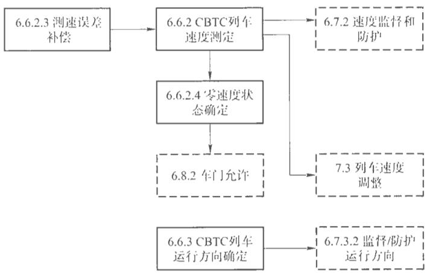  
图8实际列车速度/运行方向确定

# 6.6.2CBTC列车速度测定

# 6.6.2.1概述

此功能确定列车的速度。表 $3 3 \ \sim$ 表35规定了CBTC列车速度测定的内容。

# 6.6.2.2确定CBTC列车实际速度

CBTC应确定每辆CBTC装备列车的实际速度，速度满足分辨率和精度的要求，见表33。

# 表33确定CBTC列车实际速度

<table><tr><td rowspan=1 colspan=1>功能分配</td><td rowspan=1 colspan=1>输入</td><td rowspan=1 colspan=1>实现</td><td rowspan=1 colspan=1>输出</td></tr><tr><td rowspan=1 colspan=1>ATS</td><td rowspan=1 colspan=1></td><td rowspan=1 colspan=1></td><td rowspan=1 colspan=1></td></tr><tr><td rowspan=1 colspan=1>CBTC轨旁</td><td rowspan=1 colspan=1></td><td rowspan=1 colspan=1></td><td rowspan=1 colspan=1></td></tr><tr><td rowspan=1 colspan=1>CBTC车载</td><td rowspan=1 colspan=1>X</td><td rowspan=1 colspan=1>X</td><td rowspan=1 colspan=1>X</td></tr></table>

# 6.6.2.3测速误差补偿

CBTC系统应能够补偿测速误差产生的影响，并对测速作出合适的补偿，见表34。

# 表34测速误差补偿

<table><tr><td rowspan=1 colspan=1>功能分配</td><td rowspan=1 colspan=2></td><td rowspan=1 colspan=2></td><td rowspan=1 colspan=1>输    山</td></tr><tr><td rowspan=1 colspan=1>ATS</td><td rowspan=1 colspan=2></td><td rowspan=1 colspan=2></td><td rowspan=1 colspan=1></td></tr><tr><td rowspan=1 colspan=1>CBTC 轨务</td><td rowspan=1 colspan=2></td><td rowspan=1 colspan=2></td><td rowspan=1 colspan=1></td></tr><tr><td rowspan=1 colspan=1>CBTC 车载</td><td rowspan=1 colspan=1></td><td rowspan=1 colspan=1></td><td rowspan=1 colspan=1></td><td rowspan=1 colspan=1>S</td><td rowspan=1 colspan=1>X</td></tr></table>

# 6.6.2.4零速状态确定

CBTC应确定零速度状态，见表35。

通协会

表3速状态确定  

<table><tr><td rowspan=1 colspan=1>功能分配</td><td rowspan=1 colspan=1>输</td><td rowspan=1 colspan=1>实现</td><td rowspan=1 colspan=1>输   出</td></tr><tr><td rowspan=1 colspan=1>ATS</td><td rowspan=1 colspan=1></td><td rowspan=1 colspan=1></td><td rowspan=1 colspan=1></td></tr><tr><td rowspan=1 colspan=1>CBTC 轨旁</td><td rowspan=1 colspan=1></td><td rowspan=1 colspan=1></td><td rowspan=1 colspan=1>X</td></tr><tr><td rowspan=1 colspan=1>CBTC车载</td><td rowspan=1 colspan=1>X</td><td rowspan=1 colspan=1>X</td><td rowspan=1 colspan=1>X</td></tr><tr><td rowspan=1 colspan=1>CI</td><td rowspan=1 colspan=1></td><td rowspan=1 colspan=1></td><td rowspan=1 colspan=1>X</td></tr></table>

# 6.6.3CBTC列车运行方向确定

6.6.3.1概述

此功能确定列车实际运行方向。表36规定了CBTC列车运行方向。

# 6.6.3.2确定CBTC列车运行方向

CBTC系统应确定每辆CBTC列车的实际运行方向，见表36。

# 表36确定CBTC列车运行方向

<table><tr><td rowspan=1 colspan=1>功能分配</td><td rowspan=1 colspan=1>输入</td><td rowspan=1 colspan=1>实现</td><td rowspan=1 colspan=1>输出</td></tr><tr><td rowspan=1 colspan=1>ATS</td><td rowspan=1 colspan=1></td><td rowspan=1 colspan=1></td><td rowspan=1 colspan=1></td></tr><tr><td rowspan=1 colspan=1>CBTC轨旁</td><td rowspan=1 colspan=1></td><td rowspan=1 colspan=1></td><td rowspan=1 colspan=1>X</td></tr><tr><td rowspan=1 colspan=1>CBTC车载</td><td rowspan=1 colspan=1>X</td><td rowspan=1 colspan=1>X</td><td rowspan=1 colspan=1>X</td></tr><tr><td rowspan=1 colspan=1>CI</td><td rowspan=1 colspan=1></td><td rowspan=1 colspan=1></td><td rowspan=1 colspan=1></td></tr></table>

# 6.7监督/强制允许速度和允许运行方向

# 6.7.1功能描述

该功能是监督和强制执行允许速度和允许运行方向。

# 6.7.2速度监督和防护

6.7.2.1概述

此功能监督和防护列车速度，如图9所示。表37和表38规定了速度监督和防护的内容。

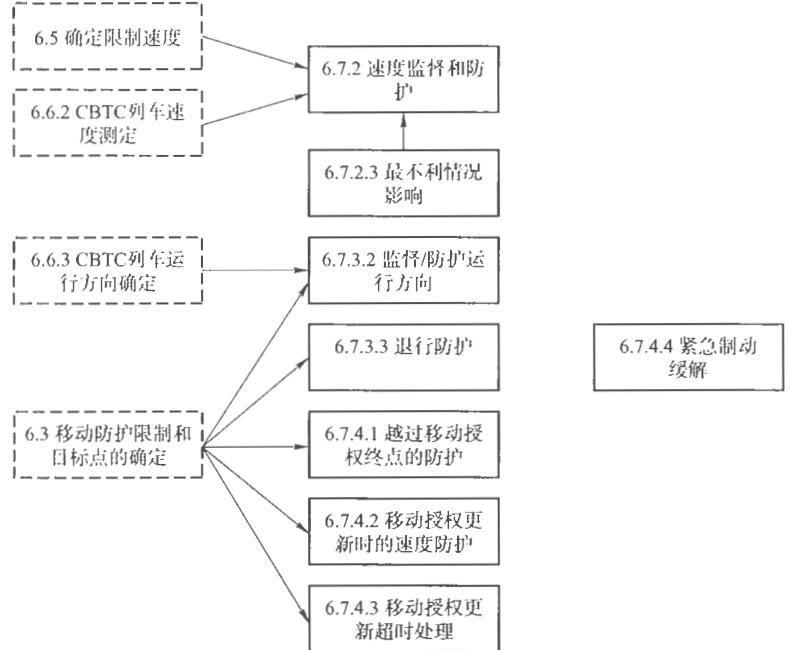  
图9监督/施加授权速度和运行方向

# 6.7.2.2速度监督和防护

如果列车实际速度超过限制速度，CBTC应实施紧急制动，见表37。

表37速度监督和防护  

<table><tr><td rowspan=1 colspan=1>功能分配</td><td rowspan=1 colspan=1>输入</td><td rowspan=1 colspan=1>实现</td><td rowspan=1 colspan=1>输出</td></tr><tr><td rowspan=1 colspan=1>ATS</td><td rowspan=1 colspan=1></td><td rowspan=1 colspan=1></td><td rowspan=1 colspan=1>X</td></tr><tr><td rowspan=1 colspan=1>CBTC 轨券</td><td rowspan=1 colspan=1></td><td rowspan=1 colspan=1></td><td rowspan=1 colspan=1></td></tr><tr><td rowspan=1 colspan=1>CBTC 车载</td><td rowspan=1 colspan=1>X</td><td rowspan=1 colspan=1>X</td><td rowspan=1 colspan=1>X</td></tr></table>

# 6.7.2.3最不利情况下的影响

CBTC的速度监督/执行应包括对最差情况下系统偏差、反应次数和反应时间的补偿，见表38。

表38最不利情况下的影响  

<table><tr><td rowspan=1 colspan=1>功能分配</td><td rowspan=1 colspan=1>输</td><td rowspan=1 colspan=1>实现</td><td rowspan=1 colspan=1>输</td></tr><tr><td rowspan=1 colspan=1>ATS</td><td rowspan=1 colspan=1></td><td rowspan=1 colspan=1></td><td rowspan=1 colspan=1></td></tr><tr><td rowspan=1 colspan=1>CBTC 轨旁</td><td rowspan=1 colspan=1></td><td rowspan=1 colspan=1></td><td rowspan=1 colspan=1></td></tr><tr><td rowspan=1 colspan=1>CBTC 车载</td><td rowspan=1 colspan=1>X</td><td rowspan=1 colspan=1>X</td><td rowspan=1 colspan=1>X</td></tr></table>

# 6.7.3运行方向监督和防护

# 6.7.3.1功能描述

此功能监督和防护列车运行方向。表39和表40规定了运行方向监督和防护的内容。

# 6.7.3.2监督/防护运行方向

如果列车实际运行方向与授权的列车运行方向不一致，CBTC 应实施紧急制动，见表39。

表39监督/防护运行方向  

<table><tr><td colspan="1" rowspan="1">功能分配</td><td colspan="1" rowspan="1">输 入</td><td colspan="1" rowspan="1">实现</td><td colspan="1" rowspan="1">输出</td></tr><tr><td colspan="1" rowspan="1">ATS</td><td colspan="1" rowspan="1"></td><td colspan="1" rowspan="1"></td><td colspan="1" rowspan="1">X</td></tr><tr><td colspan="1" rowspan="1">CBTC 轨旁</td><td colspan="1" rowspan="1">X</td><td colspan="1" rowspan="1"></td><td colspan="1" rowspan="1"></td></tr><tr><td colspan="1" rowspan="1">CBTC车载</td><td colspan="1" rowspan="1">X</td><td colspan="1" rowspan="1">X</td><td colspan="1" rowspan="1">X</td></tr></table>

# 6.7.3.3退行防护

ATP车载设备应具有退行防护功能。当退行距离和退行速度超过允许值时，系统应立即采取紧急制动。在列车退行过程中，系统应对追踪运行的列车提供安全间隔防护，退行距离超过限制，车载设备应丢失定位。见表40

表40退行防护  

<table><tr><td rowspan=1 colspan=1>功能分配</td><td rowspan=1 colspan=1>输  人</td><td rowspan=1 colspan=1>实现</td><td rowspan=1 colspan=1>输   出</td></tr><tr><td rowspan=1 colspan=1>ATS</td><td rowspan=1 colspan=1></td><td rowspan=1 colspan=1></td><td rowspan=1 colspan=1></td></tr><tr><td rowspan=1 colspan=1>CBTC 轨旁</td><td rowspan=1 colspan=1></td><td rowspan=1 colspan=1>X</td><td rowspan=1 colspan=1></td></tr><tr><td rowspan=1 colspan=1>CBTC 车载</td><td rowspan=1 colspan=1>X</td><td rowspan=1 colspan=1>X</td><td rowspan=1 colspan=1>X</td></tr></table>

# 6.7.4故障管理

# 6.7.4.1越过移动授权终点的响应

系统应确保不会越过移动授权终点，表 $4 1 ~ \sim$ 表44规定了故障管理的内容：

表41越过移动授权终点的响应  

<table><tr><td rowspan=1 colspan=1>功能分配</td><td rowspan=1 colspan=1>输  入</td><td rowspan=1 colspan=1>实现</td><td rowspan=1 colspan=1>输出</td></tr><tr><td rowspan=1 colspan=1>ATS</td><td rowspan=1 colspan=1></td><td rowspan=1 colspan=1></td><td rowspan=1 colspan=1>X</td></tr><tr><td rowspan=1 colspan=1>CBTC轨旁</td><td rowspan=1 colspan=1>X</td><td rowspan=1 colspan=1></td><td rowspan=1 colspan=1></td></tr><tr><td rowspan=1 colspan=1>CBTC 车载</td><td rowspan=1 colspan=1></td><td rowspan=1 colspan=1>X</td><td rowspan=1 colspan=1>X</td></tr></table>

# 6.7.4.2移动授权更新时的速度防护

移动授权更新时，如果列车的实际运行速度超过移动授权更新后的

紧急制动触发速度，系统应实施紧急制动，见表42。

表42移动授权更新的速度防护  

<table><tr><td rowspan=1 colspan=1>功能分配</td><td rowspan=1 colspan=1>输 入</td><td rowspan=1 colspan=1>现</td><td rowspan=1 colspan=1>输</td></tr><tr><td rowspan=1 colspan=1>ATS</td><td rowspan=1 colspan=1></td><td rowspan=1 colspan=1></td><td rowspan=1 colspan=1>X</td></tr><tr><td rowspan=1 colspan=1>CBTC 轨旁</td><td rowspan=1 colspan=1>X</td><td rowspan=1 colspan=1></td><td rowspan=1 colspan=1></td></tr><tr><td rowspan=1 colspan=1>CBTC 车载</td><td rowspan=1 colspan=1></td><td rowspan=1 colspan=1>X</td><td rowspan=1 colspan=1>X</td></tr></table>

# 6.7.4.3移动授权更新超时的防护

移动授权更新超时，系统应实施紧急制动，见表43。

# 表43移动授权审新超时的防护

<table><tr><td rowspan=1 colspan=1>功能分配</td><td rowspan=1 colspan=1>入</td><td rowspan=1 colspan=1>实</td><td rowspan=1 colspan=1>输    出</td></tr><tr><td rowspan=1 colspan=1>ATS</td><td rowspan=1 colspan=1></td><td rowspan=1 colspan=1></td><td rowspan=1 colspan=1>X</td></tr><tr><td rowspan=1 colspan=1>CBTC 轨旁</td><td rowspan=1 colspan=1></td><td rowspan=1 colspan=1></td><td rowspan=1 colspan=1></td></tr><tr><td rowspan=1 colspan=1>CBTC车载</td><td rowspan=1 colspan=1></td><td rowspan=1 colspan=1></td><td rowspan=1 colspan=1>X</td></tr></table>

# 6.7.4.4紧急制动缓解

在保证安全的条件下系统可解包施加的紧急制动，见表44。

表44紧急制动缓解  

<table><tr><td rowspan=1 colspan=1>功能分配</td><td rowspan=1 colspan=1>输 入</td><td rowspan=1 colspan=1>实现</td><td rowspan=1 colspan=1>出</td></tr><tr><td rowspan=1 colspan=1>ATS</td><td rowspan=1 colspan=1></td><td rowspan=1 colspan=1></td><td rowspan=1 colspan=1>X</td></tr><tr><td rowspan=1 colspan=1>CBTC 轨券</td><td rowspan=1 colspan=1></td><td rowspan=1 colspan=1></td><td rowspan=1 colspan=1></td></tr><tr><td rowspan=1 colspan=1>CBTC 车载</td><td rowspan=1 colspan=1>X</td><td rowspan=1 colspan=1>X</td><td rowspan=1 colspan=1>X</td></tr></table>

# 6.8车门/站台门控制

# 6.8.1功能描述

此功能实现车门/站台门控制，如图10所示。

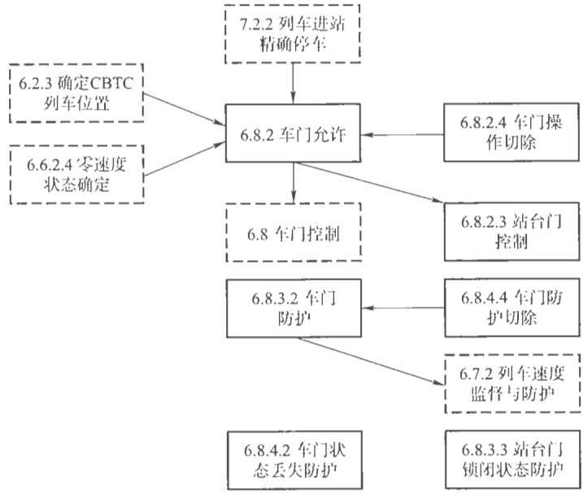  
图10车门/站台门控制

6.8.2车门允许

6.8.2.1概述

表 $4 5 \sim$ 表47规定了车门允许的内容。

# 6.8.2.2车门允许

CBTC在开车门之前，应满足下列条件：

a）列车“正确对齐”在一个指定的停止点，停止点偏差在允许范围内；  
b) 开门侧与站台一致；  
c）列车零速；  
d) 保持制动已施加。

列车在车站规定的位置停准停稳后，车载ATP应允许打开对应侧车门及站台门或双侧车门及站台门，并可选择通过自开自关、自开人关、人开人关三种方式，自动或者人工打开车门：在AM驾驶模式下，可提供三种开门方式，CM驾驶模式下，仅能实现人工开门。见表45。

列车在车站停车超出停车窗范围，车载设备应不允许车门和站台门打开，司机可在车载设备防护条件下前进或后退，直至停车对位。

# 表45车门允许

<table><tr><td rowspan=1 colspan=1>功能分配</td><td rowspan=1 colspan=1>输  人</td><td rowspan=1 colspan=1>现</td><td rowspan=1 colspan=1>输   出</td></tr><tr><td rowspan=1 colspan=1>ATS</td><td rowspan=1 colspan=1></td><td rowspan=1 colspan=1></td><td rowspan=1 colspan=1></td></tr><tr><td rowspan=1 colspan=1>CBTC轨旁</td><td rowspan=1 colspan=1></td><td rowspan=1 colspan=1></td><td rowspan=1 colspan=1></td></tr><tr><td rowspan=1 colspan=1>CBTC车载</td><td rowspan=1 colspan=1>X</td><td rowspan=1 colspan=1>X</td><td rowspan=1 colspan=1>X</td></tr></table>

# 6.8.2.3站台门控制

CBTC应打开站台门之前，应检查下列条件满足：

a)列车“正确对齐”在一个指定的停止点，停止点偏差在允许范围内；

b)站台门侧与车门侧一致；

c)列车零速；

d)保持制动已施加。

控制内容见表46。

表46站台门控制  

<table><tr><td rowspan=1 colspan=1>功能分配</td><td rowspan=1 colspan=1>输入</td><td rowspan=1 colspan=1>实现</td><td rowspan=1 colspan=1>输出</td></tr><tr><td rowspan=1 colspan=1>ATS</td><td rowspan=1 colspan=1></td><td rowspan=1 colspan=1></td><td rowspan=1 colspan=1></td></tr><tr><td rowspan=1 colspan=1>CBTC轨旁</td><td rowspan=1 colspan=1></td><td rowspan=1 colspan=1></td><td rowspan=1 colspan=1>X</td></tr><tr><td rowspan=1 colspan=1>CBTC 车载</td><td rowspan=1 colspan=1>X</td><td rowspan=1 colspan=1>X</td><td rowspan=1 colspan=1>X</td></tr><tr><td rowspan=1 colspan=1>CI</td><td rowspan=1 colspan=1></td><td rowspan=1 colspan=1></td><td rowspan=1 colspan=1>X</td></tr></table>

# 6.8.2.4车门操作切除

车辆可以提供单个车门切除功能（全自动下），切除后的车门不响应

列车开门命令，见表47。

表47车门操作切除  

<table><tr><td rowspan=1 colspan=1>功能分配</td><td rowspan=1 colspan=1>输入</td><td rowspan=1 colspan=1>实现</td><td rowspan=1 colspan=1>出</td></tr><tr><td rowspan=1 colspan=1>ATS</td><td rowspan=1 colspan=1></td><td rowspan=1 colspan=1></td><td rowspan=1 colspan=1></td></tr><tr><td rowspan=1 colspan=1>CBTC 轨旁</td><td rowspan=1 colspan=1></td><td rowspan=1 colspan=1></td><td rowspan=1 colspan=1></td></tr><tr><td rowspan=1 colspan=1>CBTC 车载</td><td rowspan=1 colspan=1>X</td><td rowspan=1 colspan=1>X</td><td rowspan=1 colspan=1>X</td></tr><tr><td rowspan=1 colspan=1>CI</td><td rowspan=1 colspan=1></td><td rowspan=1 colspan=1></td><td rowspan=1 colspan=1></td></tr><tr><td rowspan=1 colspan=1>外部系统(车辆)</td><td rowspan=1 colspan=1>X</td><td rowspan=1 colspan=1></td><td rowspan=1 colspan=1></td></tr></table>

# 6.8.3车门、站台门防护

6.8.3.1概述

表48和表49规定了车门和站台门防护的内容。

# 6.8.3.2车门防护

仅在车门处于“关闭且锁闭”状态时，系统方允许列车移动，见表48。

# 表48车门防护

<table><tr><td rowspan=1 colspan=1>功能分配</td><td rowspan=1 colspan=1>输入</td><td rowspan=1 colspan=1>实现</td><td rowspan=1 colspan=1>输出</td></tr><tr><td rowspan=1 colspan=1>ATS</td><td rowspan=1 colspan=1></td><td rowspan=1 colspan=1></td><td rowspan=1 colspan=1></td></tr><tr><td rowspan=1 colspan=1>CBTC轨旁</td><td rowspan=1 colspan=1></td><td rowspan=1 colspan=1></td><td rowspan=1 colspan=1></td></tr><tr><td rowspan=1 colspan=1>CBTC 车载</td><td rowspan=1 colspan=1>X</td><td rowspan=1 colspan=1>X</td><td rowspan=1 colspan=1>X</td></tr><tr><td rowspan=1 colspan=1>CI</td><td rowspan=1 colspan=1></td><td rowspan=1 colspan=1></td><td rowspan=1 colspan=1></td></tr></table>

# 6.8.3.3站台门锁闭状态防护

仅在站台门处于“关闭且锁闭”状态时，系统方允许列车移动CBTC等级下，当站台门锁闭状态丢失时，还未进站的列车应根据接收到的移动授权，控制列车在站台前停车；已进站未停稳以及正在出站的列车应立即紧急制动；已完全出站的列车不受影响，见表49。

表49车门防护  

<table><tr><td rowspan=1 colspan=1>功能分配</td><td rowspan=1 colspan=1>输入</td><td rowspan=1 colspan=1>实现</td><td rowspan=1 colspan=1>输出</td></tr><tr><td rowspan=1 colspan=1>ATS</td><td rowspan=1 colspan=1></td><td rowspan=1 colspan=1></td><td rowspan=1 colspan=1></td></tr><tr><td rowspan=1 colspan=1>CBTC 轨旁</td><td rowspan=1 colspan=1>X</td><td rowspan=1 colspan=1>X</td><td rowspan=1 colspan=1></td></tr><tr><td rowspan=1 colspan=1>CBTC 车载</td><td rowspan=1 colspan=1></td><td rowspan=1 colspan=1>X</td><td rowspan=1 colspan=1>X</td></tr><tr><td rowspan=1 colspan=1>CI</td><td rowspan=1 colspan=1>X</td><td rowspan=1 colspan=1></td><td rowspan=1 colspan=1></td></tr></table>

# 6.8.4故障管理

6.8.4.1概述

表 $5 0 \sim$ 表52规定了车站故障管理的内容。

# 6.8.4.2车门状态丢失防护

列车在运行过程车载设备应实时监督列车车门状态，当检测到车门不为关门且锁闭状态时系统宜采取下列措施之

a）切除牵引但不实施制动：

b) 不切除牵引也实施制动，列车运行下座车站；

c）实施紧急制动

d）实施全常用制动

# 轨道

丢失防护内容见表50。

表50车门状态丢失防护  

<table><tr><td rowspan=1 colspan=1>功能分配</td><td rowspan=1 colspan=1>输前入</td><td rowspan=1 colspan=1>实现</td><td rowspan=1 colspan=1>输   出</td></tr><tr><td rowspan=1 colspan=1>ATS</td><td rowspan=1 colspan=1></td><td rowspan=1 colspan=1></td><td rowspan=1 colspan=1></td></tr><tr><td rowspan=1 colspan=1>CBTC 轨旁</td><td rowspan=1 colspan=1></td><td rowspan=1 colspan=1></td><td rowspan=1 colspan=1></td></tr><tr><td rowspan=1 colspan=1>CBTC 车载</td><td rowspan=1 colspan=1>X</td><td rowspan=1 colspan=1>X</td><td rowspan=1 colspan=1>X</td></tr></table>

# 6.8.4.3站台门状态丢失的响应

当列车靠近车站时或者列车已在站台区域时，站台门关闭状态丢失，CBTC系统采取保证列车安全的措施，见表51。

表51站台门状态丢失的响应  

<table><tr><td rowspan=1 colspan=1>功能分配</td><td rowspan=1 colspan=1>输入</td><td rowspan=1 colspan=1>实现</td><td rowspan=1 colspan=1>输出</td></tr><tr><td rowspan=1 colspan=1>ATS</td><td rowspan=1 colspan=1></td><td rowspan=1 colspan=1></td><td rowspan=1 colspan=1></td></tr><tr><td rowspan=1 colspan=1>CBTC轨旁</td><td rowspan=1 colspan=1>X</td><td rowspan=1 colspan=1>X</td><td rowspan=1 colspan=1></td></tr><tr><td rowspan=1 colspan=1>CBTC车载</td><td rowspan=1 colspan=1></td><td rowspan=1 colspan=1>X</td><td rowspan=1 colspan=1>X</td></tr><tr><td rowspan=1 colspan=1>CI</td><td rowspan=1 colspan=1>X</td><td rowspan=1 colspan=1></td><td rowspan=1 colspan=1></td></tr></table>

# 6.8.4.4车门防护切除

系统在车门故障时，可提供车门切除功能，此时ATP不再对车门状态进行防护，见表52。

表52车门防护切除  

<table><tr><td rowspan=1 colspan=1>功能分配</td><td rowspan=1 colspan=1>输 人</td><td rowspan=1 colspan=1>实现</td><td rowspan=1 colspan=1>出</td></tr><tr><td rowspan=1 colspan=1>ATS</td><td rowspan=1 colspan=1></td><td rowspan=1 colspan=1></td><td rowspan=1 colspan=1>X</td></tr><tr><td rowspan=1 colspan=1>CBTC 轨旁</td><td rowspan=1 colspan=1></td><td rowspan=1 colspan=1></td><td rowspan=1 colspan=1></td></tr><tr><td rowspan=1 colspan=1>CBTC 车载</td><td rowspan=1 colspan=1>X</td><td rowspan=1 colspan=1>X</td><td rowspan=1 colspan=1>X</td></tr><tr><td rowspan=1 colspan=1>CI</td><td rowspan=1 colspan=1></td><td rowspan=1 colspan=1></td><td rowspan=1 colspan=1></td></tr></table>

# 6.9列车折返

列车折返方式应包括ATO无人白动折返模式、ATO有人白动折返模式、ATP监督下的人工折返模式。表53规定了列车折返方式的内容。

# 表53列车折返方式

<table><tr><td rowspan=1 colspan=1>功能分配</td><td rowspan=1 colspan=1>输入</td><td rowspan=1 colspan=1>实现</td><td rowspan=1 colspan=1>输俞出</td></tr><tr><td rowspan=1 colspan=1>ATS</td><td rowspan=1 colspan=1>X</td><td rowspan=1 colspan=1></td><td rowspan=1 colspan=1></td></tr><tr><td rowspan=1 colspan=1>CBTC轨旁</td><td rowspan=1 colspan=1>X</td><td rowspan=1 colspan=1></td><td rowspan=1 colspan=1></td></tr><tr><td rowspan=1 colspan=1>CBTC车载</td><td rowspan=1 colspan=1>X</td><td rowspan=1 colspan=1>X</td><td rowspan=1 colspan=1>X</td></tr><tr><td rowspan=1 colspan=1>CI</td><td rowspan=1 colspan=1>X</td><td rowspan=1 colspan=1></td><td rowspan=1 colspan=1></td></tr></table>

# 6.10车载ATP用户界面

6.10.1CBTC车载ATP显示数据

表54规定了车载ATP显示数据界面的内容，CBTC车载显示屏幕显示ATP数据应包括：

a) 列车运行模式；  
b) CBTC运行状态；  
c) 当前列车速度；  
d) 当前最大允许CBTC速度；  
e) 超速报警。

表54CBTC车载ATP显示数据  

<table><tr><td rowspan=1 colspan=1>功能分配</td><td rowspan=1 colspan=1>输入</td><td rowspan=1 colspan=1>实现</td><td rowspan=1 colspan=1>输出</td></tr><tr><td rowspan=1 colspan=1>ATS</td><td rowspan=1 colspan=1></td><td rowspan=1 colspan=1></td><td rowspan=1 colspan=1></td></tr><tr><td rowspan=1 colspan=1>CBTC 轨旁</td><td rowspan=1 colspan=1></td><td rowspan=1 colspan=1></td><td rowspan=1 colspan=1></td></tr><tr><td rowspan=1 colspan=1>CBTC车载</td><td rowspan=1 colspan=1>X</td><td rowspan=1 colspan=1>X</td><td rowspan=1 colspan=1>X</td></tr></table>

# 6.10.2CBTC车载ATP输入数据

表55规定了车载ATP输入数据的内容，用户ATP信息输入到CBTC应包括：

a）运行模式选择；  
b）超速报警情况确认。

表55CBTC车载ATP输入数据  

<table><tr><td rowspan=1 colspan=1>功能分配</td><td rowspan=1 colspan=1>输入</td><td rowspan=1 colspan=1>实现</td><td rowspan=1 colspan=1>输出</td></tr><tr><td rowspan=1 colspan=1>ATS</td><td rowspan=1 colspan=1></td><td rowspan=1 colspan=1></td><td rowspan=1 colspan=1></td></tr><tr><td rowspan=1 colspan=1>CBTC轨旁</td><td rowspan=1 colspan=1></td><td rowspan=1 colspan=1></td><td rowspan=1 colspan=1></td></tr><tr><td rowspan=1 colspan=1>CBTC车载</td><td rowspan=1 colspan=1>X</td><td rowspan=1 colspan=1>X</td><td rowspan=1 colspan=1>X</td></tr></table>

# 6.11自诊断、故障报警及数据记录

ATP车载设备具备自诊断、故障报警及列车运行重要数据的记录功能，并可通过离线设备打印。记录的内容包括事件的时间和日期，并保存7天，保存的数据可实现上传，并宜实现自动转存。记录内容包括：设备运行状况、行车里程、控制情况、驾驶模式、速度、列车日检数据。表56规定了自诊断、故障报警及数据记录的内容。

表56自诊断、故障报警及数据记录  

<table><tr><td rowspan=1 colspan=1>功能分配</td><td rowspan=1 colspan=1>输入</td><td rowspan=1 colspan=1>实现</td><td rowspan=1 colspan=1>输出</td></tr><tr><td rowspan=1 colspan=1>ATS</td><td rowspan=1 colspan=1></td><td rowspan=1 colspan=1></td><td rowspan=1 colspan=1>X</td></tr><tr><td rowspan=1 colspan=1>CBTC轨券</td><td rowspan=1 colspan=1></td><td rowspan=1 colspan=1></td><td rowspan=1 colspan=1></td></tr><tr><td rowspan=1 colspan=1>CBTC 车载</td><td rowspan=1 colspan=1>X</td><td rowspan=1 colspan=1>X</td><td rowspan=1 colspan=1></td></tr></table>

# 7ATO功能分配

# 7.1功能描述

ATO主要功能如图11所示。

# 7.2确定ATO曲线

# 7.2.1为启动、停止、调速，确定ATO曲线

CBTC系统应为列车确定ATO曲线ATO子系统在ATP子系统的保护下，根据ATS子系统的命令，实现对列车的自动驾驶、列车在区间运行的自动调整，并可实现列车的节能运行控制ATO子系统可控制列车按运行图规定的区间走行时分行车，自动完成对列车的启动、加速、巡航、惰行、减速和制动的合理控制。表57规定了ATO曲线的内容。

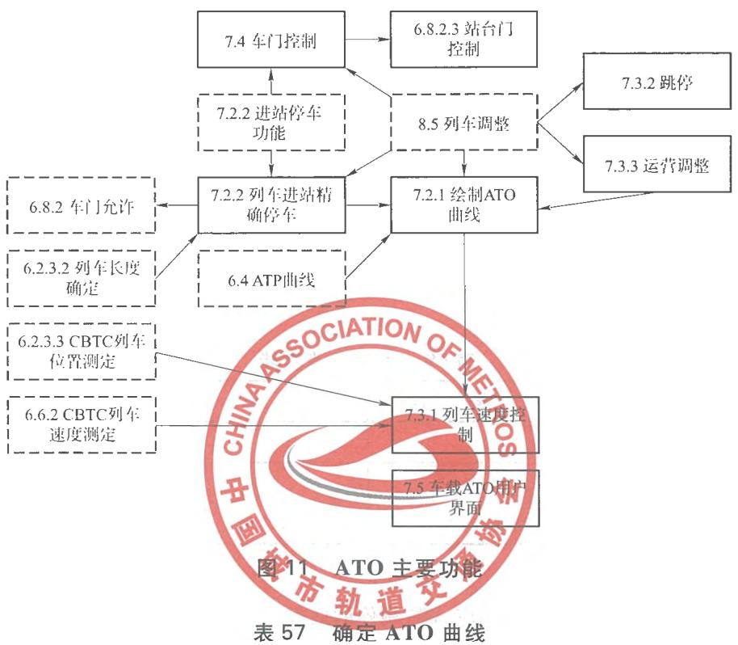

<table><tr><td rowspan=1 colspan=1>功能分配</td><td rowspan=1 colspan=1>输入</td><td rowspan=1 colspan=1>实现</td><td rowspan=1 colspan=1>输   出</td></tr><tr><td rowspan=1 colspan=1>ATS</td><td rowspan=1 colspan=1>X</td><td rowspan=1 colspan=1></td><td rowspan=1 colspan=1></td></tr><tr><td rowspan=1 colspan=1>CBTC 轨旁</td><td rowspan=1 colspan=1></td><td rowspan=1 colspan=1></td><td rowspan=1 colspan=1></td></tr><tr><td rowspan=1 colspan=1>CBTC 车载</td><td rowspan=1 colspan=1>X</td><td rowspan=1 colspan=1>X</td><td rowspan=1 colspan=1>X</td></tr></table>

# 7.2.2列车进站精确停车

ATO子系统应具备列车进站精确停车功能，不同编组的列车可以停靠的不同的停车位置。表58规定了列车进站精确停车的内容。

表58列车进站精确停车  

<table><tr><td rowspan=1 colspan=1>功能分配</td><td rowspan=1 colspan=1>输入</td><td rowspan=1 colspan=1>实现</td><td rowspan=1 colspan=1>输出</td></tr><tr><td rowspan=1 colspan=1>ATS</td><td rowspan=1 colspan=1></td><td rowspan=1 colspan=1></td><td rowspan=1 colspan=1></td></tr><tr><td rowspan=1 colspan=1>CBTC轨旁</td><td rowspan=1 colspan=1></td><td rowspan=1 colspan=1></td><td rowspan=1 colspan=1></td></tr><tr><td rowspan=1 colspan=1>CBTC车载</td><td rowspan=1 colspan=1>X</td><td rowspan=1 colspan=1>X</td><td rowspan=1 colspan=1>X</td></tr></table>

# 7.3列车速度调整

# 7.3.1根据ATO曲线调整列车速度

CBTC系统须根据ATO曲线调整列车速度．表59规定了列车调速的内容。

# 表59列车调速功能

<table><tr><td rowspan=1 colspan=1>功能分配</td><td rowspan=1 colspan=1>输  入</td><td rowspan=1 colspan=1>实现</td><td rowspan=1 colspan=1>输</td></tr><tr><td rowspan=1 colspan=1>ATS</td><td rowspan=1 colspan=1></td><td rowspan=1 colspan=1></td><td rowspan=1 colspan=1></td></tr><tr><td rowspan=1 colspan=1>CBTC 轨劳</td><td rowspan=1 colspan=1></td><td rowspan=1 colspan=1></td><td rowspan=1 colspan=1></td></tr><tr><td rowspan=1 colspan=1>CBTC 车载</td><td rowspan=1 colspan=1>X</td><td rowspan=1 colspan=1>X</td><td rowspan=1 colspan=1>X</td></tr></table>

# 7.3.2跳停

表60规定了ATO响应ATS跳停的内容：

表60ATO响应ATS系统设置的跳停命令  

<table><tr><td rowspan=1 colspan=1>功能分配</td><td rowspan=1 colspan=1>输入</td><td rowspan=1 colspan=1>实现</td><td rowspan=1 colspan=1>输出</td></tr><tr><td rowspan=1 colspan=1>ATS</td><td rowspan=1 colspan=1>X</td><td rowspan=1 colspan=1></td><td rowspan=1 colspan=1>X</td></tr><tr><td rowspan=1 colspan=1>CBTC轨旁</td><td rowspan=1 colspan=1></td><td rowspan=1 colspan=1></td><td rowspan=1 colspan=1></td></tr><tr><td rowspan=1 colspan=1>CBTC车载</td><td rowspan=1 colspan=1>X</td><td rowspan=1 colspan=1>X</td><td rowspan=1 colspan=1>X</td></tr></table>

# 7.3.3运营调整

在AM模式下，ATO子系统可根据ATS的调整指令控制区间走行时分，达到列车运行自动调整的目的。表61规定了列车自动调整的内容。

表61列车运行自动调整功能  

<table><tr><td rowspan=1 colspan=1>功能分配</td><td rowspan=1 colspan=1>输人</td><td rowspan=1 colspan=1>实现</td><td rowspan=1 colspan=1>输   出</td></tr><tr><td rowspan=1 colspan=1>ATS</td><td rowspan=1 colspan=1>X</td><td rowspan=1 colspan=1></td><td rowspan=1 colspan=1>X</td></tr><tr><td rowspan=1 colspan=1>CBTC 轨旁</td><td rowspan=1 colspan=1></td><td rowspan=1 colspan=1></td><td rowspan=1 colspan=1></td></tr><tr><td rowspan=1 colspan=1>CBTC车载</td><td rowspan=1 colspan=1>X</td><td rowspan=1 colspan=1>X</td><td rowspan=1 colspan=1>X</td></tr></table>

# 7.3.4在线列车监控

ATO子系统向ATS子系统发送列车运行信息，以便ATS子系统能对在线列车进行监控，表62规定了在线列乍进行监控的内容：

表62在线列车进行监控  

<table><tr><td rowspan=1 colspan=1>功能分配</td><td rowspan=1 colspan=1>输  人</td><td rowspan=1 colspan=1>实现</td><td rowspan=1 colspan=1>输出</td></tr><tr><td rowspan=1 colspan=1>ATS</td><td rowspan=1 colspan=1></td><td rowspan=1 colspan=1></td><td rowspan=1 colspan=1>X</td></tr><tr><td rowspan=1 colspan=1>CBTC轨旁</td><td rowspan=1 colspan=1></td><td rowspan=1 colspan=1>X</td><td rowspan=1 colspan=1>X</td></tr><tr><td rowspan=1 colspan=1>CBTC车载</td><td rowspan=1 colspan=1>X</td><td rowspan=1 colspan=1>X</td><td rowspan=1 colspan=1></td></tr></table>

7.4门控制

7.4.1开列车门/站台门

表63和表64规定了门控制的内容

# 7.4.1.1开列车门

在AM驾驶模式下，在ATP的防护下可提供白动开门或者人工开门两种开门方式，见表63。

表63开列车门  

<table><tr><td colspan="1" rowspan="1">功能分配</td><td colspan="1" rowspan="1">输  人</td><td colspan="1" rowspan="1">实现</td><td colspan="1" rowspan="1">输   出</td></tr><tr><td colspan="1" rowspan="1">ATS</td><td colspan="1" rowspan="1"></td><td colspan="1" rowspan="1"></td><td colspan="1" rowspan="1">X</td></tr><tr><td colspan="1" rowspan="1">CBTC 轨旁</td><td colspan="1" rowspan="1"></td><td colspan="1" rowspan="1"></td><td colspan="1" rowspan="1"></td></tr><tr><td colspan="1" rowspan="1">功能分配</td><td colspan="1" rowspan="1">输前入</td><td colspan="1" rowspan="1">实现</td><td colspan="1" rowspan="1">输出</td></tr><tr><td colspan="1" rowspan="1">CBTC车载</td><td colspan="1" rowspan="1">X</td><td colspan="1" rowspan="1">X</td><td colspan="1" rowspan="1">X</td></tr><tr><td colspan="1" rowspan="1">CI</td><td colspan="1" rowspan="1"></td><td colspan="1" rowspan="1"></td><td colspan="1" rowspan="1"></td></tr><tr><td colspan="1" rowspan="1">车辆(外部接口）</td><td colspan="1" rowspan="1">X</td><td colspan="1" rowspan="1"></td><td colspan="1" rowspan="1">X</td></tr></table>

# 7.4.1.2开站台门

CBTC系统须能自动或者人工开启站台门，见表64。

# 表64开站台门

<table><tr><td rowspan=1 colspan=1>功能分配</td><td rowspan=1 colspan=1>输入</td><td rowspan=1 colspan=1>实现</td><td rowspan=1 colspan=1>输出</td></tr><tr><td rowspan=1 colspan=1>ATS</td><td rowspan=1 colspan=1></td><td rowspan=1 colspan=1></td><td rowspan=1 colspan=1>X</td></tr><tr><td rowspan=1 colspan=1>CBTC轨旁</td><td rowspan=1 colspan=1></td><td rowspan=1 colspan=1></td><td rowspan=1 colspan=1>X</td></tr><tr><td rowspan=1 colspan=1>CBTC 年载</td><td rowspan=1 colspan=1>X</td><td rowspan=1 colspan=1>X</td><td rowspan=1 colspan=1></td></tr><tr><td rowspan=1 colspan=1>CI</td><td rowspan=1 colspan=1></td><td rowspan=1 colspan=1></td><td rowspan=1 colspan=1>X</td></tr></table>

# 7.4.2关列车门/站台门

7.4.2.1概述

表65和表66规定了关列车门/站台门。

# 7.4.2.2关闭列车门

在AM驾驶模式下，可提供白动关门或者人T关门两种关门方式，见表65和表66。

# 表65关闭列车门

<table><tr><td rowspan=1 colspan=1>功能分配</td><td rowspan=1 colspan=1>输入</td><td rowspan=1 colspan=1>实现</td><td rowspan=1 colspan=1>输出</td></tr><tr><td rowspan=1 colspan=1>ATS</td><td rowspan=1 colspan=1></td><td rowspan=1 colspan=1></td><td rowspan=1 colspan=1>X</td></tr><tr><td rowspan=1 colspan=1>CBTC 轨旁</td><td rowspan=1 colspan=1></td><td rowspan=1 colspan=1></td><td rowspan=1 colspan=1>X</td></tr><tr><td rowspan=1 colspan=1>CBTC 车载</td><td rowspan=1 colspan=1>X</td><td rowspan=1 colspan=1>X</td><td rowspan=1 colspan=1></td></tr><tr><td rowspan=1 colspan=1>CI</td><td rowspan=1 colspan=1></td><td rowspan=1 colspan=1></td><td rowspan=1 colspan=1></td></tr><tr><td rowspan=1 colspan=1>车辆(外部接口)</td><td rowspan=1 colspan=1>X</td><td rowspan=1 colspan=1></td><td rowspan=1 colspan=1>X</td></tr></table>

# 表66关闭站台门

<table><tr><td rowspan=1 colspan=4>子功能：关闭站台门CBTC系统应能自动或者人T关闭站台门</td></tr><tr><td rowspan=1 colspan=4>功能分配：</td></tr><tr><td rowspan=1 colspan=1>ATS</td><td rowspan=1 colspan=1></td><td rowspan=1 colspan=1></td><td rowspan=1 colspan=1>X</td></tr><tr><td rowspan=1 colspan=1>CBTC轨旁</td><td rowspan=1 colspan=1></td><td rowspan=1 colspan=1></td><td rowspan=1 colspan=1></td></tr><tr><td rowspan=1 colspan=1>CBTC 车载</td><td rowspan=1 colspan=1>X</td><td rowspan=1 colspan=1>X</td><td rowspan=1 colspan=1></td></tr><tr><td rowspan=1 colspan=1>C1</td><td rowspan=1 colspan=1>OCIATION</td><td rowspan=1 colspan=1></td><td rowspan=1 colspan=1>X</td></tr></table>

# 7.5车载ATO用户界面

在列车显示屏 年永的CBTC车载ATO数据应中授权管理部门规定。表67规定了AT显示数据的内容。

表67CBTC车载ATO显示数据  

<table><tr><td rowspan=1 colspan=1>功能分配</td><td rowspan=1 colspan=1>城   人</td><td rowspan=1 colspan=1>实通切</td><td rowspan=1 colspan=1>输    出</td></tr><tr><td rowspan=1 colspan=1>ATS</td><td rowspan=1 colspan=1>市</td><td rowspan=1 colspan=1>轨道交</td><td rowspan=1 colspan=1></td></tr><tr><td rowspan=1 colspan=1>CBTC轨旁</td><td rowspan=1 colspan=1></td><td rowspan=1 colspan=1></td><td rowspan=1 colspan=1></td></tr><tr><td rowspan=1 colspan=1>CBTC 车载</td><td rowspan=1 colspan=1>X</td><td rowspan=1 colspan=1>X</td><td rowspan=1 colspan=1>X</td></tr></table>

# 7.6自诊断、故障报警及数据记录

7.6.1概述

表68和表69规定了自诊断、故障报警及数据记录的内容。

# 7.6.2自诊断、故障报警及数据记录

ATO子系统应具有自诊断功能，记录和分析故障报警信息，并能将报警信息传至中心ATS，见表68。

# 表68自诊断、故障报警及数据记录

<table><tr><td rowspan=1 colspan=1>功能分配</td><td rowspan=1 colspan=1>输入</td><td rowspan=1 colspan=1>实现</td><td rowspan=1 colspan=1>输   出</td></tr><tr><td rowspan=1 colspan=1>ATS</td><td rowspan=1 colspan=1></td><td rowspan=1 colspan=1></td><td rowspan=1 colspan=1>X</td></tr><tr><td rowspan=1 colspan=1>CBTC 轨旁</td><td rowspan=1 colspan=1></td><td rowspan=1 colspan=1></td><td rowspan=1 colspan=1></td></tr><tr><td rowspan=1 colspan=1>CBTC 车载</td><td rowspan=1 colspan=1>X</td><td rowspan=1 colspan=1>X</td><td rowspan=1 colspan=1></td></tr></table>

# 7.6.3车载旅客信息数据

ATO乍载设备应向TMS提供有关车载旅客信息的数据，见表69..

# 表69车载旅客信息数据

<table><tr><td rowspan=1 colspan=1>功能分配</td><td rowspan=1 colspan=1>输入</td><td rowspan=1 colspan=1>实现</td><td rowspan=1 colspan=1>输出</td></tr><tr><td rowspan=1 colspan=1>ATS</td><td rowspan=1 colspan=1></td><td rowspan=1 colspan=1></td><td rowspan=1 colspan=1></td></tr><tr><td rowspan=1 colspan=1>CBTC轨旁</td><td rowspan=1 colspan=1></td><td rowspan=1 colspan=1></td><td rowspan=1 colspan=1></td></tr><tr><td rowspan=1 colspan=1>CBTC车载</td><td rowspan=1 colspan=1>Y</td><td rowspan=1 colspan=1>X</td><td rowspan=1 colspan=1></td></tr><tr><td rowspan=1 colspan=1>外部乍辆系统</td><td rowspan=1 colspan=1></td><td rowspan=1 colspan=1></td><td rowspan=1 colspan=1>X</td></tr></table>

# 8ATS功能分配

# 8.1功能描述

图12总结了主要的与CBTC相关的ATS功能。

8.2列车识别

8.2.1概述

表70和表71规定了列车识别号的内容。

# 8.2.2CBTC的运行列车识别号

每一个运行在CBTC区域内的装备CBTC的列车都应该分配一个运行列车标识号，列车识别号应由列车表号、车次号、车组号、目的地号组成。见表70。

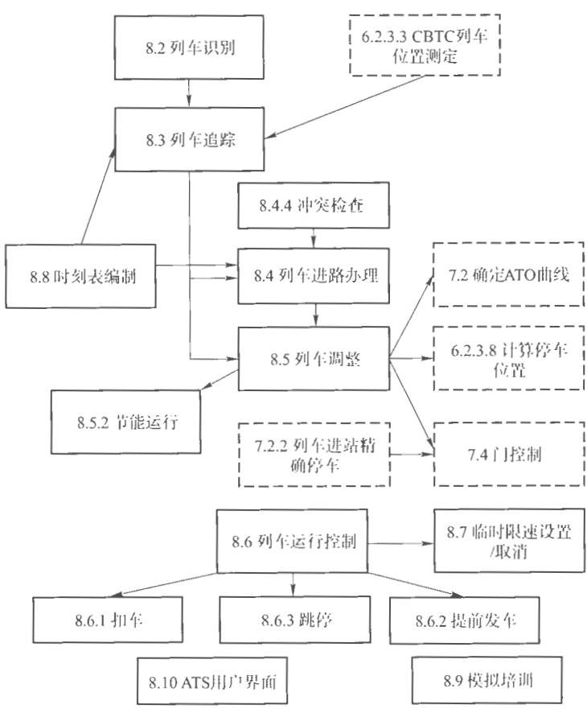  
图12ATS的主要功能

表70CBTC的运行列车识别号  

<table><tr><td rowspan=1 colspan=1>功能分配</td><td rowspan=1 colspan=1>输入</td><td rowspan=1 colspan=1>实现</td><td rowspan=1 colspan=1>输出</td></tr><tr><td rowspan=1 colspan=1>ATS</td><td rowspan=1 colspan=1>X</td><td rowspan=1 colspan=1>X</td><td rowspan=1 colspan=1>X</td></tr><tr><td rowspan=1 colspan=1>CBTC 轨旁</td><td rowspan=1 colspan=1></td><td rowspan=1 colspan=1></td><td rowspan=1 colspan=1></td></tr><tr><td rowspan=1 colspan=1>CBTC车载</td><td rowspan=1 colspan=1>X</td><td rowspan=1 colspan=1></td><td rowspan=1 colspan=1></td></tr></table>

# 8.2.3列车识别号丢失处理

在列车识别号因故丢失情况下，系统应根据运行图、列车位置及时间自动推算并自动设置列车识别号，且能通过车－地双向通信传输信息校核，见表71。

表71列车识别号丢失处理  

<table><tr><td rowspan=1 colspan=1>功能分配</td><td rowspan=1 colspan=1>输入</td><td rowspan=1 colspan=1>实现</td><td rowspan=1 colspan=1>输出</td></tr><tr><td rowspan=1 colspan=1>ATS</td><td rowspan=1 colspan=1>X</td><td rowspan=1 colspan=1>X</td><td rowspan=1 colspan=1>X</td></tr><tr><td rowspan=1 colspan=1>CBTC 轨旁</td><td rowspan=1 colspan=1></td><td rowspan=1 colspan=1></td><td rowspan=1 colspan=1></td></tr><tr><td rowspan=1 colspan=1>CBTC 车载</td><td rowspan=1 colspan=1>X</td><td rowspan=1 colspan=1></td><td rowspan=1 colspan=1></td></tr></table>

# 8.3列车追踪

ATS系统应该具有自动追踪，获取所有运行在CBTC区域的装备CBTC的列车记录并在ATS用户界面显示位置、标识、列车时刻表，及其他的相关的信息并保持这些信息的能力。列车的前后位置应该依据CBTC列车位置报告来进行追踪并显示在ATS川广界面上列车在车辆段/停车场内运行时应具有车组号的跟踪、显示功能。表72规定了ATS列车追踪的内容..

表72ATS列车追踪  

<table><tr><td rowspan=1 colspan=1>功能分配</td><td rowspan=1 colspan=1>输入</td><td rowspan=1 colspan=1>实现</td><td rowspan=1 colspan=1>输出</td></tr><tr><td rowspan=1 colspan=1>ATS</td><td rowspan=1 colspan=1></td><td rowspan=1 colspan=1>X</td><td rowspan=1 colspan=1>X</td></tr><tr><td rowspan=1 colspan=1>CBTC轨旁</td><td rowspan=1 colspan=1>X</td><td rowspan=1 colspan=1></td><td rowspan=1 colspan=1></td></tr><tr><td rowspan=1 colspan=1>CBTC车载</td><td rowspan=1 colspan=1>X</td><td rowspan=1 colspan=1></td><td rowspan=1 colspan=1></td></tr><tr><td rowspan=1 colspan=1>CI</td><td rowspan=1 colspan=1></td><td rowspan=1 colspan=1></td><td rowspan=1 colspan=1></td></tr></table>

# 8.4列车进路办理

# 8.4.1概述

表73\~表75规定了列车进路办理的内容。

# 8.4.2列车进路办理——自动

ATS系统应该具有列车自动办理进路的功能。ATS系统依照列车运行图/时刻表、在线列车运行信息、车站联锁表自动设置发车进路，指挥在线列车运行，见表73。

表73列车进路自动办理  

<table><tr><td rowspan=1 colspan=1>功能分配</td><td rowspan=1 colspan=1>输   入</td><td rowspan=1 colspan=1>实  现</td><td rowspan=1 colspan=1>输   出</td></tr><tr><td rowspan=1 colspan=1>ATS</td><td rowspan=1 colspan=1>X</td><td rowspan=1 colspan=1>X</td><td rowspan=1 colspan=1>X</td></tr><tr><td rowspan=1 colspan=1>CBTC轨旁</td><td rowspan=1 colspan=1>X</td><td rowspan=1 colspan=1></td><td rowspan=1 colspan=1>X</td></tr><tr><td rowspan=1 colspan=1>CBTC 车载</td><td rowspan=1 colspan=1>X</td><td rowspan=1 colspan=1></td><td rowspan=1 colspan=1></td></tr><tr><td rowspan=1 colspan=1>C1</td><td rowspan=1 colspan=1>GSOCIA</td><td rowspan=1 colspan=1>IONOA</td><td rowspan=1 colspan=1>X</td></tr></table>

# 8.4.3列车人工进路办理

ATS系统应该具有于动办理进路的功能，见表74

表74列车人工进路办理化

<table><tr><td rowspan=1 colspan=1>功能分配</td><td rowspan=1 colspan=1>人</td><td rowspan=1 colspan=1>实</td><td rowspan=1 colspan=1>输   出</td></tr><tr><td rowspan=1 colspan=1>ATS</td><td rowspan=1 colspan=1></td><td rowspan=1 colspan=1></td><td rowspan=1 colspan=1>X</td></tr><tr><td rowspan=1 colspan=1>CBTC 轨旁</td><td rowspan=1 colspan=1>市轨</td><td rowspan=1 colspan=1>道交</td><td rowspan=1 colspan=1>X</td></tr><tr><td rowspan=1 colspan=1>CBTC 车载</td><td rowspan=1 colspan=1></td><td rowspan=1 colspan=1></td><td rowspan=1 colspan=1></td></tr><tr><td rowspan=1 colspan=1>CI</td><td rowspan=1 colspan=1>X</td><td rowspan=1 colspan=1></td><td rowspan=1 colspan=1>X</td></tr></table>

# 8.4.4列车进路办理——冲突检查

当列车运行偏离计划，不同运行交路的列车经过同一地点时，系统应能检测到列车计划冲突，并提示调度员采取列车计划冲突干预方案，见表75。

# 表75列车进路冲突检查

<table><tr><td rowspan=1 colspan=1>功能分配</td><td rowspan=1 colspan=1>输前入</td><td rowspan=1 colspan=1>实现</td><td rowspan=1 colspan=1>输出</td></tr><tr><td rowspan=1 colspan=1>ATS</td><td rowspan=1 colspan=1>X</td><td rowspan=1 colspan=1>X</td><td rowspan=1 colspan=1>X</td></tr><tr><td rowspan=1 colspan=1>CBTC 轨劳</td><td rowspan=1 colspan=1></td><td rowspan=1 colspan=1></td><td rowspan=1 colspan=1></td></tr></table>

# 表75列车进路冲突检查（续）

<table><tr><td rowspan=1 colspan=1>功能分配</td><td rowspan=1 colspan=1>输入</td><td rowspan=1 colspan=1>实现</td><td rowspan=1 colspan=1>输出</td></tr><tr><td rowspan=1 colspan=1>CBTC 车载</td><td rowspan=1 colspan=1></td><td rowspan=1 colspan=1></td><td rowspan=1 colspan=1></td></tr><tr><td rowspan=1 colspan=1>CI</td><td rowspan=1 colspan=1></td><td rowspan=1 colspan=1></td><td rowspan=1 colspan=1></td></tr></table>

8.5列车调整

8.5.1列车自动调整

8.5.1.1概述

表 $7 6 \sim$ 表78规定了列车调整的内容。

# 8.5.1.2自动调度

ATS系统可包括白动调度功能，见表76、

# 表76自动调度

<table><tr><td rowspan=1 colspan=1>功能分配</td><td rowspan=1 colspan=1>输入</td><td rowspan=1 colspan=1>实现</td><td rowspan=1 colspan=1>输   出</td></tr><tr><td rowspan=1 colspan=1>ATS</td><td rowspan=1 colspan=1>X</td><td rowspan=1 colspan=1>X</td><td rowspan=1 colspan=1></td></tr><tr><td rowspan=1 colspan=1>CBTC 轨旁</td><td rowspan=1 colspan=1></td><td rowspan=1 colspan=1></td><td rowspan=1 colspan=1></td></tr><tr><td rowspan=1 colspan=1>CBTC 车载</td><td rowspan=1 colspan=1></td><td rowspan=1 colspan=1></td><td rowspan=1 colspan=1>X</td></tr></table>

# 8.5.1.3列车时刻表/发车（运行）间隔调整

ATS系统可具有监视与白动调整的功能，见表77，

# 表77列车时刻表调整功能

<table><tr><td rowspan=1 colspan=1>功能分配</td><td rowspan=1 colspan=1>输入</td><td rowspan=1 colspan=1>实现</td><td rowspan=1 colspan=1>输   出</td></tr><tr><td rowspan=1 colspan=1>ATS</td><td rowspan=1 colspan=1>X</td><td rowspan=1 colspan=1>X</td><td rowspan=1 colspan=1></td></tr><tr><td rowspan=1 colspan=1>CBTC 轨旁</td><td rowspan=1 colspan=1></td><td rowspan=1 colspan=1></td><td rowspan=1 colspan=1></td></tr><tr><td rowspan=1 colspan=1>CBTC车载</td><td rowspan=1 colspan=1></td><td rowspan=1 colspan=1></td><td rowspan=1 colspan=1>X</td></tr></table>

# 8.5.1.4冲突自动调整

在CBTC列车位置报告的基础上，ATS系统应包括基于列车位置报告的列车自动调整功能，来处理列车冲突，以把整个系统的延迟减少到最

小，见表78。

表78冲突自动调整  

<table><tr><td rowspan=1 colspan=1>功能分配</td><td rowspan=1 colspan=1>输</td><td rowspan=1 colspan=1>实现</td><td rowspan=1 colspan=1>输出</td></tr><tr><td rowspan=1 colspan=1>ATS</td><td rowspan=1 colspan=1>X</td><td rowspan=1 colspan=1>X</td><td rowspan=1 colspan=1></td></tr><tr><td rowspan=1 colspan=1>CBTC 轨旁</td><td rowspan=1 colspan=1></td><td rowspan=1 colspan=1></td><td rowspan=1 colspan=1></td></tr><tr><td rowspan=1 colspan=1>CBTC 乍载</td><td rowspan=1 colspan=1></td><td rowspan=1 colspan=1></td><td rowspan=1 colspan=1>X</td></tr><tr><td rowspan=1 colspan=1>CI</td><td rowspan=1 colspan=1></td><td rowspan=1 colspan=1></td><td rowspan=1 colspan=1></td></tr></table>

# 8.5.2节能运行

ATS系统可具有通过实时控制及协调列车加速、列车滑行、列车制动来实施能源优化的功能，表79规定了节能运行的内容。

# 表79节能运行

<table><tr><td rowspan=1 colspan=1>功能分配</td><td rowspan=1 colspan=1>输    人</td><td rowspan=1 colspan=1>实现</td><td rowspan=1 colspan=1>输出</td></tr><tr><td rowspan=1 colspan=1>ATS</td><td rowspan=1 colspan=1>X</td><td rowspan=1 colspan=1>X</td><td rowspan=1 colspan=1></td></tr><tr><td rowspan=1 colspan=1>CBTC 轨学</td><td rowspan=1 colspan=1></td><td rowspan=1 colspan=1></td><td rowspan=1 colspan=1></td></tr><tr><td rowspan=1 colspan=1>CBTC 年载</td><td rowspan=1 colspan=1></td><td rowspan=1 colspan=1>X</td><td rowspan=1 colspan=1>X</td></tr></table>

# 8.6列车运行控制

# 8.6.1扣车

ATS系统应具有在车站扣车能力，表80规定了扣车的内容。

表80扣车功能  

<table><tr><td rowspan=1 colspan=1>功能分配</td><td rowspan=1 colspan=1>输 入</td><td rowspan=1 colspan=1>实现</td><td rowspan=1 colspan=1>输 出</td></tr><tr><td rowspan=1 colspan=1>ATS</td><td rowspan=1 colspan=1>X</td><td rowspan=1 colspan=1>X</td><td rowspan=1 colspan=1>X</td></tr><tr><td rowspan=1 colspan=1>CBTC 轨旁</td><td rowspan=1 colspan=1></td><td rowspan=1 colspan=1></td><td rowspan=1 colspan=1></td></tr><tr><td rowspan=1 colspan=1>CBTC 车载</td><td rowspan=1 colspan=1></td><td rowspan=1 colspan=1></td><td rowspan=1 colspan=1>X</td></tr><tr><td rowspan=1 colspan=1>C1</td><td rowspan=1 colspan=1></td><td rowspan=1 colspan=1>X</td><td rowspan=1 colspan=1></td></tr></table>

# 8.6.2提前发车

ATS系统应具有设置站台提前发车的功能。表81规定了提前发车的内容。

表81提前发车  

<table><tr><td rowspan=1 colspan=1>功能分配</td><td rowspan=1 colspan=1>输前入</td><td rowspan=1 colspan=1>实现</td><td rowspan=1 colspan=1>输出</td></tr><tr><td rowspan=1 colspan=1>ATS</td><td rowspan=1 colspan=1>X</td><td rowspan=1 colspan=1>X</td><td rowspan=1 colspan=1></td></tr><tr><td rowspan=1 colspan=1>CBTC 轨旁</td><td rowspan=1 colspan=1></td><td rowspan=1 colspan=1></td><td rowspan=1 colspan=1></td></tr><tr><td rowspan=1 colspan=1>CBTC 车载</td><td rowspan=1 colspan=1></td><td rowspan=1 colspan=1></td><td rowspan=1 colspan=1>X</td></tr></table>

# 8.6.3跳停

ATS系统应具有设置一个或多个装备CBTC的列车经过下一个或下儿个车站而不停车的功能。表82规定了跳停车站的内容。

表82跳停车站  

<table><tr><td rowspan=1 colspan=1>功能分配</td><td rowspan=1 colspan=1>输</td><td rowspan=1 colspan=1>实现</td><td rowspan=1 colspan=1>输出</td></tr><tr><td rowspan=1 colspan=1>ATS</td><td rowspan=1 colspan=1>X</td><td rowspan=1 colspan=1>X</td><td rowspan=1 colspan=1></td></tr><tr><td rowspan=1 colspan=1>CBTC轨旁</td><td rowspan=1 colspan=1></td><td rowspan=1 colspan=1></td><td rowspan=1 colspan=1></td></tr><tr><td rowspan=1 colspan=1>CBTC 车载</td><td rowspan=1 colspan=1></td><td rowspan=1 colspan=1></td><td rowspan=1 colspan=1>X</td></tr></table>

# 8.6.4控制权转换

在紧急情况下，车站值班员可在控制工作站上强行取得控制权，控制车站的进路和信号列车进路控制权的优先级为本地控制优先于中央控制；在本地控制或中央控制时，人T控制优先于自动控制：表83规定了控制权转换的内容。

表83控制权转换  

<table><tr><td colspan="1" rowspan="1">功能分配</td><td colspan="1" rowspan="1">输 入</td><td colspan="1" rowspan="1">实现</td><td colspan="1" rowspan="1">输  出</td></tr><tr><td colspan="1" rowspan="1">ATS</td><td colspan="1" rowspan="1">X</td><td colspan="1" rowspan="1">X</td><td colspan="1" rowspan="1">X</td></tr><tr><td colspan="1" rowspan="1">CBTC 轨旁</td><td colspan="1" rowspan="1"></td><td colspan="1" rowspan="1"></td><td colspan="1" rowspan="1"></td></tr><tr><td colspan="1" rowspan="1">CBTC车载</td><td colspan="1" rowspan="1"></td><td colspan="1" rowspan="1"></td><td colspan="1" rowspan="1"></td></tr><tr><td colspan="1" rowspan="1">CI</td><td colspan="1" rowspan="1">X</td><td colspan="1" rowspan="1">X</td><td colspan="1" rowspan="1">X</td></tr></table>

# 8.7控制列车运行

ATS系统应具有在CBTC区域内任何轨道区段，设置（与取消）临时限速的能力。表84规定了临时限速的内容。

表84临时限速  

<table><tr><td rowspan=1 colspan=1>功能分配</td><td rowspan=1 colspan=1>GSOCIA</td><td rowspan=1 colspan=2>TONOA现</td><td rowspan=1 colspan=1>输    出</td></tr><tr><td rowspan=1 colspan=1>ATS</td><td rowspan=1 colspan=1>X</td><td rowspan=1 colspan=2></td><td rowspan=1 colspan=1></td></tr><tr><td rowspan=1 colspan=1>CBTC轨旁</td><td rowspan=1 colspan=1></td><td rowspan=1 colspan=2></td><td rowspan=1 colspan=1>X</td></tr><tr><td rowspan=1 colspan=1>CBTC车载</td><td rowspan=1 colspan=1></td><td rowspan=1 colspan=1></td><td rowspan=1 colspan=1>体</td><td rowspan=1 colspan=1>X</td></tr></table>

# 8.8时刻表编制

ATS 应具备变更计划运衍 酸功餐，并按照变更后的结果组织和实施当日的列车运行。表 了时刻表编制的内容：

表85时刻表编制  

<table><tr><td rowspan=1 colspan=1>功能分配</td><td rowspan=1 colspan=1>输   人</td><td rowspan=1 colspan=1>现</td><td rowspan=1 colspan=1>输   出</td></tr><tr><td rowspan=1 colspan=1>ATS</td><td rowspan=1 colspan=1>X</td><td rowspan=1 colspan=1>X</td><td rowspan=1 colspan=1>X</td></tr><tr><td rowspan=1 colspan=1>CBTC 轨旁</td><td rowspan=1 colspan=1></td><td rowspan=1 colspan=1></td><td rowspan=1 colspan=1></td></tr><tr><td rowspan=1 colspan=1>CBTC车载</td><td rowspan=1 colspan=1></td><td rowspan=1 colspan=1></td><td rowspan=1 colspan=1></td></tr></table>

# 8.9模拟培训

ATS应具备模拟演示及培训系统，实现对调度员的培训。表86规定了模拟培训的内容。

# 表86模拟培训

<table><tr><td rowspan=1 colspan=1>功能分配</td><td rowspan=1 colspan=1>输入</td><td rowspan=1 colspan=1>实现</td><td rowspan=1 colspan=1>输出</td></tr><tr><td rowspan=1 colspan=1>ATS</td><td rowspan=1 colspan=1>X</td><td rowspan=1 colspan=1>X</td><td rowspan=1 colspan=1>X</td></tr><tr><td rowspan=1 colspan=1>CBTC轨旁</td><td rowspan=1 colspan=1></td><td rowspan=1 colspan=1></td><td rowspan=1 colspan=1></td></tr><tr><td rowspan=1 colspan=1>CBTC车载</td><td rowspan=1 colspan=1></td><td rowspan=1 colspan=1></td><td rowspan=1 colspan=1></td></tr></table>

# 8.10用户界面

# 8.10.1显示数据

CBTC的ATS显示应能表示以下信息：

) 精确的和区域相关的信息；列车状态相关信息；  
() 列车移动授权/进路信息；  
(1) 被控列车运行相关的信息，如防护区段信息、锁闭的进路/区段以及临时限速极限和限速值；  
e）其他  
表87规定了ATS显示数据的内容。

表87ATS显示数据  

<table><tr><td rowspan=1 colspan=1>功能分配</td><td rowspan=1 colspan=1>输</td><td rowspan=1 colspan=1>实现</td><td rowspan=1 colspan=1>出</td></tr><tr><td rowspan=1 colspan=1>ATS</td><td rowspan=1 colspan=1>X</td><td rowspan=1 colspan=1>X</td><td rowspan=1 colspan=1>X</td></tr><tr><td rowspan=1 colspan=1>CBTC 轨旁</td><td rowspan=1 colspan=1>X</td><td rowspan=1 colspan=1></td><td rowspan=1 colspan=1></td></tr><tr><td rowspan=1 colspan=1>CBTC车载</td><td rowspan=1 colspan=1>X</td><td rowspan=1 colspan=1></td><td rowspan=1 colspan=1></td></tr><tr><td rowspan=1 colspan=1>CI</td><td rowspan=1 colspan=1>X</td><td rowspan=1 colspan=1></td><td rowspan=1 colspan=1></td></tr></table>

8.10.2数据管理

8.10.2.1概述

表88～表90规定了CBTC输人数据的内容。

# 8.10.2.2CBTC输入数据

CBTC的ATS用户界面显示应能够接收以下ATS用户输入：

a) 办理和取消进路输人；  
b) 建立和取消防护区段，锁闭进路/区段，以及临时限速输入；  
c）其他。  
表88规定了CBTC输人数据的内容。

表88CBTC输入数据  

<table><tr><td rowspan=1 colspan=1>功能分配</td><td rowspan=1 colspan=1>输入</td><td rowspan=1 colspan=1>实现</td><td rowspan=1 colspan=1>输出</td></tr><tr><td rowspan=1 colspan=1>ATS</td><td rowspan=1 colspan=1>X</td><td rowspan=1 colspan=1>X</td><td rowspan=1 colspan=1>X</td></tr><tr><td rowspan=1 colspan=1>CBTC 轨旁</td><td rowspan=1 colspan=1></td><td rowspan=1 colspan=1></td><td rowspan=1 colspan=1></td></tr><tr><td rowspan=1 colspan=1>CBTC 车载</td><td rowspan=1 colspan=1></td><td rowspan=1 colspan=1></td><td rowspan=1 colspan=1></td></tr></table>

# 8.10.2.3发送报警数据

ATS子系统可将自身的报警信息、ATP车载子系统、ATO子系统、CI子系统的报警信息传至控制中心维护工作站、车站维护工作站、综合维修中心的信号监测报警工作站，见表89，

表89发送报警数据  

<table><tr><td rowspan=1 colspan=1></td><td rowspan=1 colspan=1>功能分配</td><td rowspan=1 colspan=1>输前入</td><td rowspan=1 colspan=1>实现</td><td rowspan=1 colspan=1>输出</td></tr><tr><td rowspan=1 colspan=1></td><td rowspan=1 colspan=1>ATS</td><td rowspan=1 colspan=1>X</td><td rowspan=1 colspan=1>X</td><td rowspan=1 colspan=1></td></tr><tr><td rowspan=1 colspan=1></td><td rowspan=1 colspan=1>CBTC 轨旁</td><td rowspan=1 colspan=1>X</td><td rowspan=1 colspan=1></td><td rowspan=1 colspan=1></td></tr><tr><td rowspan=1 colspan=2>CBTC车载</td><td rowspan=1 colspan=1>X</td><td rowspan=1 colspan=1></td><td rowspan=1 colspan=1></td></tr><tr><td rowspan=1 colspan=2>CI</td><td rowspan=1 colspan=1>X</td><td rowspan=1 colspan=1></td><td rowspan=1 colspan=1></td></tr><tr><td rowspan=1 colspan=2>MSS</td><td rowspan=1 colspan=1></td><td rowspan=1 colspan=1></td><td rowspan=1 colspan=1>X</td></tr></table>

# 8.10.2.4数据记录及回放

系统应对各种操作信息、设备运行状态信息及运行数据进行记录和备份，并具有根据记录数据对任何时间、任何信息点进行过程回放功能，综合维修中心的信号监测报警工作站系统应具备在线回放功能，回放记

录应保存不少于30天，见表90

表90数据记录及回放  

<table><tr><td rowspan=1 colspan=1>功能分配</td><td rowspan=1 colspan=1>输 入</td><td rowspan=1 colspan=1>现</td><td rowspan=1 colspan=1>输   出</td></tr><tr><td rowspan=1 colspan=1>ATS</td><td rowspan=1 colspan=1>X</td><td rowspan=1 colspan=1>X</td><td rowspan=1 colspan=1>X</td></tr><tr><td rowspan=1 colspan=1>CBTC轨旁</td><td rowspan=1 colspan=1>X</td><td rowspan=1 colspan=1></td><td rowspan=1 colspan=1></td></tr><tr><td rowspan=1 colspan=1>CBTC车载</td><td rowspan=1 colspan=1>X</td><td rowspan=1 colspan=1></td><td rowspan=1 colspan=1></td></tr><tr><td rowspan=1 colspan=1>CI</td><td rowspan=1 colspan=1>X</td><td rowspan=1 colspan=1></td><td rowspan=1 colspan=1></td></tr><tr><td rowspan=1 colspan=1>MSS</td><td rowspan=1 colspan=1></td><td rowspan=1 colspan=1></td><td rowspan=1 colspan=1>X</td></tr></table>

# 9CI功能分配

# 9.1功能描述

CBTC相关的CI主要功能分配，如图13所示

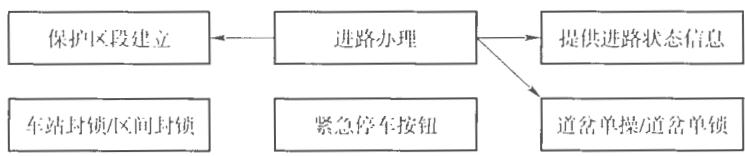  
图13 CI的主要功能

# 9.2进路办理

# 9.2.1功能描述

表91～表93规定了进路办理的内容。

# 9.2.2进路办理

联锁应具备进路办理功能。包括人工办理列车进路、设置自动进路和自动折返进路。联锁将办理的进路信息提供给ATP系统，用于移动授权的计算，见表91。

表91进路办理  

<table><tr><td rowspan=1 colspan=1>功能分配</td><td rowspan=1 colspan=1>输 人</td><td rowspan=1 colspan=1>实现</td><td rowspan=1 colspan=1>输出</td></tr><tr><td rowspan=1 colspan=1>ATS</td><td rowspan=1 colspan=1>X</td><td rowspan=1 colspan=1></td><td rowspan=1 colspan=1></td></tr><tr><td rowspan=1 colspan=1>CBTC轨旁</td><td rowspan=1 colspan=1></td><td rowspan=1 colspan=1></td><td rowspan=1 colspan=1>X</td></tr><tr><td rowspan=1 colspan=1>CBTC车载</td><td rowspan=1 colspan=1></td><td rowspan=1 colspan=1></td><td rowspan=1 colspan=1></td></tr><tr><td rowspan=1 colspan=1>CI</td><td rowspan=1 colspan=1>X</td><td rowspan=1 colspan=1>X</td><td rowspan=1 colspan=1></td></tr></table>

# 9.2.3装有无效CBTC装备的列车进路办理

对于设备故障的CBTC列车或无装备的列车，在前方进路出清并重新开放后，装有无效CBTC装备的烈车方可驶入，见表92。

# 故障列车进路办理

<table><tr><td rowspan=1 colspan=1>功能分配</td><td rowspan=1 colspan=1>人</td><td rowspan=1 colspan=2>实</td><td rowspan=1 colspan=1>输   出</td></tr><tr><td rowspan=1 colspan=1>ATS</td><td rowspan=1 colspan=1></td><td rowspan=1 colspan=2></td><td rowspan=1 colspan=1></td></tr><tr><td rowspan=1 colspan=1>CBTC轨旁</td><td rowspan=1 colspan=1></td><td rowspan=1 colspan=1></td><td rowspan=1 colspan=1></td><td rowspan=1 colspan=1></td></tr><tr><td rowspan=1 colspan=1>CBTC车载</td><td rowspan=1 colspan=1>国城</td><td rowspan=1 colspan=2></td><td rowspan=1 colspan=1></td></tr><tr><td rowspan=1 colspan=1>CI</td><td rowspan=1 colspan=1></td><td rowspan=1 colspan=2>福</td><td rowspan=1 colspan=1>X</td></tr></table>

# 轨道

# 9.2.4保护区段

联锁子系统除对正常的列车进路进行防护外，还应建立列车进路的保护区段，并予以防护，见表93。

表93保护区段  

<table><tr><td rowspan=1 colspan=1>功能分配</td><td rowspan=1 colspan=1>输入</td><td rowspan=1 colspan=1>实现</td><td rowspan=1 colspan=1>输  出</td></tr><tr><td rowspan=1 colspan=1>ATS</td><td rowspan=1 colspan=1>X</td><td rowspan=1 colspan=1></td><td rowspan=1 colspan=1></td></tr><tr><td rowspan=1 colspan=1>CBTC轨旁</td><td rowspan=1 colspan=1></td><td rowspan=1 colspan=1></td><td rowspan=1 colspan=1>X</td></tr><tr><td rowspan=1 colspan=1>CBTC车载</td><td rowspan=1 colspan=1></td><td rowspan=1 colspan=1></td><td rowspan=1 colspan=1></td></tr><tr><td rowspan=1 colspan=1>CI</td><td rowspan=1 colspan=1>X</td><td rowspan=1 colspan=1>X</td><td rowspan=1 colspan=1></td></tr></table>

# 9.3锁闭/解锁进路/区段

9.3.1概述

表94\~表97规定了锁闭/解锁进路/区段的内容。

# 9.3.2进路/区段锁闭

系统应具有锁闭（并随后解锁）CBTC区域内的道岔、信号机或轨道区段的能力，CI子系统应对进路实现预先锁闭和接近锁闭，锁闭的进路随列车的运行自动分段解锁，见表94。

表94进路/区段锁闭  

<table><tr><td rowspan=1 colspan=1>功能分配</td><td rowspan=1 colspan=1>输入</td><td rowspan=1 colspan=1>实现</td><td rowspan=1 colspan=1>输出</td></tr><tr><td rowspan=1 colspan=1>ATS</td><td rowspan=1 colspan=1>X</td><td rowspan=1 colspan=1></td><td rowspan=1 colspan=1>X</td></tr><tr><td rowspan=1 colspan=1>CBTC轨旁</td><td rowspan=1 colspan=1></td><td rowspan=1 colspan=1></td><td rowspan=1 colspan=1>X</td></tr><tr><td rowspan=1 colspan=1>CBTC 车载</td><td rowspan=1 colspan=1></td><td rowspan=1 colspan=1></td><td rowspan=1 colspan=1></td></tr><tr><td rowspan=1 colspan=1>CI</td><td rowspan=1 colspan=1>X</td><td rowspan=1 colspan=1>X</td><td rowspan=1 colspan=1></td></tr></table>

# 9.3.3道岔单操、单锁

联锁应具备道岔单独操纵及锁闭的能力，见表95。

# 表95道岔操作

<table><tr><td rowspan=1 colspan=1>功能分配</td><td rowspan=1 colspan=1>输入</td><td rowspan=1 colspan=1>实现</td><td rowspan=1 colspan=1>输出</td></tr><tr><td rowspan=1 colspan=1>ATS</td><td rowspan=1 colspan=1>X</td><td rowspan=1 colspan=1></td><td rowspan=1 colspan=1>X</td></tr><tr><td rowspan=1 colspan=1>CBTC 轨旁</td><td rowspan=1 colspan=1></td><td rowspan=1 colspan=1></td><td rowspan=1 colspan=1>X</td></tr><tr><td rowspan=1 colspan=1>CBTC车载</td><td rowspan=1 colspan=1></td><td rowspan=1 colspan=1></td><td rowspan=1 colspan=1></td></tr><tr><td rowspan=1 colspan=1>CI</td><td rowspan=1 colspan=1>X</td><td rowspan=1 colspan=1>X</td><td rowspan=1 colspan=1></td></tr></table>

# 9.3.4计轴故障恢复

系统应具有计轴故障恢复的能力，见表96。

表96计轴故障恢复  

<table><tr><td rowspan=1 colspan=1>功能分配</td><td rowspan=1 colspan=1>输入</td><td rowspan=1 colspan=1>实现</td><td rowspan=1 colspan=1>输出</td></tr><tr><td rowspan=1 colspan=1>ATS</td><td rowspan=1 colspan=1>X</td><td rowspan=1 colspan=1></td><td rowspan=1 colspan=1>X</td></tr><tr><td rowspan=1 colspan=1>CBTC轨旁</td><td rowspan=1 colspan=1></td><td rowspan=1 colspan=1></td><td rowspan=1 colspan=1>X</td></tr><tr><td rowspan=1 colspan=1>CBTC车载</td><td rowspan=1 colspan=1></td><td rowspan=1 colspan=1></td><td rowspan=1 colspan=1></td></tr><tr><td rowspan=1 colspan=1>C</td><td rowspan=1 colspan=1>X</td><td rowspan=1 colspan=1>X</td><td rowspan=1 colspan=1></td></tr></table>

# 9.4紧急停车按钮

联锁子系统检查站台紧急停车按钮的状态，一旦检测到按钮被按下，应立即关闭相应的进路。表97规定了紧急停车按钮的内容。

# 表97紧急停车按钮

<table><tr><td rowspan=1 colspan=1>功能分配</td><td rowspan=1 colspan=1>输入</td><td rowspan=1 colspan=1>实现</td><td rowspan=1 colspan=1>输出</td></tr><tr><td rowspan=1 colspan=1>ATS</td><td rowspan=1 colspan=1></td><td rowspan=1 colspan=1></td><td rowspan=1 colspan=1>X</td></tr><tr><td rowspan=1 colspan=1>CBTC 轨旁</td><td rowspan=1 colspan=1></td><td rowspan=1 colspan=1>X</td><td rowspan=1 colspan=1>X</td></tr><tr><td rowspan=1 colspan=1>CBTC车载</td><td rowspan=1 colspan=1></td><td rowspan=1 colspan=1></td><td rowspan=1 colspan=1></td></tr><tr><td rowspan=1 colspan=1>C1</td><td rowspan=1 colspan=1>X</td><td rowspan=1 colspan=1>X</td><td rowspan=1 colspan=1></td></tr></table>

# 9.5故障监测及操作记录

CI子系统具有自检、自诊断和对信号机、转辙机等基础信号设备的监测报警功能，并在车站的维护工作站上显示及报警。表98规定了故障监测及操作记录的内容。

表98故障检测  

<table><tr><td colspan="1" rowspan="1">功能分配</td><td colspan="1" rowspan="1">输   人</td><td colspan="1" rowspan="1">实</td><td colspan="1" rowspan="1">输   出</td></tr><tr><td colspan="1" rowspan="1">ATS</td><td colspan="1" rowspan="1"></td><td colspan="1" rowspan="1"></td><td colspan="1" rowspan="1">X</td></tr><tr><td colspan="1" rowspan="1">CBTC轨旁</td><td colspan="1" rowspan="1"></td><td colspan="1" rowspan="1"></td><td colspan="1" rowspan="1"></td></tr><tr><td colspan="1" rowspan="1">功能分配</td><td colspan="1" rowspan="1">输入</td><td colspan="1" rowspan="1">实现</td><td colspan="1" rowspan="1">输出</td></tr><tr><td colspan="1" rowspan="1">CBTC车载</td><td colspan="1" rowspan="1"></td><td colspan="1" rowspan="1"></td><td colspan="1" rowspan="1"></td></tr><tr><td colspan="1" rowspan="1">CI</td><td colspan="1" rowspan="1">X</td><td colspan="1" rowspan="1">X</td><td colspan="1" rowspan="1">X</td></tr></table>

# 参考文献

[1 ] IEEE 1474.3 IEEE Recommended Practice for Communications-Based Train Control (CBTC) System Design and Functional Allocations

中国城市轨道交通协会团体标准城市轨道交通基于通信的列车运行控制系统（CBTC)互联互通系统规范

# 第2部分：系统架构和功能分配

T/CAMET 04010.2—2018

中国铁道出版社有限公司出版发行（100054，北京市西城K有安门西街8号）公司网址：http：//www.tdpress.com北京铭成印刷有限公司印刷

开本： $8 8 0 \ \mathrm { m m } \times 1 \ 2 3 0 \ \mathrm { m m }$ 1/32印张：2.25字数：61千2019年5月第1版2019年5月第1次印刷

书号： $1 5 1 1 3 \cdot 5 6 5 6$ 定价：20.00元

# 版权所有侵权必究