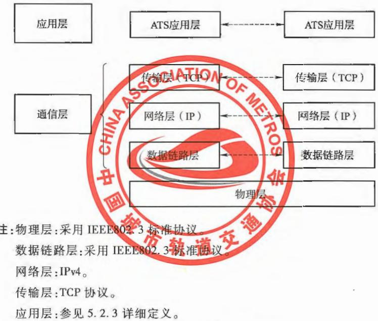
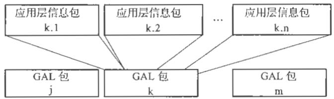
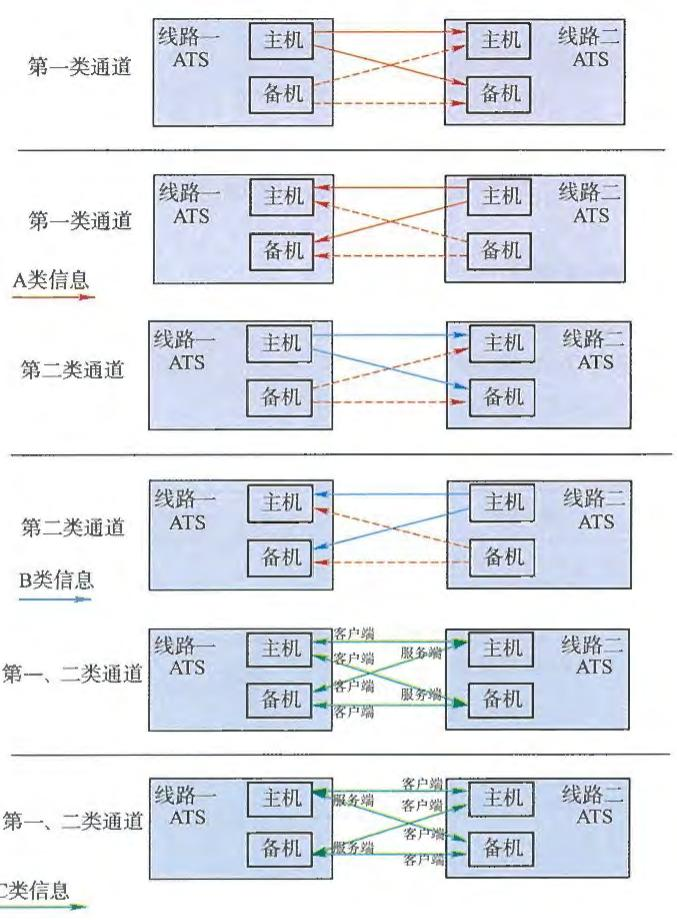

# 中国城市轨道交通协会团体标准

T/CAMET 04011.62018

城市轨道交通 基于通信的列车运行控制系统（CBTC）互联互通接口规范第6部分：列车自动监控系统（ATS）间接口

Urban rail transit — Interface specification for interoperability of communication based train control system Part 6: Interface between automatic train supervision systems

# 目 次

前言 VI引言… VⅢ1范围 12规范性引用文件 13术语和缩略语 23.1术语 23.2缩略语 34 总则…5ATS-ATS报文规范 45.1 通信机制 45.2 接口详细描述 5附录A（规范性附录）设备类型定义、设备色码定义、列车信息识别号字段说明…… 25

# 前 言

T/CAMET04011《城市轨道交通基于通信的列车运行控制系统（CBTC）互联互通接口规范》分为以下八个部分：

第1部分：应答器报文；  
第2部分：CBTC系统车地连续通信协议；  
第3部分：车载列车自动保护（ATP）/列车自动运行（ATO）系统与车辆的接口；  
第4部分：区域控制器（ZC）间接口；  
第5部分：计算机联锁（CI）间接口；  
第6部分：列车自动监控系统（ATS）间接口；  
第7部分：信号各子系统与维护支持系统（MSS）间接口；  
第8部分：车载人机界面。

本部分是T/CAMET04011的第6部分。

本部分按照GB/T1.1—2009给出的规则起草。

请注意本部分的某些内容可能涉及专利，本部分的发布机构不承担识别这些专利的责任。

本部分由中国城市轨道交通协会技术装备专业委员会提出。

本部分由中国城市轨道交通协会归口。

本部分起草单位：北京全路通信信号研究设计院集团有限公司、交控科技股份有限公司、中国铁道科学研究院集团有限公司通信信号研究所、株洲中车时代电气股份有限公司、浙江众合科技股份有限公司。

本部分主要起草人：编写组：陈逸、肖孟、李弘、郭辉、宋丽丽、张德明、郭戬、王丽丽、黎邓根、邬斌剑、王春。审核组：李中浩、朱翔、赵炜、郑生全、张艳兵、张良、王道敏、张琼燕、段晨宁、李新文、李德堂、文成祥、任敬、朱东飞、肖利君、张守芝、刘新平。

# 引 言

为促进中国城市轨道交通建设，实现并满足城市轨道交通互联互通的需要，达到经济适用、资源共享、技术先进及可持续发展的目标，制定城市轨道交通基于通信的列车运行控制系统（CBTC）互联互通系列团体标准。

该系列规范包括《城市轨道交通基于通信的列车运行控制系统（CBTC）互联互.通系统规范》《城市轨道交通基于通信的列车运行控制系统（CBTC）互联互通接口规范》《城市轨道交通基于通信的列车运行控制系统（CBTC）互联互通测试规范》《城市轨道交通基于通信的列车运行控制系统（CBTC）互联互通T程规范》4个规范（17个部分）。

# 城市轨道交通 基于通信的列车运行

控制系统（CBTC）互联互通接口规范第6部分：列车自动监控系统（ATS）间接口

# 1范围

T/CAMET04011的本部分规定了互联互通相邻线路间线路级列车自动监控系统（以下简称 包括通信架构、信息内容、数据交互流程、可扩展性段说明。

本部分适用于国采用基于通信的列车运控制系统(CBTC）的新建、新改造及扩建市，通线路建设，用指导信号系统的系统

# 2规范性引用文件

# 轨道

下列文件对于本部分的应用是不可少的。凡是注日期的引用文件，仅所注日期的版本适用于本部分。凡是不注日期的引用文件，其最新版本（包括所有的修改单）适用于本部分。

CJ/T407—2012 城市轨道交通基于通信的列车自动控制系统技术要求

T/CAMET04010.1—2018 城市轨道交通 基于通信的列车运控制系统（CBTC）互联互通系统规范第1部分：系统总体要求

运基信号[2010]267号RSSP-I铁路信号安全通信协议

IEEE 802.3 以太网（Ethernet)

RFC791 互联网协议（Internet Protocol）

RFC 793 传输控制协议(Transmission Control Protocol）

# 3术语和缩略语

GB50157—2013、CJ/T407—2012和T/CAMET04010.1—2018界定的及下列术语和缩略语适用于本部分。为了便于使用，以下重复列出了其中的主要相关术语。

# 3.1术语

3.1.1

基于通信的列车控制communication based train control（CBTC）

通过不依赖轨旁列车占用检测设备的列车主动定位技术、连续车一地双向数据通信技术以及能够执行安全功能的车载和地面处理器而构建的连续式列车自动控制系统。

[CJ/T407—2012,定义3.1.1]

# 3.1.2

正线 main line 载客列车运营的贯穿全程的线路。 [GB50157—2013，定义2.0.11]

3.1.3

列车自动监控automatic train supervision

根据列车时刻表为列车运行自动设定进路、指挥行车、实施列车运行管理等技术的总称。

[CB50157—2013，定义2.0.38]

3.1.4

列车自动防护automatic train protection

自动实现列车运行间隔、超速防护、进路安全和车门等监控技术的总称。

[GB50157—2013，定义2.0.39]

# 3.1.5

列车自动运行automatic train operation

自动实现列车加速、调速、停车和车门开闭、提示等控制技术的总称。

[GB50157—2013，定义2.0.40]

3.1.6

计算机联锁 computer interlocking

以计算机技术为核心，自动实现进路、道岔、信号机等防护技术的总称。

[CJ/T407—2012，定义3.1.6]

3.1.7

移动授权 movement authority

列车沿给定的行驶方向进人并在某一特定轨道区段内行车的许可。

[CJ/T407—2012，定义3.1.7]

3.1.8

# 转换轨 transfer track

指车辆段/停车场与正线的连接轨，运营列车在驶入/驶出转换轨过程中，当条件具备时，进行列车运行控制级别及驾驶模式转换。

[T/CAMET04010.1,术语3.1.13]

3.1.9

# 跨线运行 overline operation

运营列车在两条或两条以上制式相同或兼容的线路中，由一条线路进人另外一条线路进行共线运行的方式。

[T/CAMET04010.1—2018,术语3.1.14]

3.1.10

# 互联互通 interoperability

装备不同信号厂家车载设备的列车可以在装备不同信号厂家轨旁设备的一条轨道交通线路内或多条轨道交通线路上无缝互通安全可靠运营。

[T/CAMET04010.1—2018,术语3.1.16]

# 3.2缩略语

AM：列车自动驾驶模式（Automatic Train Operating Mode）ATO：列车自动运行（Automatic TrainOperation）

ATP:列车白动防护（Automatic Train Protection）ATS:列车自动监控（Automatic Train Supervision）CBTC：基于通信的列车控制（Communication Based Train Control）CI:计算机联锁（Computer Interlocking)CM:列车自动防护模式（Coded Train Operating Mode)EUM：非限制人工驾驶模式（Emergency Unrestricted Train OperatingMode)GAI.：通川应用层（Generic Application Layer）IPv4：互联网协议（Internet Protocol，IP）的第4版MA：移动授权（Movement Authority）PSD:站台门（Platform Screen Door)RM:限制人工驾驶模式（Restricted Train Operating Mode）TCP:传输控制协议(Transmission Control Protocol)TSR :临时限速（Temporary Speed Restriction)ZC:区域控制器（ZoneController）

# 4总则

城市轨道交通基于通信的列车运行控制系统（CBTC）互联互通的一个重要日标是可实现列车跨线路运行，列车跨线运行涉及到不同厂商、多条线路的ATS之问在列车运行调度指挥方面进行协调、交接。当前ATS接口支撑的功能包括：互联互通线路站场信息共享、跨线运行列车信息共享、跨线运行列车计划调整信息共享、跨线运行列车接入站首站跳停命令下达功能。根据后续工程实施中用户需求的增加，可对ATS间接[I内容进行扩展。

# 5ATS-ATS报文规范

# 5.1通信机制

ATS间通信机制如下：

a）相邻ATS间通信应采用周期与非周期发送的方式进行通信；b）通信双方应均采用大端字节序进行数据传输。

# 5.2 接口详细描述

# 5.2.1 通信层次结构描述

ATS间通信层次结构划分见图1。

  
图1ATS间通信层次结构

# 5.2.2 接口连接方式

# 5.2.2.1物理接口

ATS应冗余接入通信网络，网络拓扑结构为A网-A网、B网-B网，接口间宜通过防火墙进行隔离。

# 5.2.2.2 通信层次描述

ATS与ATS间应建立对等的逻辑连接。通信层次如图2所示（箭头

指向表示服务端，红蓝线表示双网逻辑连接）。

说明：

第一组通道，线路一ATS的主机应作为客户端同时与线路二ATS的主机和备机建立双网连接，用于传送本线路内产生的信息。

第二组通道，线路二ATS的主机应作为客户端同时与线路一ATS的主机和备机建立双网连接，用于传送本线路内产生的信息。

服务端侦听端口应为9900。

# 图2通信层次

# 5.2.2.3动态交互描述

# 5.2.2.3.1信息帧格式定义

相邻ATS间每个周期需要交互的信息应组成通用应用层（GAL）信息包进行传输，如图3所示。

  
图3GAL信息包和应用层信息包关系结构图

# 5.2.2.3.2信息包格式定义

ATS间通信的GAL信息包中包含ATS间传输的各条应用信息。每6

个GAL信息包总长应不得超过 $6 5 ~ 0 0 0$ 字节。每个GAL信息包应只包含一类应用信息包。GAL信息包格式定义见表1和表2。

表1GAL信息包格式定义  

<table><tr><td colspan="1" rowspan="1">信息域定义</td><td colspan="1" rowspan="1">字节编号</td><td colspan="1" rowspan="1">字段</td><td colspan="1" rowspan="1">长度</td><td colspan="1" rowspan="1">信息位定义及说明</td></tr><tr><td colspan="1" rowspan="2">帧头</td><td colspan="1" rowspan="1">1</td><td colspan="1" rowspan="2"></td><td colspan="1" rowspan="2">2字节</td><td colspan="1" rowspan="2">0xDFDF</td></tr><tr><td colspan="1" rowspan="1">2</td></tr><tr><td colspan="1" rowspan="8">双网序列号</td><td colspan="1" rowspan="1">3</td><td colspan="1" rowspan="8"></td><td colspan="1" rowspan="8">8字节</td><td colspan="1" rowspan="8">用于将GAL包双网传输的唯一标识。发送方设置，双网发送数据时，同一GAL包的双网序列号必须保证相同。通信连接建立后，通信双方将各自的“双网序列号”置0，并随着GAL包的发送递增计数，每发一包，计数加1，到达8字节限制后又变成0。接收方接收双网数据时，如果当前GAL包的双网序列号等于或小于上一个接收的GAL包的双网序列号，则丢弃当前GAL包</td></tr><tr><td colspan="1" rowspan="1">4</td></tr><tr><td colspan="1" rowspan="1">5</td></tr><tr><td colspan="1" rowspan="1">6</td></tr><tr><td colspan="1" rowspan="1">7</td></tr><tr><td colspan="1" rowspan="1">8</td></tr><tr><td colspan="1" rowspan="1">9</td></tr><tr><td colspan="1" rowspan="1">10</td></tr><tr><td colspan="1" rowspan="2">接口信息类型</td><td colspan="1" rowspan="1">11</td><td colspan="1" rowspan="1">类型高位</td><td colspan="1" rowspan="2">2字节</td><td colspan="1" rowspan="2">0x0404:ATS-ATS接口</td></tr><tr><td colspan="1" rowspan="1">12</td><td colspan="1" rowspan="1">类型低位</td></tr><tr><td colspan="1" rowspan="4">发送方标识信息</td><td colspan="1" rowspan="1">13</td><td colspan="1" rowspan="4">源ID</td><td colspan="1" rowspan="4">4字节</td><td colspan="1" rowspan="4">发送方设备ID</td></tr><tr><td colspan="1" rowspan="1">14</td></tr><tr><td colspan="1" rowspan="1">15</td></tr><tr><td colspan="1" rowspan="1">16</td></tr><tr><td colspan="1" rowspan="4">接收方标识信息</td><td colspan="1" rowspan="1">17</td><td colspan="1" rowspan="4">目的ID4字节</td><td colspan="1" rowspan="4">目的ID4字节</td><td colspan="1" rowspan="4">接收方设备ID</td></tr><tr><td colspan="1" rowspan="1">18</td></tr><tr><td colspan="1" rowspan="1">19</td></tr><tr><td colspan="1" rowspan="1">20</td></tr><tr><td colspan="1" rowspan="1">信息域定义</td><td colspan="1" rowspan="1">字节编号</td><td colspan="1" rowspan="1">宁段</td><td colspan="1" rowspan="1">长度</td><td colspan="1" rowspan="1">信息位定义及说明</td></tr><tr><td colspan="1" rowspan="4">数据版本校验信息</td><td colspan="1" rowspan="1">21</td><td colspan="1" rowspan="4">数据版本</td><td colspan="1" rowspan="4">4字节</td><td colspan="1" rowspan="4">ATS重叠区内数据版本信息</td></tr><tr><td colspan="1" rowspan="1">22</td></tr><tr><td colspan="1" rowspan="1">23</td></tr><tr><td colspan="1" rowspan="1">24</td></tr><tr><td colspan="1" rowspan="4">本方消息序列号</td><td colspan="1" rowspan="1">25</td><td colspan="1" rowspan="4">序列号</td><td colspan="1" rowspan="4">4字节</td><td colspan="1" rowspan="4">记录发送本条消息时，本方的周期计数</td></tr><tr><td colspan="1" rowspan="1">26</td></tr><tr><td colspan="1" rowspan="1">27</td></tr><tr><td colspan="1" rowspan="1">28</td></tr><tr><td colspan="1" rowspan="2">通信周期</td><td colspan="1" rowspan="1">29</td><td colspan="1" rowspan="2">通信周期</td><td colspan="1" rowspan="2">2字节</td><td colspan="1" rowspan="2">设备通信周期，单位：ms</td></tr><tr><td colspan="1" rowspan="1">30</td></tr><tr><td colspan="1" rowspan="1">对方消息序列号"</td><td colspan="1" rowspan="1">31</td><td colspan="1" rowspan="1">序列号</td><td colspan="1" rowspan="1">4字节</td><td colspan="1" rowspan="1">记录收到对方上一条消息中的对方消息序列号</td></tr><tr><td colspan="1" rowspan="1">收到上条消息时本方序列号“</td><td colspan="1" rowspan="1">32</td><td colspan="1" rowspan="1">序列号</td><td colspan="1" rowspan="1">4字节</td><td colspan="1" rowspan="1">记录收到对方上一条消息时，本方的周期计数"</td></tr><tr><td colspan="1" rowspan="1">协议版本号“</td><td colspan="1" rowspan="1">33</td><td colspan="1" rowspan="1">协议版本号</td><td colspan="1" rowspan="1">1字节</td><td colspan="1" rowspan="1">ATS－ATS的协议版本，可参照T程约定</td></tr><tr><td colspan="1" rowspan="1">应用层信息包个数</td><td colspan="1" rowspan="1">34</td><td colspan="1" rowspan="1">应用层信息包个数</td><td colspan="1" rowspan="1">1字节</td><td colspan="1" rowspan="1">GAL包内含有的所有应川层信息包个数</td></tr><tr><td colspan="1" rowspan="2">应用层信息长度</td><td colspan="1" rowspan="1">35</td><td colspan="1" rowspan="2">应用层信息长度</td><td colspan="1" rowspan="2">2字节</td><td colspan="1" rowspan="2">“应用层信息”的长度，单位：字节</td></tr><tr><td colspan="1" rowspan="1">36</td></tr><tr><td colspan="1" rowspan="1">应用层信息</td><td colspan="1" rowspan="1"></td><td colspan="1" rowspan="1">应用层信息</td><td colspan="1" rowspan="1">变长</td><td colspan="1" rowspan="1">参见表2格式定义</td></tr><tr><td>信息域定义 字节编号字段</td><td></td><td></td><td>长度</td><td>信息位定义及说明</td></tr><tr><td>帧尾</td><td></td><td></td><td>2字节</td><td>0xFDFD</td></tr><tr><td colspan="5">"序列号有效值为1~（231-1）。发送方应保证生成两包信息包时，两包信息 报中的“本方消息序列号”字段的差值与“通信周期”相乘等于生成两包消息 的时间间隔，主要用于心跳信息包交互时判断通信延时的参考依据，但不强 制要求通信延时的处理方式。 b当未收到对方消息时，此字段应填写OxFFFFFFFF。</td></tr></table>

# 表2应用层信息格式定义

<table><tr><td rowspan=1 colspan=1>信息域定义</td><td rowspan=1 colspan=1>字节编号</td><td rowspan=1 colspan=1>报文内容</td><td rowspan=1 colspan=1>说  明</td></tr><tr><td rowspan=2 colspan=1>报文长度</td><td rowspan=1 colspan=1>1</td><td rowspan=2 colspan=1>报文长度（报文类型~报文结束）</td><td rowspan=2 colspan=1>自      详细内容参见5.2.3.1</td></tr><tr><td rowspan=1 colspan=1>2</td></tr><tr><td rowspan=2 colspan=1>报文类型</td><td rowspan=1 colspan=1>3</td><td rowspan=2 colspan=1>定 中  条应用</td><td rowspan=2 colspan=1>自      详细内容参见5.2.3.1</td></tr><tr><td rowspan=1 colspan=1>4</td></tr><tr><td rowspan=2 colspan=1>总包数</td><td rowspan=1 colspan=1>5</td><td rowspan=2 colspan=1></td><td rowspan=2 colspan=1>用层信息包需要拆分时，拆后的信息包数量</td></tr><tr><td rowspan=1 colspan=1>6</td></tr><tr><td rowspan=2 colspan=1>当前包号</td><td rowspan=1 colspan=1>7</td><td rowspan=2 colspan=1>正在发送的信息包序号，从1开始</td><td rowspan=2 colspan=1>应用层信息包需要拆分时，此信息包在所有信息包中的序号</td></tr><tr><td rowspan=1 colspan=1>8</td></tr><tr><td rowspan=1 colspan=1>报文内容</td><td rowspan=1 colspan=1>9~报文结束</td><td rowspan=1 colspan=1>按照报文格式定义的报文具体内容</td><td rowspan=1 colspan=1>自定义，详细内容参见5.2.3.3</td></tr></table>

# 5.2.2.3.3 通信状态的监督和管理

ATS间通信状态的监督和管理如下：

a）ATS应对接收到的应用信息进行合法性检查。若检查未通过，应认为本周期未收到相邻ATS的应用信息，并应记录报警信息。具体检查方式如下：

1) 信息内容的一致性检查：包括信息的字段合法性检查、字段组合合法性检查、以及信息完整性检查；2) GAL信息包数据所应包含的信息的完整性；3) 其他逻辑检查。

b）ATS应能对通信连接状态进行判断，即应用层根据GAL信息包头中字段进行判断：

1）ATS与相邻ATS通信中断的超时时问值（ $T _ { \mathrm { A T S T i n , e a u t } } ~ ,$ 应可配置（范围 $: 3 \ \mathrm { ~ s ~ } \sim 9 \ \mathrm { ~ s ~ } $ ），且宜采用推荐值： $6 \mathrm { ~ s ~ }$   
2） 若ATS在 $T _ { \mathrm { A ^ { \prime } i \Gamma S ^ { \prime } l " , u t } \cup u t }$ 超时时间内，没有接收到来自相邻ATS的任何消息，则ATS应认为与相邻ATS通信中断。若ATS收到双网的通信通道中的任何一网通道上的正确数据，即应认为该通信连接恢复。  
3） 若ATS判断接收到相邻ATS的周期性应用信息延迟已经达到或超过 $T _ { \mathrm { A T S T i m e \diamond \omega u l } }$ 时，ATS可丢弃此信息包，并应认为与相邻ATS通信中断或发生丢包。  
4） 通信中断的情况下，应生成报警信息。  
5） 连接断开时应立即重连。  
6） 互联互通线网中，各厂商的ATS间的通信超时时间应一致，消息有效期时间应一致。

c）通信中断的倒机切换逻辑：

1) ATS和相邻ATS的备机只有在完成了与各自系统主机的同步，真正进入备机状态以后才应与对方进行通信联系。  
2） ATS和相邻ATS在通信中断后应首先尝试重新建立连接，只有在重建连接仍不成功后，才应进行倒机切换逻辑判断。  
3） ATS主备机之间、相邻ATS主备机之间应通过其他的物理连接相互沟通各自系统主备机之间的通信连接状态，为倒机切换提供准确、可靠的判断依据。  
4) ATS和相邻ATS只有在主机之间的通信连接发生故障以

后才应进行倒机切换。备机与备机之间、主机与备机之间的通信中断后只报警而不倒机。

5) ATS和相邻ATS主机通信中断且持续一段时间（该时间应可配置，范围 $2 \mathrm { ~ s ~ } { \sim } 4 \mathrm { ~ s ~ }$ 内不能恢复，且在判断ATS备机与相邻ATS主机通信正常的情况下，ATS才应进行倒机切换。

# 5.2.3 接口数据描述

# 5.2.3.1 数据类型定义

表3规定了ATS间通信的所有应用信息类型及其含义、发送方向、长度范围、发送方式（周期/非周期）的内容。

表3ATS间通信的应用层信息定义  

<table><tr><td rowspan=1 colspan=1>信息类型</td><td rowspan=1 colspan=1>信息包名</td><td rowspan=1 colspan=1>发送方向</td><td rowspan=1 colspan=1>长度（至少字节数）发送方式</td><td rowspan=1 colspan=1>发送方式</td></tr><tr><td rowspan=1 colspan=1>0x0201</td><td rowspan=1 colspan=1>站场显示信息包</td><td rowspan=1 colspan=1>双向</td><td rowspan=1 colspan=1>4</td><td rowspan=1 colspan=1>周期</td></tr><tr><td rowspan=1 colspan=1>0x0202</td><td rowspan=1 colspan=1>列车信息包</td><td rowspan=1 colspan=1>双向</td><td rowspan=1 colspan=1>4</td><td rowspan=1 colspan=1>周期</td></tr><tr><td rowspan=1 colspan=1>0x0203</td><td rowspan=1 colspan=1>列车运行调整信息包</td><td rowspan=1 colspan=1>交出站→接人站</td><td rowspan=1 colspan=1>4</td><td rowspan=1 colspan=1>周期</td></tr><tr><td rowspan=1 colspan=1>0x0204</td><td rowspan=1 colspan=1>列车接人站跳停命令信息包</td><td rowspan=1 colspan=1>接人站→交出站</td><td rowspan=1 colspan=1>4</td><td rowspan=1 colspan=1>非周期</td></tr><tr><td rowspan=1 colspan=1>0x0205</td><td rowspan=1 colspan=1>列车接人站跳停回执信息包</td><td rowspan=1 colspan=1>交出站→接人站</td><td rowspan=1 colspan=1>4</td><td rowspan=1 colspan=1>非周期</td></tr><tr><td rowspan=1 colspan=1>0x020A</td><td rowspan=1 colspan=1>ATS城市自定义信息包</td><td rowspan=1 colspan=1>双向</td><td rowspan=1 colspan=1>4</td><td rowspan=1 colspan=1>非周期</td></tr><tr><td rowspan=1 colspan=1>0x020B</td><td rowspan=1 colspan=1>ATS厂商自定义信息包</td><td rowspan=1 colspan=1>双向</td><td rowspan=1 colspan=1>4</td><td rowspan=1 colspan=1>非周期</td></tr></table>

# 5.2.3.2 数据交互方式定义

图4表明了两个线路ATS间互传的数据流，具体定义如下：

a）A：本线路的列车运行调整信息；  
b）B：本线路的站场显示信息、列车信息、接入站跳停命令及回执信息；  
c) C：心跳信息。

说明：

  
图4数据交互方式

箭头方向表示数据流向，实线表示通信连接建立且发送数据，虚线表示通信连接建立但只发送心跳信息，不发送其他信息。

# 5.2.3.3应用信息定义

# 5.2.3.3.1说明

本节中的“无效”值：正常通信时发送方不可能发送的非法取值。接

收方收到GAL包中的应用信息包中存在“无效”值时，应对GAL包应用信息包中无效字段进行容错处理。

本节中的“默认”值：

a)针对具体工程中不实现的功能，通信双方可在具体工程中约定，相关字段取值应按照“默认”值发送。

b)设备在初始化完成前，无法确定状态时，相关字段取值应按照“默认”值发送。接收方收到“默认”值后，应认为信息有效，不进行处理。

本节中涉及“上行”、“下行”的方向定义，应采用运营方向规定的上下行。

# 5.2.3.3.2 心跳信息包

ATS应周期性发送心路 息包。 M

# 5.2.3.3.3 站场显示信息包

表4。 ATS应周期性擇您視车始的所有斯场最示信发送给相邻ATS，见

表4 站场显示信息  

<table><tr><td colspan="3" rowspan="1">字段</td><td colspan="1" rowspan="1">城市</td><td colspan="1" rowspan="1">通</td><td colspan="1" rowspan="1">明</td></tr><tr><td colspan="3" rowspan="1">线路号</td><td colspan="1" rowspan="1">城市</td><td colspan="2" rowspan="1">轨线遵</td></tr><tr><td colspan="3" rowspan="1">时间</td><td colspan="1" rowspan="1">9</td><td colspan="2" rowspan="1">本信息包产生时问。以数字表示年（2字节）、月、日、时、分、秒、毫秒（2字节）</td></tr><tr><td colspan="3" rowspan="1">车站信息个数</td><td colspan="1" rowspan="1">1</td><td colspan="2" rowspan="1">信息包内车站个数</td></tr><tr><td colspan="1" rowspan="4">车站信息1</td><td colspan="2" rowspan="1">站码</td><td colspan="1" rowspan="1">4</td><td colspan="2" rowspan="1">车站ID</td></tr><tr><td colspan="2" rowspan="1">站信息长</td><td colspan="1" rowspan="1">2</td><td colspan="2" rowspan="1">站信息字节长度</td></tr><tr><td colspan="1" rowspan="2">设备信息1</td><td colspan="1" rowspan="1">设备类型</td><td colspan="1" rowspan="1">1</td><td colspan="2" rowspan="1">数值，取值见附录A.1。其他值无效</td></tr><tr><td colspan="1" rowspan="1">设备编号</td><td colspan="1" rowspan="1">4</td><td colspan="2" rowspan="1">每站每种设备类型下单独编号，设备类型和设备编号一起应能唯一标识一个站内的设备。设备编号应优先采用互联互通信号系统</td></tr><tr><td colspan="3" rowspan="1">字段</td><td colspan="1" rowspan="1">长度/字节</td><td colspan="2" rowspan="1">说明</td></tr><tr><td colspan="1" rowspan="6">车站信息1</td><td colspan="1" rowspan="3">设备信息1</td><td colspan="1" rowspan="1">设备编号</td><td colspan="1" rowspan="1">4</td><td colspan="2" rowspan="1">设备编号。当互联互通信号系统设备编号文件未规定该设备的编号时，可由信息发送方厂家白行配置</td></tr><tr><td colspan="1" rowspan="1">色码长度</td><td colspan="1" rowspan="1">1</td><td colspan="2" rowspan="1">数值，表示色码字节个数</td></tr><tr><td colspan="1" rowspan="1">色码</td><td colspan="1" rowspan="1">N</td><td colspan="2" rowspan="1">N个字节顺序组成（bitO~bit8N-1）这8N个bil位。色码意为设备状态组位码，假设设备有n种（n≤8N）独立状态，第i（O≤i&lt;8N）种状态占用Mi位，这Mi位叫做第i个组位，则色码的8N位由这些状态组位组成，设备状态的扩展即为扩组位。色码定义见附录A.2</td></tr><tr><td colspan="2" rowspan="1">设备信息2</td><td colspan="1" rowspan="1"></td><td colspan="2" rowspan="1"></td></tr><tr><td colspan="2" rowspan="1">…·…</td><td colspan="1" rowspan="1"></td><td colspan="2" rowspan="1"></td></tr><tr><td colspan="2" rowspan="1">设备信息n</td><td colspan="1" rowspan="1"></td><td colspan="2" rowspan="1"></td></tr><tr><td colspan="3" rowspan="1">车站信息2</td><td colspan="1" rowspan="1"></td><td colspan="2" rowspan="1"></td></tr><tr><td colspan="3" rowspan="1"></td><td colspan="1" rowspan="1"></td><td colspan="2" rowspan="1"></td></tr><tr><td colspan="3" rowspan="1">车站信息m</td><td colspan="1" rowspan="1"></td><td colspan="2" rowspan="1">m为“车站信息个数”字段取值</td></tr></table>

# 5.2.3.3.4列车信息包

ATS应周期性将复视车站的所有列车状态信息发送给相邻ATS，见表5。

表5列车信息包  

<table><tr><td colspan="3" rowspan="1">字段</td><td colspan="1" rowspan="1">长度</td><td colspan="1" rowspan="1">说明</td></tr><tr><td colspan="3" rowspan="1">线路号</td><td colspan="1" rowspan="1">4</td><td colspan="1" rowspan="1">线路I)</td></tr><tr><td colspan="3" rowspan="1">时间</td><td colspan="1" rowspan="1">9</td><td colspan="1" rowspan="1">本信息包产生时间，以数宇表示年（2字节）、门、1、时、分、秒、毫秒（2字节）</td></tr><tr><td colspan="3" rowspan="1">字段</td><td colspan="1" rowspan="1">长度</td><td colspan="1" rowspan="1">说明</td></tr><tr><td colspan="3" rowspan="1">车站信息个数</td><td colspan="1" rowspan="1">1</td><td colspan="1" rowspan="1">信息包内车站个数</td></tr><tr><td colspan="2" rowspan="16">站码列车数量车站信息1列车信息1</td><td colspan="2" rowspan="1">站码</td><td colspan="1" rowspan="1">4</td></tr><tr><td colspan="2" rowspan="1">列车数量</td><td colspan="1" rowspan="1">2</td><td colspan="1" rowspan="1">车站管辖范围内列车数量</td></tr><tr><td colspan="1" rowspan="1">列车信息长度</td><td colspan="1" rowspan="1">2</td><td colspan="1" rowspan="1">列车信息字节长度</td></tr><tr><td colspan="1" rowspan="1">源线路号</td><td colspan="1" rowspan="1">4</td><td colspan="1" rowspan="1">详见附录A.3</td></tr><tr><td colspan="1" rowspan="1">日的线路号</td><td colspan="1" rowspan="1">4</td><td colspan="1" rowspan="1">详见附录A.3</td></tr><tr><td colspan="1" rowspan="1">列车类型</td><td colspan="1" rowspan="1">1</td><td colspan="1" rowspan="1">1为计划车，2为头码车，3为人工车，其他无效</td></tr><tr><td colspan="1" rowspan="1">表号长度</td><td colspan="1" rowspan="1">1</td><td colspan="1" rowspan="1">数值</td></tr><tr><td colspan="1" rowspan="1">表号</td><td colspan="1" rowspan="1"></td><td colspan="1" rowspan="1">字符，个数由表长度指定，详见附录A.3</td></tr><tr><td colspan="1" rowspan="1">车次号长度</td><td colspan="1" rowspan="1">1</td><td colspan="1" rowspan="1">数值</td></tr><tr><td colspan="1" rowspan="1">车次号</td><td colspan="1" rowspan="1"></td><td colspan="1" rowspan="1">字符，个数由车次号长度指定，详见附录A.3</td></tr><tr><td colspan="1" rowspan="1">车组所屈线路号</td><td colspan="1" rowspan="1">4</td><td colspan="1" rowspan="1">详见附录A.3</td></tr><tr><td colspan="1" rowspan="1">车组号长度</td><td colspan="1" rowspan="1">1</td><td colspan="1" rowspan="1">数值，详见附录A.3</td></tr><tr><td colspan="1" rowspan="1">车组号</td><td colspan="1" rowspan="1"></td><td colspan="1" rowspan="1">字符，个数由车组号长度指定，详见附录A.3</td></tr><tr><td colspan="1" rowspan="1">目的地号长度</td><td colspan="1" rowspan="1">1</td><td colspan="1" rowspan="1">数值</td></tr><tr><td colspan="1" rowspan="1">目的地号</td><td colspan="1" rowspan="1"></td><td colspan="1" rowspan="1">字符，个数由目的地号长度指定，详见附录A.3</td></tr><tr><td colspan="1" rowspan="1">最大车头所在逻辑区段编号</td><td colspan="1" rowspan="1">4</td><td colspan="1" rowspan="1">车头所在位置默认值：0x00000000；无效值：OxFFFIFFFF</td></tr><tr><td colspan="2" rowspan="1">字段</td><td colspan="1" rowspan="1">长度</td><td colspan="3" rowspan="1">说明</td></tr><tr><td colspan="1" rowspan="9">车站列车信息1信息1</td><td colspan="1" rowspan="1">最大车头所在逻辑区段内偏移量</td><td colspan="1" rowspan="1">4</td><td colspan="3" rowspan="1">单位：cm默认值：OxFFFFFFFF；有效范围：0x0~OxFFFFFFFE</td></tr><tr><td colspan="2" rowspan="1">最小车头所在逻辑区段编号</td><td colspan="1" rowspan="1">4</td><td colspan="2" rowspan="1">车尾所在位置默认值：000000000；无效值：OxFFFFFFFF</td></tr><tr><td colspan="2" rowspan="1">最小车头所在逻辑区段内偏移量</td><td colspan="1" rowspan="1">4</td><td colspan="2" rowspan="1">单位：cm默认值：OxFFFFFFFF；有效范围：0xO~0xFFFFFFFE</td></tr><tr><td colspan="2" rowspan="1">运行方向</td><td colspan="1" rowspan="1">1</td><td colspan="2" rowspan="1">ATS系统内的列车运营方向0x01：下行；0x02：上行；0x00：未知；其他无效</td></tr><tr><td colspan="2" rowspan="1">车载ATP报告方向</td><td colspan="1" rowspan="1">1</td><td colspan="2" rowspan="1">ATP系统位置报告巾的列车方向0x01：下行；0x02：上行；0x00：未知；其他无效</td></tr><tr><td colspan="2" rowspan="1">车轮转向</td><td colspan="1" rowspan="1">1</td><td colspan="2" rowspan="1">车轮正转（前进）：0x01；车轮反转（后退）：0x02；其他值无效。车轮不转动时按正转发送</td></tr><tr><td colspan="2" rowspan="1">早晚点标志</td><td colspan="1" rowspan="1">1</td><td colspan="2" rowspan="1">0为正点，1为早点，2为晚点，其他无效</td></tr><tr><td colspan="2" rowspan="1">早晚点时间</td><td colspan="1" rowspan="1">4</td><td colspan="2" rowspan="1">数值，单位：s</td></tr><tr><td colspan="2" rowspan="1">列车通信状态</td><td colspan="1" rowspan="1">1</td><td colspan="2" rowspan="1">高1bit位1表示ATP切除，0表示ATP未切除，低7bit表示列车状态，1为通信车，2为非通信车，3为通信状态未知，其他无效。补充说明：若某一方ATS无ATP切除功能，则对方作为信息接收方可不处理本字段高1bit，本方作为信息发送方应将本字段高1bit置为0</td></tr><tr><td colspan="2" rowspan="1">字</td><td colspan="1" rowspan="1">长度</td><td colspan="2" rowspan="1">明</td></tr><tr><td colspan="1" rowspan="9">车站列车信息1信息1</td><td colspan="1" rowspan="1">列车状态</td><td colspan="1" rowspan="1">1</td><td colspan="2" rowspan="1">0x01:CBTC车；0x02:非CBTC车；其他无效</td></tr><tr><td colspan="3" rowspan="1">停准停稳</td><td colspan="1" rowspan="1">1</td><td colspan="1" rowspan="1">1：停准且停稳；2：未停准或未停稳；其他无效</td></tr><tr><td colspan="3" rowspan="1">列车速度信息</td><td colspan="1" rowspan="1">2</td><td colspan="1" rowspan="1">数值，单位：cm/s默认值：0xFFFF</td></tr><tr><td colspan="3" rowspan="1">车门关</td><td colspan="1" rowspan="1"></td><td colspan="1" rowspan="1">0x01:</td></tr><tr><td colspan="3" rowspan="1">ATP系统校</td><td colspan="1" rowspan="1"></td><td colspan="1" rowspan="1">得驶模式）：动防护模式）；0x03:        自动运行模式）；ORFE.默认值；其他无效</td></tr><tr><td colspan="3" rowspan="1">ATOT作模式</td><td colspan="1" rowspan="1">1</td><td colspan="1" rowspan="1">0x00：ATO未建立；0x03：AM自动驾驶；其他无效</td></tr><tr><td colspan="3" rowspan="1">区间运行调整命令</td><td colspan="1" rowspan="1">2</td><td colspan="1" rowspan="1">运行等级或区间运行时间（列车从前站发车到下一站停车时间，单位：s），可根据工程需求确定</td></tr><tr><td colspan="3" rowspan="1">跳停命令</td><td colspan="1" rowspan="1">1</td><td colspan="1" rowspan="1">0x55：有；0xAA：无；0xFF：状态无意义；其他无效</td></tr><tr><td colspan="3" rowspan="1">扣车命令</td><td colspan="1" rowspan="1">1</td><td colspan="1" rowspan="1">0x55：有;0xAA：无；0xFF：状态无意义；其他无效</td></tr><tr><td colspan="3" rowspan="1">字段</td><td colspan="1" rowspan="1">长度</td><td colspan="1" rowspan="1">说明</td></tr><tr><td colspan="1" rowspan="6">车站信息1</td><td colspan="1" rowspan="4">列车信息1</td><td colspan="1" rowspan="1">列车阻塞"</td><td colspan="1" rowspan="1">1</td><td colspan="1" rowspan="1">0x01：列车阻塞；0x02：列车非阻塞；其他无效</td></tr><tr><td colspan="1" rowspan="1">列车激活端</td><td colspan="1" rowspan="1">1</td><td colspan="1" rowspan="1">同《城市轨道交通基于通信的列车运行控制系统（CBTC）互联互通接口规范第2部分：CBTC系统车地连续通信协议》中的定义</td></tr><tr><td colspan="1" rowspan="1">列车完整性</td><td colspan="1" rowspan="1">1</td><td colspan="1" rowspan="1">0x01:完整；0x02：不完整；其他无效</td></tr><tr><td colspan="1" rowspan="1">列车紧急制动状态</td><td colspan="1" rowspan="1">1</td><td colspan="1" rowspan="1">0x01：紧急制动；0x02：无紧急制动；其他无效</td></tr><tr><td colspan="1" rowspan="1">…</td><td colspan="1" rowspan="1"></td><td colspan="1" rowspan="1"></td><td colspan="1" rowspan="1"></td></tr><tr><td colspan="1" rowspan="1">列车信息n</td><td colspan="1" rowspan="1"></td><td colspan="1" rowspan="1"></td><td colspan="1" rowspan="1">n为“列车数量”字段取值</td></tr><tr><td colspan="1" rowspan="1">----·-</td><td colspan="1" rowspan="1"></td><td colspan="1" rowspan="1"></td><td colspan="1" rowspan="1"></td><td colspan="1" rowspan="1"></td></tr><tr><td colspan="1" rowspan="1">车站信息m</td><td colspan="1" rowspan="1"></td><td colspan="1" rowspan="1"></td><td colspan="1" rowspan="1"></td><td colspan="1" rowspan="1">m为“车站信息个数”字段取值</td></tr><tr><td colspan="5" rowspan="1">““列车阻塞”表示列车由于停车或低速行驶，处在某区间内时间是否超出设定时限（可设置)的状态信息。</td></tr></table>

# 5.2.3.3.5列车运行调整信息包

对于跨线列车，线路ATS间应周期性互传各自线路内跨线运营分界处交出车站的计划运行图/时刻表、实迹运行图/时刻表和计划调整信息。互传信息内容见表6。

表6列车运行调整信息包  

<table><tr><td colspan="3" rowspan="1">字段</td><td colspan="1" rowspan="1">长度</td><td colspan="1" rowspan="1">明</td></tr><tr><td colspan="3" rowspan="1">线路号</td><td colspan="1" rowspan="1">4</td><td colspan="1" rowspan="1">线路ID</td></tr><tr><td colspan="3" rowspan="1">时间</td><td colspan="1" rowspan="1">9</td><td colspan="1" rowspan="1">本信息包产生时间。以数字表示年（2字节）、月、日、时、分、秒、毫秒（2字节）</td></tr><tr><td colspan="3" rowspan="1">字段</td><td colspan="1" rowspan="1">长度</td><td colspan="1" rowspan="1">说明</td></tr><tr><td colspan="3" rowspan="1">车站信息个数</td><td colspan="1" rowspan="1">1</td><td colspan="1" rowspan="1">信息包内车站个数</td></tr><tr><td colspan="2" rowspan="16">站码列车数量车站信息1列车信息1</td><td colspan="2" rowspan="1">站码</td><td colspan="1" rowspan="1">4</td></tr><tr><td colspan="2" rowspan="1">列车数量</td><td colspan="1" rowspan="1">2</td><td colspan="1" rowspan="1">本调度日内从该车站交出的列车数量</td></tr><tr><td colspan="1" rowspan="1">列车信息长度</td><td colspan="1" rowspan="1">2</td><td colspan="1" rowspan="1">列车信息字节长度</td></tr><tr><td colspan="1" rowspan="1">源线路号</td><td colspan="1" rowspan="1">4</td><td colspan="1" rowspan="1">详见附录A.3</td></tr><tr><td colspan="1" rowspan="1">月的线路号</td><td colspan="1" rowspan="1">4</td><td colspan="1" rowspan="1">详见附录A.3</td></tr><tr><td colspan="1" rowspan="1">列车类型</td><td colspan="1" rowspan="1">1</td><td colspan="1" rowspan="1">1为计划车，2为头码车，3为人工车，其他无效</td></tr><tr><td colspan="1" rowspan="1">表号长度</td><td colspan="1" rowspan="1">1</td><td colspan="1" rowspan="1">数值</td></tr><tr><td colspan="1" rowspan="1">表号</td><td colspan="1" rowspan="1"></td><td colspan="1" rowspan="1">宇符，个数由表长度指定，详见附录A.3</td></tr><tr><td colspan="1" rowspan="1">车次号长度</td><td colspan="1" rowspan="1">1</td><td colspan="1" rowspan="1">数值</td></tr><tr><td colspan="1" rowspan="1">车次号</td><td colspan="1" rowspan="1"></td><td colspan="1" rowspan="1">字符，个数由车次号长度指定，详见附录A.3</td></tr><tr><td colspan="1" rowspan="1">车组所属线路号</td><td colspan="1" rowspan="1">4</td><td colspan="1" rowspan="1">详见附录A.3</td></tr><tr><td colspan="1" rowspan="1">车组号长度</td><td colspan="1" rowspan="1">1</td><td colspan="1" rowspan="1">数值，详见附录A.3</td></tr><tr><td colspan="1" rowspan="1">车组号</td><td colspan="1" rowspan="1"></td><td colspan="1" rowspan="1">字符，个数山车组号长度指定，详见附录A.3</td></tr><tr><td colspan="1" rowspan="1">目的地号长度</td><td colspan="1" rowspan="1">1</td><td colspan="1" rowspan="1">数值</td></tr><tr><td colspan="1" rowspan="1">目的地号</td><td colspan="1" rowspan="1"></td><td colspan="1" rowspan="1">字符，个数由目的地号长度指定，详见附录A.3</td></tr><tr><td colspan="1" rowspan="1">运行方向</td><td colspan="1" rowspan="1">1</td><td colspan="1" rowspan="1">ATS系统内的列车运营方向0x01：下行；0x02：上行；0x00：未知；其他无效</td></tr></table>

表6列车运行调整信息包（续）  

<table><tr><td rowspan=1 colspan=3>字段</td><td rowspan=1 colspan=1>长度</td><td rowspan=1 colspan=1>说明</td></tr><tr><td rowspan=7 colspan=1>车站信息1</td><td rowspan=5 colspan=1>列车信息1</td><td rowspan=1 colspan=1>预计交出时间</td><td rowspan=1 colspan=1>7</td><td rowspan=1 colspan=1>计划调整后的预计交出时间。以数字表示年（2字节）、月、日、时、分、秒，7个字节全为0表示列车已经实际交出。无计划信息时取值为OxFFFFFFFFFFFFFF</td></tr><tr><td rowspan=1 colspan=1>预计交出时刻的计划偏离时分</td><td rowspan=1 colspan=1>4</td><td rowspan=1 colspan=1>表示计划在本线路调整完成后剩余的时间偏差值，也即需要下一线路ATS进行计划调整的时间偏差值，无计划信息列车按照准点处理。bitO~bi129为偏离时分数值，单位：s；bit30~bit31为早晚点标志，0为准点，1为早点，2为晚点</td></tr><tr><td rowspan=1 colspan=1>实际交出时间</td><td rowspan=1 colspan=1>7</td><td rowspan=1 colspan=1>列车实际运行的交出时间。以数字表示年（2字节）、月、日、时、分、秒，7个字节全为0表示列车还未实际交出</td></tr><tr><td rowspan=1 colspan=1>实际交出时刻的计划偏离时分</td><td rowspan=1 colspan=1>4</td><td rowspan=1 colspan=1>早晚点信息。无计划信息列车按照准点处理。bit0~bit29为偏离时分数值，单位：sbit30~bit31为早晚点标志，0为准点、1为早点、2为晚点</td></tr><tr><td rowspan=1 colspan=1>跨线区间的预计运行时间</td><td rowspan=1 colspan=1>2</td><td rowspan=1 colspan=1>单位：8</td></tr><tr><td rowspan=1 colspan=1>……·</td><td rowspan=1 colspan=1></td><td rowspan=1 colspan=1></td><td rowspan=1 colspan=1></td></tr><tr><td rowspan=1 colspan=1>列车信息n</td><td rowspan=1 colspan=1></td><td rowspan=1 colspan=1></td><td rowspan=1 colspan=1>n为“列车数量”字段取值</td></tr><tr><td rowspan=1 colspan=1>-</td><td rowspan=1 colspan=1></td><td rowspan=1 colspan=1></td><td rowspan=1 colspan=1></td><td rowspan=1 colspan=1></td></tr><tr><td rowspan=1 colspan=1>车站信息m</td><td rowspan=1 colspan=1></td><td rowspan=1 colspan=1></td><td rowspan=1 colspan=1></td><td rowspan=1 colspan=1>m为“车站信息个数”字段取值</td></tr></table>

# 5.2.3.3.6列车接入站跳停命令信息包

对跨线列车，当在接入线接人站（人工或自动）设置跳停时，应由接人线ATS发送站台跳停命令至至交出线ATS。当交出线ATS收到跳停命令后，应发送接收回执给接人站ATS，并应由交出站ATS负责管理接人站台的跳停命令和确定将命令发送至列车的时机，当回执超时且重发次数达到配置数量后应报警，并应停止发送。回执超时时间和重发次数均应可配置。跳停命令信息包见表7。

表7列车接入站跳停命令信息包  

<table><tr><td rowspan=1 colspan=3></td><td rowspan=1 colspan=1>长度</td><td rowspan=1 colspan=1>说明</td></tr><tr><td rowspan=1 colspan=3>操作ID</td><td rowspan=1 colspan=1></td><td rowspan=1 colspan=1>UUID，命今唯一标识，每次人T/自动操作均</td></tr><tr><td rowspan=1 colspan=3>接入站所在线路号</td><td rowspan=1 colspan=1></td><td rowspan=1 colspan=1>接站所在线路</td></tr><tr><td rowspan=1 colspan=3>接人站站码</td><td rowspan=1 colspan=1>4</td><td rowspan=1 colspan=1>接人站ID</td></tr><tr><td rowspan=1 colspan=3>交出站所在线路号</td><td rowspan=1 colspan=1></td><td rowspan=1 colspan=1>交出站所在线路</td></tr><tr><td rowspan=1 colspan=3>交出站站码</td><td rowspan=1 colspan=1>4</td><td rowspan=1 colspan=1>交出站TD</td></tr><tr><td rowspan=1 colspan=3>时间</td><td rowspan=1 colspan=1></td><td rowspan=1 colspan=1>字节）、月、日、时、分、秒、毫交</td></tr><tr><td rowspan=1 colspan=3>站台数量</td><td rowspan=1 colspan=1>2</td><td rowspan=1 colspan=1>数字</td></tr><tr><td rowspan=5 colspan=1>站台信息</td><td rowspan=1 colspan=2>站台编号</td><td rowspan=1 colspan=1>2</td><td rowspan=1 colspan=1>数字，站台统一编号</td></tr><tr><td rowspan=1 colspan=2>跳停类型</td><td rowspan=1 colspan=1>2</td><td rowspan=1 colspan=1>数字，1为无跳停，2为所有列车跳停，3为有指定列车跳停，OxFFFF为默认值，其他无效</td></tr><tr><td rowspan=1 colspan=2>列车数量</td><td rowspan=1 colspan=1>2</td><td rowspan=1 colspan=1>数字，如跳停类型为1无跳停和2所有列车跳停，本字段应为0，跳停列车信息仅在跳停类型为指定列车跳停时有效</td></tr><tr><td rowspan=2 colspan=1>跳停列车信息1</td><td rowspan=1 colspan=1>源线路号</td><td rowspan=1 colspan=1>4</td><td rowspan=1 colspan=1>详见附录A.3</td></tr><tr><td rowspan=1 colspan=1>目的线路号</td><td rowspan=1 colspan=1>4</td><td rowspan=1 colspan=1>详见附录A.3</td></tr></table>

表7列车接入站跳停命令信息包（表）  

<table><tr><td rowspan=1 colspan=3>字段</td><td rowspan=1 colspan=1>长度</td><td rowspan=1 colspan=1>说明</td></tr><tr><td rowspan=10 colspan=1>站台信息</td><td rowspan=8 colspan=1>跳停列车信息1</td><td rowspan=1 colspan=1>表号长度</td><td rowspan=1 colspan=1>1</td><td rowspan=1 colspan=1>数值，表号长度和车次号长度为0时，表示指定车组跳停</td></tr><tr><td rowspan=1 colspan=1>表号</td><td rowspan=1 colspan=1></td><td rowspan=1 colspan=1>字符，个数由表长度指定，详见附录A.3</td></tr><tr><td rowspan=1 colspan=1>车次号长度</td><td rowspan=1 colspan=1>1</td><td rowspan=1 colspan=1>数值</td></tr><tr><td rowspan=1 colspan=1>车次号</td><td rowspan=1 colspan=1></td><td rowspan=1 colspan=1>字符，个数由车次号长度指定，详见附录A.3</td></tr><tr><td rowspan=1 colspan=1>车组所属线路号</td><td rowspan=1 colspan=1>4</td><td rowspan=1 colspan=1>详见附录A.3，车组号长度为0时无效</td></tr><tr><td rowspan=1 colspan=1>车组号长度</td><td rowspan=1 colspan=1>1</td><td rowspan=1 colspan=1>数字，车组号长度为0时，表示指定车次跳停，表号、车次号、车组号不能同时为空</td></tr><tr><td rowspan=1 colspan=1>车组号</td><td rowspan=1 colspan=1></td><td rowspan=1 colspan=1>字符，个数由车组号长度指定，详见附录A.3</td></tr><tr><td rowspan=1 colspan=1>下一停车站台编号</td><td rowspan=1 colspan=1></td><td rowspan=1 colspan=1>前方最近的停车站台编号，定义同站台编号，默认值为0xFFFF</td></tr><tr><td rowspan=1 colspan=1>…</td><td rowspan=1 colspan=1></td><td rowspan=1 colspan=1></td><td rowspan=1 colspan=1></td></tr><tr><td rowspan=1 colspan=1>跳停列车信息n</td><td rowspan=1 colspan=1></td><td rowspan=1 colspan=1></td><td rowspan=1 colspan=1>n为“列车数量”字段取值</td></tr><tr><td rowspan=1 colspan=1>……</td><td rowspan=1 colspan=1></td><td rowspan=1 colspan=1></td><td rowspan=1 colspan=1></td><td rowspan=1 colspan=1></td></tr><tr><td rowspan=1 colspan=1>下一站台信息</td><td rowspan=1 colspan=1></td><td rowspan=1 colspan=1></td><td rowspan=1 colspan=1></td><td rowspan=1 colspan=1></td></tr></table>

# 5.2.3.3.7列车接入站跳停回执信息包

对跨线列车，当接入线接入站站台设置跳停时，交出线ATS在收到接入站发送的接入站站台跳停命令信息包后应回复接收回执。列车接入站跳停回执信息包见表8。

表8列车接入站跳停回执信息包  

<table><tr><td rowspan=1 colspan=1>字段</td><td rowspan=1 colspan=1>长度</td><td rowspan=1 colspan=1>说明</td></tr><tr><td rowspan=1 colspan=1>操作ID</td><td rowspan=1 colspan=1>16</td><td rowspan=1 colspan=1>UUID，命令唯一标识，与回复的命令ID相同</td></tr><tr><td rowspan=1 colspan=1>交出线路号</td><td rowspan=1 colspan=1>4</td><td rowspan=1 colspan=1>线路ID</td></tr><tr><td rowspan=1 colspan=1>交出线路名称长度</td><td rowspan=1 colspan=1>1</td><td rowspan=1 colspan=1>数值</td></tr><tr><td rowspan=1 colspan=1>交出线路名称</td><td rowspan=1 colspan=1></td><td rowspan=1 colspan=1>字符串</td></tr><tr><td rowspan=1 colspan=1>回执单位类型</td><td rowspan=1 colspan=1>1</td><td rowspan=1 colspan=1>01:车站02：中心其他无效</td></tr><tr><td rowspan=1 colspan=1>回执单位编码</td><td rowspan=1 colspan=1>2</td><td rowspan=1 colspan=1>单位类型为中心时，单位编码为调度台ID，服务器ID为0单位类型为车站时，单位编码为站码</td></tr><tr><td rowspan=1 colspan=1>回执单位名称长度</td><td rowspan=1 colspan=1>1</td><td rowspan=1 colspan=1>数值</td></tr><tr><td rowspan=1 colspan=1>回执单位名称</td><td rowspan=1 colspan=1></td><td rowspan=1 colspan=1>字符串</td></tr><tr><td rowspan=1 colspan=1>回执模块名称长度</td><td rowspan=1 colspan=1>1</td><td rowspan=1 colspan=1>数值</td></tr><tr><td rowspan=1 colspan=1>同执模块名称</td><td rowspan=1 colspan=1></td><td rowspan=1 colspan=1>字符串</td></tr><tr><td rowspan=1 colspan=1>回执发送时间</td><td rowspan=1 colspan=1>9</td><td rowspan=1 colspan=1>命令同执发送时的系统时间，以数字表示年、月、日、时、分、秒、毫秒（2字节）</td></tr><tr><td rowspan=1 colspan=1>接收结果状态</td><td rowspan=1 colspan=1>1</td><td rowspan=1 colspan=1>数值，0x01：接收成功，0x02：接收失败接收失败时，接收返回信息字段为失败原因，接收成功时，接收返同信息长度为0其他无效</td></tr><tr><td rowspan=1 colspan=1>接收返回信息长度</td><td rowspan=1 colspan=1>2</td><td rowspan=1 colspan=1>数值</td></tr><tr><td rowspan=1 colspan=1>接收返回信息</td><td rowspan=1 colspan=1></td><td rowspan=1 colspan=1>字符</td></tr><tr><td rowspan=1 colspan=1>预留信息长度</td><td rowspan=1 colspan=1>2</td><td rowspan=1 colspan=1>数值</td></tr><tr><td rowspan=1 colspan=1>预留信息</td><td rowspan=1 colspan=1></td><td rowspan=1 colspan=1>字节</td></tr></table>

# 5.2.3.3.8ATS城市自定义信息包

自定义信息包用于实现各城市特有的互联互通相关功能。具体内容可在工程中根据实际需求约定。城市自定义信息包见表9。

表9ATS城市自定义信息包  

<table><tr><td rowspan=1 colspan=1>字段</td><td rowspan=1 colspan=1>长度</td><td rowspan=1 colspan=1>说明</td></tr><tr><td rowspan=1 colspan=1>信息定义</td><td rowspan=1 colspan=1>N</td><td rowspan=1 colspan=1>具体内容在工程中约定</td></tr></table>

# 5.2.3.3.9ATS厂商自定义信息包

自定义信息包用于实现各厂商特有功能，具体内容可由各厂商分别定制。发送方应判断当接收方与自身属于同一厂商时才可发送厂商自定义信息包。ATS收到非本厂商的厂商自定义信息包后，可不进行处理。厂商自定义信息包见表10。

表10ATS厂商自定义信息包  

<table><tr><td rowspan=1 colspan=1>字段</td><td rowspan=1 colspan=1>长度</td><td rowspan=1 colspan=1>说明</td></tr><tr><td rowspan=1 colspan=1>信息定义</td><td rowspan=1 colspan=1>N</td><td rowspan=1 colspan=1>具体内容由各厂商分别定制</td></tr></table>

# 附录A

（规范性附录）

# 设备类型定义、设备色码定义、列车信息识别号字段说明

# A.1设备类型定义

表A.1给出了设备类型定义。

表A.1设备类型定义  

<table><tr><td rowspan=1 colspan=1>序号</td><td rowspan=1 colspan=1>设备类型</td><td rowspan=1 colspan=1>设备类型名称</td><td rowspan=1 colspan=1>备   注</td></tr><tr><td rowspan=1 colspan=1>1</td><td rowspan=1 colspan=1>0x11</td><td rowspan=1 colspan=1>逻辑</td><td rowspan=1 colspan=1></td></tr><tr><td rowspan=1 colspan=1>2</td><td rowspan=1 colspan=1>0x16</td><td rowspan=1 colspan=1>段</td><td rowspan=1 colspan=1></td></tr><tr><td rowspan=1 colspan=1>3</td><td rowspan=1 colspan=1>0x14</td><td rowspan=1 colspan=1>道岔</td><td rowspan=1 colspan=1></td></tr><tr><td rowspan=1 colspan=1>4</td><td rowspan=1 colspan=1>0x18</td><td rowspan=1 colspan=1>限</td><td rowspan=1 colspan=1></td></tr><tr><td rowspan=1 colspan=1>5</td><td rowspan=1 colspan=1>0x21</td><td rowspan=1 colspan=1>号机</td><td rowspan=1 colspan=1></td></tr><tr><td rowspan=1 colspan=1>6</td><td rowspan=1 colspan=1>0x31</td><td rowspan=1 colspan=1></td><td rowspan=1 colspan=1>例如       路、自动触发等按钮</td></tr><tr><td rowspan=1 colspan=1>7</td><td rowspan=1 colspan=1>0x41</td><td rowspan=1 colspan=1>表示灯</td><td rowspan=1 colspan=1>轨如通道1、接口电源灯等表示灯，自动进路、自动触发表示灯</td></tr><tr><td rowspan=1 colspan=1>8</td><td rowspan=1 colspan=1>0x42</td><td rowspan=1 colspan=1>联锁计数器</td><td rowspan=1 colspan=1>“联锁计数器”是指ATS界面上用于显示联锁倒计时（延时解锁等情况下）的设备</td></tr><tr><td rowspan=1 colspan=1>9</td><td rowspan=1 colspan=1>0x52</td><td rowspan=1 colspan=1>站台紧急关闭</td><td rowspan=1 colspan=1></td></tr><tr><td rowspan=1 colspan=1>10</td><td rowspan=1 colspan=1>0x54</td><td rowspan=1 colspan=1>安全门/屏蔽门</td><td rowspan=1 colspan=1></td></tr><tr><td rowspan=1 colspan=1>11</td><td rowspan=1 colspan=1>0x61</td><td rowspan=1 colspan=1>供电区段</td><td rowspan=1 colspan=1></td></tr></table>

# A.2设备色码定义

# A.2.1逻辑区段

表A.2给出了逻辑区段定义。

表A.2逻辑区段  

<table><tr><td colspan="1" rowspan="1">比特位</td><td colspan="1" rowspan="1">状态</td><td colspan="1" rowspan="1">值</td><td colspan="1" rowspan="1">说明</td></tr><tr><td colspan="1" rowspan="1">0</td><td colspan="1" rowspan="1">通信故障状态</td><td colspan="1" rowspan="1">0:无故障1:有故障</td><td colspan="1" rowspan="1">ATS与联锁通信故障时的一种特殊状态表示</td></tr><tr><td colspan="1" rowspan="1">1</td><td colspan="1" rowspan="1">非通信列车占用状态</td><td colspan="1" rowspan="1">0：出清1：占用</td><td colspan="1" rowspan="1"></td></tr><tr><td colspan="1" rowspan="1">2</td><td colspan="1" rowspan="1">锁闭状态</td><td colspan="1" rowspan="1">0:非锁闭1：锁闭</td><td colspan="1" rowspan="1"></td></tr><tr><td colspan="1" rowspan="1">3</td><td colspan="1" rowspan="1">故障锁闭</td><td colspan="1" rowspan="1">0:非故障锁闭1:故障锁闭</td><td colspan="1" rowspan="1"></td></tr><tr><td colspan="1" rowspan="1">4</td><td colspan="1" rowspan="1">封锁状态</td><td colspan="1" rowspan="1">0:非封锁1:封锁</td><td colspan="1" rowspan="1"></td></tr><tr><td colspan="1" rowspan="1">5</td><td colspan="1" rowspan="1">CBTC通信列车占用状态</td><td colspan="1" rowspan="1">0：出清1:占用</td><td colspan="1" rowspan="1"></td></tr><tr><td colspan="1" rowspan="1">6</td><td colspan="1" rowspan="1">保护区段锁闭</td><td colspan="1" rowspan="1">0:非锁闭1：锁闭</td><td colspan="1" rowspan="1"></td></tr><tr><td colspan="1" rowspan="1">7</td><td colspan="1" rowspan="1">区段切除</td><td colspan="1" rowspan="1">0：非切除1：切除</td><td colspan="1" rowspan="1"></td></tr><tr><td colspan="1" rowspan="1">8.9</td><td colspan="1" rowspan="1">预留</td><td colspan="1" rowspan="1"></td><td colspan="1" rowspan="1"></td></tr><tr><td colspan="1" rowspan="1">10</td><td colspan="1" rowspan="1">计轴复位</td><td colspan="1" rowspan="1">0:无计轴复位（或默认值）1：有计轴复位</td><td colspan="1" rowspan="1">若ATS没有此信息，应发送默认值，作为信息接收方时可不处理本字段</td></tr><tr><td colspan="1" rowspan="1">11</td><td colspan="1" rowspan="1">预留</td><td colspan="1" rowspan="1"></td><td colspan="1" rowspan="1"></td></tr><tr><td colspan="1" rowspan="1">12,13</td><td colspan="1" rowspan="1">预留</td><td colspan="1" rowspan="1"></td><td colspan="1" rowspan="1"></td></tr><tr><td colspan="1" rowspan="1">14,15</td><td colspan="1" rowspan="1">预留</td><td colspan="1" rowspan="1"></td><td colspan="1" rowspan="1"></td></tr><tr><td colspan="1" rowspan="1">16~22</td><td colspan="1" rowspan="1">预留</td><td colspan="1" rowspan="1"></td><td colspan="1" rowspan="1"></td></tr><tr><td colspan="1" rowspan="1">23</td><td colspan="1" rowspan="1">ARB故障</td><td colspan="1" rowspan="1">0:无故障1:有故障</td><td colspan="1" rowspan="1"></td></tr><tr><td colspan="1" rowspan="1">24,25</td><td colspan="1" rowspan="1">OD占川</td><td colspan="1" rowspan="1">00：默认01：非法10:出清11：占用</td><td colspan="1" rowspan="1">若ATS没有此信息，应发送默认值，作为信息接收方时可不处理本字段</td></tr><tr><td colspan="1" rowspan="1">26~31</td><td colspan="1" rowspan="1">预留</td><td colspan="1" rowspan="1"></td><td colspan="1" rowspan="1"></td></tr></table>

# A.2.2物理区段

如没有该信息，可不用发送此类设备信息。表A.3给出了物理区段定义。

表A.3物理区段  

<table><tr><td rowspan=1 colspan=1>比特位</td><td rowspan=1 colspan=1>状态</td><td rowspan=1 colspan=1>值</td><td rowspan=1 colspan=1>说明</td></tr><tr><td rowspan=1 colspan=1>0</td><td rowspan=1 colspan=1>通信故障状态</td><td rowspan=1 colspan=1>0:无故障1:有故障</td><td rowspan=1 colspan=1>ATS与联锁通信故障时的一种特殊状态表示</td></tr><tr><td rowspan=1 colspan=1>1</td><td rowspan=1 colspan=1>故障锁闭</td><td rowspan=1 colspan=1>0：非故障锁闭1:故障锁闭</td><td rowspan=1 colspan=1></td></tr><tr><td rowspan=1 colspan=1>2</td><td rowspan=1 colspan=1>区段切除</td><td rowspan=1 colspan=1>0:非切除1:切除</td><td rowspan=1 colspan=1></td></tr><tr><td rowspan=1 colspan=1>3</td><td rowspan=1 colspan=1>计轴复位</td><td rowspan=1 colspan=1>0：计轴复位1：计轴未复位</td><td rowspan=1 colspan=1></td></tr><tr><td rowspan=1 colspan=1>4~7</td><td rowspan=1 colspan=1>预留</td><td rowspan=1 colspan=1></td><td rowspan=1 colspan=1></td></tr></table>

# A.2.3道岔

表A.4给出了道岔定义。

表A.4道岔  

<table><tr><td colspan="1" rowspan="1">比特位</td><td colspan="1" rowspan="1">状态</td><td colspan="1" rowspan="1">值</td><td colspan="1" rowspan="1">说明</td></tr><tr><td colspan="1" rowspan="1">0</td><td colspan="1" rowspan="1">通信故障状态</td><td colspan="1" rowspan="1">0:无故障1:有故障</td><td colspan="1" rowspan="1">ATS与联锁通信故障时的一种特殊状态表示</td></tr><tr><td colspan="1" rowspan="1">1</td><td colspan="1" rowspan="1">非通信列车占用状态</td><td colspan="1" rowspan="1">0：出清1：占用</td><td colspan="1" rowspan="1"></td></tr><tr><td colspan="1" rowspan="1">2</td><td colspan="1" rowspan="1">锁闭状态</td><td colspan="1" rowspan="1">0:非锁闭1:锁闭</td><td colspan="1" rowspan="1"></td></tr><tr><td colspan="1" rowspan="1">3</td><td colspan="1" rowspan="1">故障锁闭</td><td colspan="1" rowspan="1">0：非故障锁闭1:故障锁闭</td><td colspan="1" rowspan="1"></td></tr><tr><td colspan="1" rowspan="1">4,5</td><td colspan="1" rowspan="1">道岔位置</td><td colspan="1" rowspan="1">00：四开（无表示）01：定位10:反位11：挤岔</td><td colspan="1" rowspan="1"></td></tr><tr><td colspan="1" rowspan="1">6</td><td colspan="1" rowspan="1">单锁状态</td><td colspan="1" rowspan="1">0：非单锁1：单锁</td><td colspan="1" rowspan="1"></td></tr><tr><td colspan="1" rowspan="1">7</td><td colspan="1" rowspan="1">单封状态</td><td colspan="1" rowspan="1">0：非单封1：单封</td><td colspan="1" rowspan="1"></td></tr><tr><td colspan="1" rowspan="1">8</td><td colspan="1" rowspan="1">CBTC通信列车占用状态</td><td colspan="1" rowspan="1">0：出清1:占用</td><td colspan="1" rowspan="1"></td></tr><tr><td colspan="1" rowspan="1">9</td><td colspan="1" rowspan="1">保护区段锁闭</td><td colspan="1" rowspan="1">0:非锁闭1:锁闭</td><td colspan="1" rowspan="1"></td></tr><tr><td colspan="1" rowspan="1">10</td><td colspan="1" rowspan="1">轨道区段切除</td><td colspan="1" rowspan="1">0：非切除1：切除</td><td colspan="1" rowspan="1"></td></tr><tr><td colspan="1" rowspan="1">11</td><td colspan="1" rowspan="1">区段封锁状态</td><td colspan="1" rowspan="1">0:非封锁1:封锁</td><td colspan="1" rowspan="1"></td></tr><tr><td colspan="1" rowspan="1">12~18</td><td colspan="1" rowspan="1">预留</td><td colspan="1" rowspan="1"></td><td colspan="1" rowspan="1"></td></tr><tr><td colspan="1" rowspan="1">19,20</td><td colspan="1" rowspan="1">预留</td><td colspan="1" rowspan="1"></td><td colspan="1" rowspan="1"></td></tr><tr><td colspan="1" rowspan="1">21,22</td><td colspan="1" rowspan="1">预留</td><td colspan="1" rowspan="1"></td><td colspan="1" rowspan="1"></td></tr><tr><td colspan="1" rowspan="1">23~29</td><td colspan="1" rowspan="1">预留</td><td colspan="1" rowspan="1"></td><td colspan="1" rowspan="1"></td></tr><tr><td colspan="1" rowspan="1">30</td><td colspan="1" rowspan="1">ARB故障</td><td colspan="1" rowspan="1">0:无故障1:有故障</td><td colspan="1" rowspan="1"></td></tr><tr><td colspan="1" rowspan="1">31,32</td><td colspan="1" rowspan="1">OD占用</td><td colspan="1" rowspan="1">00：默认01:非法10：出清11：占用</td><td colspan="1" rowspan="1">若ATS没有此信息，应发送默认值，作为信息接收方时可不处理本字段</td></tr><tr><td colspan="1" rowspan="1">33~39</td><td colspan="1" rowspan="1">预留</td><td colspan="1" rowspan="1"></td><td colspan="1" rowspan="1"></td></tr></table>

# A.2.4临时限速区段

COCIATION

表A.5给出了临时限速区段定义。

# 表A.5 临时限速区段

<table><tr><td rowspan=1 colspan=1>比特位</td><td rowspan=1 colspan=1>状    冠</td><td rowspan=1 colspan=1></td><td rowspan=1 colspan=1>值</td><td rowspan=1 colspan=1>品     说明</td></tr><tr><td rowspan=1 colspan=1>0</td><td rowspan=1 colspan=2>信息标志</td><td rowspan=1 colspan=1>0：状态信息无效临时限速状态为未知1：状态信息有效</td><td rowspan=1 colspan=1>表示ATS问此临时限速段信息是否有效</td></tr><tr><td rowspan=1 colspan=1>1,2</td><td rowspan=1 colspan=2>CI限速状态</td><td rowspan=1 colspan=1>00:无限速0限验证通过10.限速执行成功11：取消验证通过</td><td rowspan=1 colspan=1>若ATS没有限速验证通过、取消验证通过状态，作为信息接收方时可不处理本字段的上述状态</td></tr><tr><td rowspan=1 colspan=1>3,4</td><td rowspan=1 colspan=2>ATP限速状态</td><td rowspan=1 colspan=1>00:无限速01：限速验证通过10:限速执行成功11:取消验证通过</td><td rowspan=1 colspan=1>若ATS没有限速验证通过、取消验证通过状态，作为信息接收方时可不处理本字段的上述状态</td></tr><tr><td rowspan=1 colspan=1>5~11</td><td rowspan=1 colspan=2>ATP限速等级</td><td rowspan=1 colspan=1>数值，限速值（0~128km/h），0为无效值</td><td rowspan=1 colspan=1></td></tr><tr><td rowspan=1 colspan=1>12~15</td><td rowspan=1 colspan=2>预留</td><td rowspan=1 colspan=1></td><td rowspan=1 colspan=1></td></tr></table>

# A.2.5信号机

信号机的颜色可用两位（高位、低位，低位为靠近灯柱位置，高位为远离灯柱的位置）的颜色组合来表示，表示方法如下：

a) 室外信号机关闭：高位、低位均为无色；  
b）一个颜色：比如绿——高位无色、低位为绿；  
c）两个颜色：比如红白——高位为红、低位为白。  
表A.6给出了信号机定义。

表A.6信号机  

<table><tr><td colspan="1" rowspan="1">比特位</td><td colspan="1" rowspan="1">状态</td><td colspan="1" rowspan="1">值</td><td colspan="1" rowspan="1">明</td></tr><tr><td colspan="1" rowspan="1">0</td><td colspan="1" rowspan="1">通信故障状态</td><td colspan="1" rowspan="1">0:无故障1:有故障</td><td colspan="1" rowspan="1">ATS与联锁通信故障时的一种特殊状态表示</td></tr><tr><td colspan="1" rowspan="1">1~4</td><td colspan="1" rowspan="1">低位颜色</td><td colspan="1" rowspan="1">0x00:无色0x01：绿0x02:黄0x03:红0x04:白0×05:蓝0x06:灰0x07:紫0x08:黑0x09:橙0x0a:青0x0b~0x0f:预留</td><td colspan="1" rowspan="1"></td></tr><tr><td colspan="1" rowspan="1">5</td><td colspan="1" rowspan="1">低位闪烁</td><td colspan="1" rowspan="1">0:无闪烁1：闪烁</td><td colspan="1" rowspan="1"></td></tr><tr><td colspan="1" rowspan="1">6~9</td><td colspan="1" rowspan="1">高位颜色</td><td colspan="1" rowspan="1">取值同“低位颜色”</td><td colspan="1" rowspan="1"></td></tr><tr><td colspan="1" rowspan="1">10</td><td colspan="1" rowspan="1">高位闪烁</td><td colspan="1" rowspan="1">0:无闪烁1：闪烁</td><td colspan="1" rowspan="1"></td></tr><tr><td colspan="1" rowspan="1">12</td><td colspan="1" rowspan="1">室外信号机关闭</td><td colspan="1" rowspan="1">0：非关闭1:关闭</td><td colspan="1" rowspan="1"></td></tr><tr><td colspan="1" rowspan="1">比特位</td><td colspan="1" rowspan="1">状态</td><td colspan="1" rowspan="1">值</td><td colspan="1" rowspan="1">说明</td></tr><tr><td colspan="1" rowspan="1">14</td><td colspan="1" rowspan="1">屏蔽一次临时限速</td><td colspan="1" rowspan="1">0:无屏蔽一次临时限速1：屏蔽一次临时限速</td><td colspan="1" rowspan="1">点式、联锁等级下进路内存在有临时限速的区段时，进路始端信号机不开放，屏蔽一次临时限速命令可开放始端信号机。一次有效。本项表示信号机有或无屏蔽一次临时限速的状态，默认值为0</td></tr><tr><td colspan="1" rowspan="1">15</td><td colspan="1" rowspan="1">预留</td><td colspan="1" rowspan="1"></td><td colspan="1" rowspan="1"></td></tr><tr><td colspan="1" rowspan="1">20~23</td><td colspan="1" rowspan="1">预留</td><td colspan="1" rowspan="1">预留</td><td colspan="1" rowspan="1"></td></tr></table>

# A.2.6按钮

表A.7给出了按钮定义。

表A.7按钮  

<table><tr><td rowspan=1 colspan=1>比特位</td><td rowspan=1 colspan=1>状态</td><td rowspan=1 colspan=1>值</td><td rowspan=1 colspan=1>说明</td></tr><tr><td rowspan=1 colspan=1>0</td><td rowspan=1 colspan=1>通信故障状态</td><td rowspan=1 colspan=1>0:无故障1:有故障</td><td rowspan=1 colspan=1>ATS与联锁通信故障时的一种特殊状态表示</td></tr><tr><td rowspan=1 colspan=1>1</td><td rowspan=1 colspan=1>按下状态</td><td rowspan=1 colspan=1>0：弹起1:按下</td><td rowspan=1 colspan=1></td></tr><tr><td rowspan=1 colspan=1>2</td><td rowspan=1 colspan=1>闪烁</td><td rowspan=1 colspan=1>预留</td><td rowspan=1 colspan=1></td></tr><tr><td rowspan=1 colspan=1>3</td><td rowspan=1 colspan=1>封锁状态</td><td rowspan=1 colspan=1>预留</td><td rowspan=1 colspan=1></td></tr><tr><td rowspan=1 colspan=1>4~7</td><td rowspan=1 colspan=1>预留</td><td rowspan=1 colspan=1>预留</td><td rowspan=1 colspan=1></td></tr></table>

# A.2.7联锁计数器

表A.8给出了联锁计数器定义。

表A.8联锁计数器  

<table><tr><td rowspan=1 colspan=1>比特位</td><td rowspan=1 colspan=1>状态</td><td rowspan=1 colspan=1>值</td><td rowspan=1 colspan=1>说明</td></tr><tr><td rowspan=1 colspan=1>0</td><td rowspan=1 colspan=1>通信故障状态</td><td rowspan=1 colspan=1>0:无故障1:有故障</td><td rowspan=1 colspan=1>表示ATS与联锁通信故障时的一种特殊状态表示</td></tr><tr><td rowspan=1 colspan=1>1~8</td><td rowspan=1 colspan=1>计时值</td><td rowspan=1 colspan=1>0~255</td><td rowspan=1 colspan=1>计时单位：s</td></tr><tr><td rowspan=1 colspan=1>9~15</td><td rowspan=1 colspan=1>预留</td><td rowspan=1 colspan=1>预留</td><td rowspan=1 colspan=1></td></tr></table>

# A.2.8表示灯

表A.9给出了表示灯定义。

表A.9表示灯  

<table><tr><td rowspan=1 colspan=1>比特位</td><td rowspan=1 colspan=1>状态</td><td rowspan=1 colspan=1>值</td><td rowspan=1 colspan=1>说   明</td></tr><tr><td rowspan=1 colspan=1>0</td><td rowspan=1 colspan=1>通信故障状态</td><td rowspan=1 colspan=1>0:无故障1:有故障</td><td rowspan=1 colspan=1>ATS与联锁通信故障时的一种特殊状态表示</td></tr><tr><td rowspan=1 colspan=1>1~4</td><td rowspan=1 colspan=1>颜色</td><td rowspan=1 colspan=1>0x00:无色0x01：绿0x02:黄0x03:红0x04:白0x05：蓝0x06：灰0x07:紫0x08:黑0x09:橙0x0a:青0x0b~0x0f:预留</td><td rowspan=1 colspan=1></td></tr><tr><td rowspan=1 colspan=1>5</td><td rowspan=1 colspan=1>闪烁</td><td rowspan=1 colspan=1>0:无闪烁1：闪烁</td><td rowspan=1 colspan=1></td></tr><tr><td rowspan=1 colspan=1>6,7</td><td rowspan=1 colspan=1>预留</td><td rowspan=1 colspan=1>预留</td><td rowspan=1 colspan=1></td></tr></table>

# A.2.9站台紧急关闭

表A.10给出了站台紧急关闭定义。

表A.10站台紧急关闭   

<table><tr><td rowspan=1 colspan=1>比特位</td><td rowspan=1 colspan=1>状态</td><td rowspan=1 colspan=1>值</td><td rowspan=1 colspan=1>说明</td></tr><tr><td rowspan=1 colspan=1>0</td><td rowspan=1 colspan=1>通信故障状态</td><td rowspan=1 colspan=1>0:无故障1:有故障</td><td rowspan=1 colspan=1>ATS与联锁通信故障时的一种特殊状态表示</td></tr><tr><td rowspan=1 colspan=1>1</td><td rowspan=1 colspan=1>站台紧急关闭</td><td rowspan=1 colspan=1>0：无1：有</td><td rowspan=1 colspan=1></td></tr><tr><td rowspan=1 colspan=1>2~7</td><td rowspan=1 colspan=1>预留</td><td rowspan=1 colspan=1>预留</td><td rowspan=1 colspan=1></td></tr></table>

A.2.10安全门/屏蔽

# SCIATION

表A.11给出了安全屏蔽门定义。

表A.11 安全门/屏蔽活  

<table><tr><td rowspan=1 colspan=1>比特位</td><td rowspan=1 colspan=1>状态</td><td rowspan=1 colspan=1></td><td rowspan=1 colspan=1>值</td><td rowspan=1 colspan=1></td></tr><tr><td rowspan=1 colspan=1>0</td><td rowspan=1 colspan=2>通信故障</td><td rowspan=1 colspan=1>0:无故障1:有故障</td><td rowspan=1 colspan=1>ATS与联锁通信故障时种特殊状态表示</td></tr><tr><td rowspan=1 colspan=1>1,2</td><td rowspan=1 colspan=2>门状态</td><td rowspan=1 colspan=1>10:旁路关门11:旁路开门</td><td rowspan=1 colspan=1>若ATS没有旁路关门和旁路开门状态，作为信息接收方时以上两种状态宜按照正常关门处理</td></tr><tr><td rowspan=1 colspan=1>3~7</td><td rowspan=1 colspan=2>预留</td><td rowspan=1 colspan=1>预留</td><td rowspan=1 colspan=1></td></tr></table>

# A.2.11供电区段

表A.12给出了供电区段定义。

表A.12供电区段  

<table><tr><td colspan="1" rowspan="1">比特位</td><td colspan="1" rowspan="1">状态</td><td colspan="1" rowspan="1">值</td><td colspan="1" rowspan="1">说阴</td></tr><tr><td colspan="1" rowspan="1">0</td><td colspan="1" rowspan="1">通信故障状态</td><td colspan="1" rowspan="1">0：无故障1:有故障</td><td colspan="1" rowspan="1">ATS与联锁通信故障时的一种特殊状态表示</td></tr><tr><td colspan="1" rowspan="1">比特位</td><td colspan="1" rowspan="1">状态</td><td colspan="1" rowspan="1">值</td><td colspan="1" rowspan="1">明</td></tr><tr><td colspan="1" rowspan="1">1,2</td><td colspan="1" rowspan="1">供电状态</td><td colspan="1" rowspan="1">00：未知01:通电10：断电</td><td colspan="1" rowspan="1"></td></tr><tr><td colspan="1" rowspan="1">3~7</td><td colspan="1" rowspan="1">预留</td><td colspan="1" rowspan="1">预留</td><td colspan="1" rowspan="1"></td></tr></table>

# A.3列车信息识别号字段说明

表A.13给出了列车信息识别号字段说明定义。

表A.13列车信息识别号字段说明  

<table><tr><td rowspan=1 colspan=1>内容</td><td rowspan=1 colspan=1>说明</td></tr><tr><td rowspan=1 colspan=1>源线路号</td><td rowspan=1 colspan=1>列车始发所在线路号，可由字母或数字组成，非跨线列车源线路号与日的线路号相同</td></tr><tr><td rowspan=1 colspan=1>日的线路号</td><td rowspan=1 colspan=1>列车终到所在线路号，可由字母或数字组成，非跨线列车日的线路号与源线路号相同</td></tr><tr><td rowspan=1 colspan=1>列车类型</td><td rowspan=1 colspan=1>1为计划车；2为头码车；3为人工车；其他无效</td></tr><tr><td rowspan=1 colspan=1>表号</td><td rowspan=1 colspan=1>由两位数字或三位数字组成，默认值为“00”或“000”</td></tr><tr><td rowspan=1 colspan=1>车次号</td><td rowspan=1 colspan=1>由四位数字组成，默认值为“0000”，有效范围0001~9999。9000~9999作为预留车次范围（车次号范围定义可按照业主需求进行配置）</td></tr><tr><td rowspan=1 colspan=1>车组所属线路号</td><td rowspan=1 colspan=1>车组所属线路号，可山字母或数字组成</td></tr><tr><td rowspan=1 colspan=1>车组号</td><td rowspan=1 colspan=1>由三位数字组成，有效范围001~999，车组所属线路号+车组号应在互联互通线路内唯一</td></tr><tr><td rowspan=1 colspan=1>日的地号</td><td rowspan=1 colspan=1>可由字母或数字组成，目的线路号+目的地号在互联互通线路内应统一定义</td></tr><tr><td rowspan=1 colspan=1>运行方向</td><td rowspan=1 colspan=1>ATS系统内的列车运营方向0x01：下行；0x02：上行;0x00：未知；其他无效</td></tr></table>

中国城市轨道交通协会团体标准城市轨道交通基于通信的列车运行控制系统（CBTC）互联互通接口规范第6部分：列车自动监控系统（ATS）间接口T/CAMET04011.6—2018

\*

中国铁道出版社有限公司出版发行（100054，北京市西城区右安门西街8号）公司网址：http://www.tdpress.com

北京铭成印刷有限公司印刷

开本： $8 8 0 \ \mathrm { m m } \times 1 \ 2 3 0 \ \mathrm { m m } \quad 1 / 3 2$ 印张：1.375字数：36千2019年5月第1版2019年5月第1次印刷

书号： $1 5 1 1 3 \cdot 5 7 3 2$ 定价：15.00元

# 版权所有侵权必究